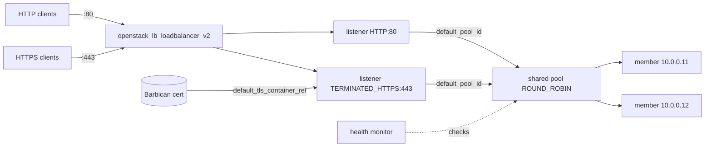

# Octavia Load Balancer with Multiple Listeners

Run HTTP and HTTPS on a single Octavia load balancer with Terraform. One load
balancer carries two listeners (port 80 and port 443) that share one backend
pool, so a single set of members and one health monitor serve both ports.

> **Primary search phrase:** Terraform OpenStack Octavia multiple listeners example

## Architecture



Both listeners set `default_pool_id` to the same pool. The pool is attached to
the load balancer (via `loadbalancer_id`, not a single `listener_id`), which is
what makes sharing possible.

### Shared vs. separate pools

- **Shared pool (this example):** simplest when both ports front the same
  application. One member list, one monitor.
- **Separate pools:** give each listener its own `openstack_lb_pool_v2` and
  members when the ports serve different backends, need different `lb_method`
  values, or scale independently. The L7 example
  ([`l7-policy-routing`](../l7-policy-routing/)) shows multiple pools on one
  listener; the same resource pattern applies per listener here.

## Usage

```bash
export OS_CLOUD=openstack          # or set `cloud` in terraform.tfvars
cp terraform.tfvars.example terraform.tfvars   # paste your Barbican container ref
terraform init
terraform plan
terraform apply
```

## Inputs

| Name | Description | Type | Default |
|------|-------------|------|---------|
| `cloud` | clouds.yaml entry to use | `string` | `"openstack"` |
| `lb_name` | Load balancer name (prefix for children) | `string` | `"example-multiple-listeners"` |
| `subnet_name` | Subnet for the VIP and members | `string` | `"private-subnet"` |
| `http_port` | HTTP listener port | `number` | `80` |
| `https_port` | HTTPS listener port | `number` | `443` |
| `member_port` | Backend listening port | `number` | `80` |
| `backend_members` | Backend member IPs | `list(string)` | `["10.0.0.11","10.0.0.12"]` |
| `default_tls_container_ref` | Barbican container href for HTTPS | `string` | _required_ |

## Outputs

| Name | Description |
|------|-------------|
| `loadbalancer_id` | UUID of the load balancer |
| `vip_address` | VIP serving both HTTP and HTTPS |
| `http_listener_id` | UUID of the HTTP listener |
| `https_listener_id` | UUID of the HTTPS listener |
| `shared_pool_id` | UUID of the shared backend pool |

## Best practices

- **Why this approach:** Co-locating listeners on one LB shares the VIP and the
  amphora capacity, and a shared pool keeps member management in one place.
- **Common mistakes:** Attaching the pool to a single listener with `listener_id`
  (then it cannot be shared); duplicate `protocol_port` values on one LB;
  expecting HTTP clients to be auto-upgraded to HTTPS (add an L7 redirect policy
  on the HTTP listener if you want that).
- **Scaling considerations:** Split into separate pools once the ports diverge in
  backends or scaling needs; keep them shared while they are truly identical.
- **Performance considerations:** Set listener `tls_versions`/`tls_ciphers` on the
  HTTPS listener; the shared `ROUND_ROBIN` pool suits uniform backends.
- **Cost considerations:** One LB with two listeners is cheaper than two separate
  load balancers for the same application.

## Security considerations

- Consider redirecting HTTP to HTTPS (an `openstack_lb_l7policy_v2` with
  `action = "REDIRECT_PREFIX"`/`REDIRECT_URL` on the HTTP listener) so clients
  never stay on cleartext.
- Keep the TLS certificate in Barbican (a reference only is stored here); see
  [`tls-termination`](../tls-termination/) for the full Barbican workflow.
- Restrict the VIP and member security groups; expose only the ports you serve.

## Troubleshooting

| Symptom | Likely cause | Fix |
|---------|--------------|-----|
| `Duplicate listener` / port conflict | Two listeners on the same port | Give each listener a distinct `protocol_port` |
| Pool cannot be shared | Pool created with `listener_id` | Attach the pool with `loadbalancer_id` (done here) |
| HTTPS listener `ERROR` | Barbican ref/ACL problem | See the tls-termination troubleshooting table |
| Only one port works | Security group blocks the other | Open both `http_port` and `https_port` |
| Members `OFFLINE` | Backend/monitor mismatch | Verify members answer on `member_port` and the monitor path |
| Provider auth errors | Bad/missing `clouds.yaml` or `OS_CLOUD` | See [provider configuration](../../../docs/provider-configuration.md) |

## Cleanup

```bash
terraform destroy
```

## Further reading

- [Provider configuration & clouds.yaml](../../../docs/provider-configuration.md)
- [OpenStack provider — lb_listener_v2 docs](https://registry.terraform.io/providers/terraform-provider-openstack/openstack/latest/docs/resources/lb_listener_v2)
- [Advanced OpenStack guides on DevOps AI ToolKit](https://devopsaitoolkit.com/blog/)
