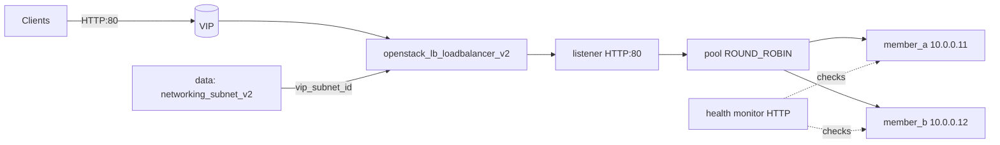

# Basic Octavia Load Balancer

Provision a basic OpenStack Octavia load balancer with Terraform: one load
balancer VIP, an HTTP listener on port 80, a round-robin pool, two backend
members, and an HTTP health monitor. This is the "hello world" of the Octavia
(`openstack_lb_*`) resources and the template the other load-balancer examples
build on.

> **Primary search phrase:** Terraform OpenStack Octavia load balancer example

## Architecture



The subnet is looked up by name with a data source, so no cloud-specific UUIDs
are hard-coded. The load balancer allocates its VIP from that subnet, the
listener accepts HTTP on port 80, and the pool spreads requests across the two
members. The health monitor removes any member that stops answering.

## Usage

```bash
export OS_CLOUD=openstack          # or set `cloud` in terraform.tfvars
cp terraform.tfvars.example terraform.tfvars
terraform init
terraform plan
terraform apply
```

To expose the VIP publicly, attach a floating IP to the `vip_port_id` output —
see [`floating-ips`](../../floating-ips/).

## Inputs

| Name | Description | Type | Default |
|------|-------------|------|---------|
| `cloud` | clouds.yaml entry to use | `string` | `"openstack"` |
| `lb_name` | Load balancer name (prefix for child resources) | `string` | `"example-octavia-basic"` |
| `subnet_name` | Subnet for the VIP and members | `string` | `"private-subnet"` |
| `listener_port` | Front-end HTTP port | `number` | `80` |
| `member_a_address` | First backend IP | `string` | `"10.0.0.11"` |
| `member_b_address` | Second backend IP | `string` | `"10.0.0.12"` |
| `member_port` | Backend listening port | `number` | `80` |
| `monitor_url_path` | Health check path | `string` | `"/"` |

## Outputs

| Name | Description |
|------|-------------|
| `loadbalancer_id` | UUID of the load balancer |
| `vip_address` | VIP clients connect to |
| `vip_port_id` | Neutron port of the VIP (attach a floating IP here) |
| `listener_id` | UUID of the HTTP listener |
| `pool_id` | UUID of the backend pool |
| `member_ids` | UUIDs of the backend members |

## Best practices

- **Why this approach:** Looking up the subnet by name keeps the config
  portable; placing members on the same subnet as the VIP avoids extra routing.
  A health monitor is included from the start because a pool without one will
  happily send traffic to dead backends.
- **Common mistakes:** Forgetting the health monitor; setting `timeout` greater
  than or equal to `delay` (timeout must be less than delay); pointing members
  at an address that is not reachable on `subnet_id`.
- **Scaling considerations:** For more than a couple of members, drive them from
  a variable list with `for_each` — see
  [`listener-pool-members`](../listener-pool-members/).
- **Performance considerations:** `ROUND_ROBIN` is fine for uniform backends;
  use `LEAST_CONNECTIONS` for long-lived connections and `SOURCE_IP` for
  sticky-by-client behaviour.
- **Cost considerations:** Each load balancer runs amphora instances (in the
  default driver) that bill while active. Tag and `terraform destroy` dev LBs.

## Security considerations

- A bare HTTP listener carries traffic in cleartext. Terminate TLS at the load
  balancer for anything public — see [`tls-termination`](../tls-termination/).
- Restrict who can reach the VIP with a security group on the members and, where
  supported, the listener `allowed_cidrs` argument.
- Members should only accept traffic from the load balancer subnet, not the
  whole world; lock down member security groups accordingly.

## Troubleshooting

| Symptom | Likely cause | Fix |
|---------|--------------|-----|
| LB stuck in `PENDING_CREATE` | Octavia driver/amphora cannot boot | Check the Octavia service and its image/flavor; `openstack loadbalancer status show <id>` |
| `Subnet <name> not found` | Wrong `subnet_name` or no access | `openstack subnet list` |
| Members show `ERROR`/`OFFLINE` | Health check failing | Verify `monitor_url_path` returns 2xx and `member_port` is correct |
| `timeout must be less than delay` | Monitor timing invalid | Set `timeout` < `delay` |
| VIP unreachable from outside | No floating IP / security group blocks it | Attach a floating IP to `vip_port_id`; open the member security group |
| Provider auth errors | Bad/missing `clouds.yaml` or `OS_CLOUD` | See [provider configuration](../../../docs/provider-configuration.md) |

## Cleanup

```bash
terraform destroy
```

## Further reading

- [Provider configuration & clouds.yaml](../../../docs/provider-configuration.md)
- [OpenStack provider — lb_loadbalancer_v2 docs](https://registry.terraform.io/providers/terraform-provider-openstack/openstack/latest/docs/resources/lb_loadbalancer_v2)
- [Advanced OpenStack guides on DevOps AI ToolKit](https://devopsaitoolkit.com/blog/)
