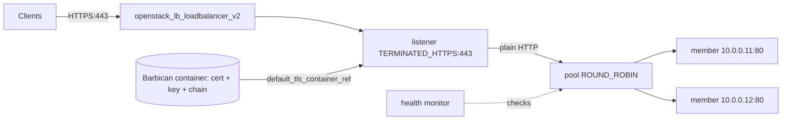

# Octavia TLS Termination with Barbican

Terminate HTTPS at an Octavia load balancer with Terraform, serving a
certificate stored in Barbican (OpenStack's secrets service). The listener uses
`protocol = "TERMINATED_HTTPS"` and a `default_tls_container_ref`; the backend
pool speaks plain HTTP, so members never handle TLS.

> **Primary search phrase:** Terraform OpenStack Octavia TLS termination Barbican example

## Architecture



Clients connect over TLS to the VIP. Octavia pulls the certificate and private
key from the referenced Barbican container at listener creation, decrypts
traffic, and forwards plain HTTP to the members. Optional `sni_container_refs`
let one listener present different certificates per hostname (SNI).

## Working with Barbican

Octavia reads TLS material from Barbican, so the cert/key never enter Terraform
state. Create the container before `terraform apply`:

```bash
# Store the private key, certificate, and intermediate chain as secrets.
openstack secret store --name 'server-key'  -t 'application/octet-stream' -e base64 --payload "$(base64 server.key)"
openstack secret store --name 'server-cert' -t 'application/octet-stream' -e base64 --payload "$(base64 server.crt)"
openstack secret store --name 'server-ca'   -t 'application/octet-stream' -e base64 --payload "$(base64 chain.crt)"

# Bundle them into a 'certificate' container and note its href.
openstack secret container create --name 'tls-www' --type certificate \
  --secret certificate="<cert-href>" \
  --secret private_key="<key-href>" \
  --secret intermediates="<ca-href>"
```

Grant the Octavia service user read access to the secrets (commonly via an ACL or
the `creator`/`load-balancer_member` role) or the listener will fail to fetch
them. Use the resulting container href as `default_tls_container_ref`.

## Usage

```bash
export OS_CLOUD=openstack          # or set `cloud` in terraform.tfvars
cp terraform.tfvars.example terraform.tfvars   # paste your Barbican container ref
terraform init
terraform plan
terraform apply
```

## Inputs

| Name | Description | Type | Default |
|------|-------------|------|---------|
| `cloud` | clouds.yaml entry to use | `string` | `"openstack"` |
| `lb_name` | Load balancer name (prefix for children) | `string` | `"example-tls-termination"` |
| `subnet_name` | Subnet for the VIP and members | `string` | `"private-subnet"` |
| `https_port` | Front-end HTTPS port | `number` | `443` |
| `member_port` | Backend HTTP port | `number` | `80` |
| `backend_members` | Backend member IPs | `list(string)` | `["10.0.0.11","10.0.0.12"]` |
| `default_tls_container_ref` | Barbican container href (cert+key+chain) | `string` | _required_ |
| `sni_container_refs` | Extra Barbican refs for SNI | `list(string)` | `[]` |

## Outputs

| Name | Description |
|------|-------------|
| `loadbalancer_id` | UUID of the load balancer |
| `vip_address` | VIP clients connect to over HTTPS |
| `vip_port_id` | Neutron port of the VIP (attach a floating IP here) |
| `https_listener_id` | UUID of the TERMINATED_HTTPS listener |
| `pool_id` | UUID of the backend pool |

## Best practices

- **Why this approach:** Terminating TLS at the LB centralises certificate
  management in Barbican, keeps keys out of Terraform state, and lets backends
  stay simple HTTP servers.
- **Common mistakes:** Passing a _secret_ href instead of a _container_ href;
  forgetting to grant Octavia ACL access to the secrets; omitting the
  intermediate chain (browsers then show chain errors).
- **Scaling considerations:** Use `sni_container_refs` to host many certificates
  on one listener instead of one LB per hostname.
- **Performance considerations:** Pin modern protocols/ciphers via `tls_versions`
  and `tls_ciphers` on the listener; offloading TLS at the amphora frees the
  backends from crypto work.
- **Cost considerations:** One HTTPS LB fronting many backends is cheaper than
  per-host certificates and instances.

## Security considerations

- Keep keys in Barbican, never in `.tf`/`.tfvars` or state — this example only
  stores a _reference_.
- Disable legacy TLS (set `tls_versions` to TLS 1.2+) and consider HSTS via the
  listener `hsts_*` arguments for public sites.
- Termination means LB-to-member traffic is plaintext on the internal subnet; if
  that subnet is untrusted, re-encrypt to members with a pool `tls_container_ref`.
- Rotate certificates by creating a new Barbican container and updating the ref.

## Troubleshooting

| Symptom | Likely cause | Fix |
|---------|--------------|-----|
| Listener stuck / `ERROR` | Octavia cannot read the Barbican secrets | Grant the Octavia user ACL access; check the container href |
| `Could not find container` | Secret href used, not container href | Pass the `containers/<uuid>` URL |
| Browser chain warning | Missing intermediates | Include the chain in the container |
| Handshake failure | Outdated `tls_versions`/`tls_ciphers` | Allow TLS 1.2/1.3 and modern ciphers |
| Members `OFFLINE` | Backend not serving HTTP on `member_port` | Verify the member app and port |
| Provider auth errors | Bad/missing `clouds.yaml` or `OS_CLOUD` | See [provider configuration](../../../docs/provider-configuration.md) |

## Cleanup

```bash
terraform destroy
```

Barbican secrets are not managed here; delete them separately with
`openstack secret container delete` / `openstack secret delete` if no longer
needed.

## Further reading

- [Provider configuration & clouds.yaml](../../../docs/provider-configuration.md)
- [OpenStack provider — lb_listener_v2 docs](https://registry.terraform.io/providers/terraform-provider-openstack/openstack/latest/docs/resources/lb_listener_v2)
- [Advanced OpenStack guides on DevOps AI ToolKit](https://devopsaitoolkit.com/blog/)
