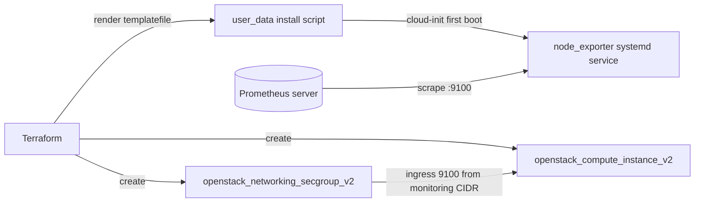

# Instance with Prometheus node_exporter

Boot an OpenStack instance that installs and runs **Prometheus node_exporter**
on first boot via cloud-init, fronted by a security group that opens the metrics
port (9100) only to a trusted monitoring CIDR. The OpenStack provider has no
telemetry resource, so monitoring is built from real infrastructure: an instance,
a security group, and a templated install script.

> **Primary search phrase:** Terraform OpenStack Prometheus node_exporter example

## Architecture



## Usage

```bash
export OS_CLOUD=openstack          # or set `cloud` in terraform.tfvars
cp terraform.tfvars.example terraform.tfvars
terraform init
terraform plan
terraform apply

# Then add the printed endpoint to your Prometheus scrape config:
#   - targets: ["<node_exporter_endpoint>"]
```

## Inputs

| Name | Description | Type | Default |
|------|-------------|------|---------|
| `cloud` | clouds.yaml entry to use | `string` | `"openstack"` |
| `instance_name` | Name of the instance | `string` | `"example-node-exporter"` |
| `flavor_name` | Flavor (size) | `string` | `"m1.small"` |
| `image_name` | Glance image (Debian/Ubuntu base) | `string` | `"ubuntu-22.04"` |
| `network_name` | Tenant network to attach | `string` | `"private"` |
| `key_pair_name` | Existing key pair for SSH (optional) | `string` | `""` |
| `monitoring_cidr` | CIDR allowed to scrape 9100 | `string` | `"10.0.0.0/24"` |
| `node_exporter_version` | node_exporter version to install | `string` | `"1.8.2"` |
| `metrics_port` | Port node_exporter listens on | `number` | `9100` |
| `security_group_name` | Name for the metrics security group | `string` | `"node-exporter"` |
| `tags` | Instance tags | `list(string)` | see `variables.tf` |

## Outputs

| Name | Description |
|------|-------------|
| `instance_id` | UUID of the instance |
| `access_ip_v4` | First IPv4 address |
| `node_exporter_endpoint` | `ip:port` to add to Prometheus |
| `security_group_id` | UUID of the metrics security group |

## Best practices

- **Why this approach:** The exporter is installed declaratively through
  `templatefile()` + cloud-init, so the node is reproducible and immutable — no
  manual SSH steps. node_exporter runs as a dedicated unprivileged system user
  under a hardened systemd unit.
- **Common mistakes:** Opening 9100 to `0.0.0.0/0` (a `validation` block here
  refuses that); assuming the exporter binary self-updates (pin and bump
  `node_exporter_version` deliberately).
- **Scaling considerations:** For a fleet, reuse this user_data pattern across
  `count`/`for_each` instances and feed their IPs into Prometheus with
  [`prometheus-targets-file`](../prometheus-targets-file/).

## Security considerations

- node_exporter exposes detailed host metrics (mounts, processes, network).
  Treat 9100 as sensitive: scope `monitoring_cidr` to the Prometheus subnet only.
- Egress is opened so the instance can fetch the release tarball on boot; in a
  locked-down environment, mirror node_exporter internally and tighten egress.
- Inject SSH via a managed key pair, never passwords; never bake secrets into
  user_data (it is readable from the metadata service).

## Troubleshooting

| Symptom | Likely cause | Fix |
|---------|--------------|-----|
| Scrape connection refused | cloud-init still running / download failed | SSH in, check `journalctl -u node_exporter` and `/var/log/cloud-init-output.log` |
| Scrape times out | Security group / CIDR mismatch | Confirm the Prometheus source IP is inside `monitoring_cidr` |
| `useradd: command not found` | Non Debian/Ubuntu image | Use an apt-based image or adapt the script for the target distro |
| Download 404 | Bad `node_exporter_version` | Use an existing release version (no leading `v`) |
| Metrics work locally but not remotely | Egress-only path / NAT | Ensure the network is reachable from Prometheus (router/floating IP) |

## Cleanup

```bash
terraform destroy
```

## Further reading

- [Provider configuration & clouds.yaml](../../../docs/provider-configuration.md)
- [Prometheus node_exporter](https://github.com/prometheus/node_exporter)
- [Monitoring OpenStack with Terraform on DevOps AI ToolKit](https://devopsaitoolkit.com/blog/)
