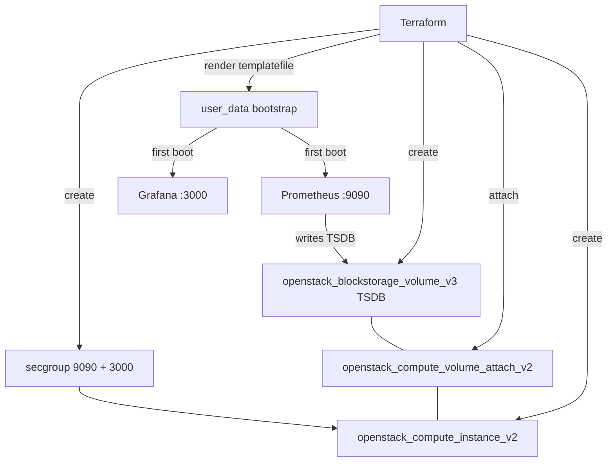

# Monitoring stack VM (Prometheus + Grafana) on OpenStack

Provision a single, larger OpenStack instance sized to run **Prometheus and
Grafana**, with a dedicated Cinder volume for the time-series database (TSDB) and
a security group exposing Grafana (3000) and Prometheus (9090) to scoped CIDRs.
cloud-init installs and configures everything on first boot.

> **Primary search phrase:** Terraform OpenStack Prometheus Grafana monitoring stack

## Architecture



## Usage

```bash
export OS_CLOUD=openstack          # or set `cloud` in terraform.tfvars
cp terraform.tfvars.example terraform.tfvars
terraform init
terraform plan
terraform apply

# Open the printed grafana_endpoint (default login admin/admin — change it).
```

## Inputs

| Name | Description | Type | Default |
|------|-------------|------|---------|
| `cloud` | clouds.yaml entry to use | `string` | `"openstack"` |
| `instance_name` | Name of the monitoring VM | `string` | `"monitoring-stack"` |
| `flavor_name` | Flavor (size) — sized for the stack | `string` | `"m1.large"` |
| `image_name` | Glance image (Debian/Ubuntu base) | `string` | `"ubuntu-22.04"` |
| `network_name` | Tenant network to attach | `string` | `"private"` |
| `key_pair_name` | Existing key pair for SSH (optional) | `string` | `""` |
| `monitoring_cidr` | CIDR allowed to reach Prometheus (9090) | `string` | `"10.0.0.0/24"` |
| `grafana_cidr` | CIDR allowed to reach Grafana (3000) | `string` | `"10.0.0.0/24"` |
| `prometheus_port` | Prometheus listen port | `number` | `9090` |
| `grafana_port` | Grafana listen port | `number` | `3000` |
| `tsdb_volume_size` | TSDB volume size (GiB) | `number` | `100` |
| `tsdb_volume_type` | Cinder volume type (empty = default) | `string` | `""` |
| `tsdb_device` | Guest device path for the TSDB volume | `string` | `"/dev/vdb"` |
| `prometheus_version` | Prometheus version to install | `string` | `"2.53.0"` |
| `security_group_name` | Name for the stack security group | `string` | `"monitoring-stack"` |
| `tags` | Instance tags | `list(string)` | see `variables.tf` |

## Outputs

| Name | Description |
|------|-------------|
| `instance_id` | UUID of the instance |
| `access_ip_v4` | First IPv4 address |
| `prometheus_endpoint` | `http://ip:9090` |
| `grafana_endpoint` | `http://ip:3000` |
| `tsdb_volume_id` | UUID of the TSDB volume |
| `security_group_id` | UUID of the stack security group |

## Best practices

- **Why this approach:** Keeping the TSDB on a dedicated Cinder volume means
  metric retention survives instance rebuilds and can be snapshotted/resized
  independently of the OS disk. The whole node is reproducible from code.
- **Common mistakes:** Under-sizing the flavor (Prometheus is memory hungry);
  leaving Grafana's default `admin/admin` credentials; assuming the volume device
  is always `/dev/vdb` (it can vary — the bootstrap waits and matches `tsdb_device`).
- **Scaling considerations:** This is a single-node stack. For HA/long-term
  storage, push to remote-write (Thanos/Mimir/Cortex) and run Grafana separately
  from Prometheus.
- **Cost considerations:** A larger flavor plus a 100 GiB volume bills
  continuously; tag everything and right-size retention to control spend.

## Security considerations

- Neither Prometheus nor Grafana is internet-safe by default — Prometheus has no
  auth, and Grafana ships with a default admin password. Scope `monitoring_cidr`
  and `grafana_cidr` tightly (a `validation` block refuses `0.0.0.0/0` for 9090).
- Put Grafana behind a reverse proxy with TLS and SSO before exposing it widely;
  rotate the admin password immediately.
- Egress is open so the host can fetch Prometheus and the Grafana APT repo; lock
  it down to internal mirrors in restricted environments.

## Troubleshooting

| Symptom | Likely cause | Fix |
|---------|--------------|-----|
| Grafana/Prometheus unreachable | cloud-init still running | Check `/var/log/cloud-init-output.log`, `systemctl status prometheus grafana-server` |
| Prometheus won't start, TSDB errors | Volume not mounted at `/var/lib/prometheus` | Verify `tsdb_device`; check `lsblk`, `mount`, `/etc/fstab` |
| `No valid host was found` | Flavor too large for any host | Use a smaller flavor or another AZ |
| Volume attach stuck | AZ mismatch between volume and instance | Ensure Cinder and Nova AZs are compatible |
| Grafana on wrong port | `grafana.ini` edit skipped | Confirm `http_port` in `/etc/grafana/grafana.ini` |

## Cleanup

```bash
terraform destroy
```

## Further reading

- [Provider configuration & clouds.yaml](../../../docs/provider-configuration.md)
- [Prometheus storage docs](https://prometheus.io/docs/prometheus/latest/storage/)
- [Building observability on OpenStack with Terraform — DevOps AI ToolKit](https://devopsaitoolkit.com/blog/)
