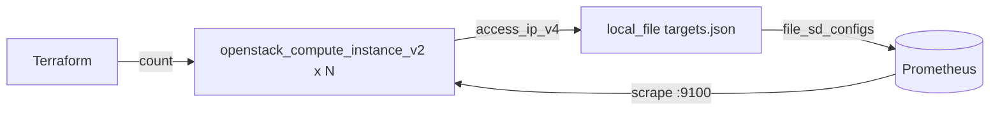

# Prometheus file_sd targets file from OpenStack instances

Create a fleet of OpenStack instances with `count` and render their IP addresses
into a **Prometheus `file_sd` targets JSON file** using the `hashicorp/local`
provider's `local_file` resource. Terraform becomes the source of truth for what
Prometheus scrapes — apply the config and your target list updates automatically.

> **Primary search phrase:** Terraform OpenStack Prometheus file_sd targets example

## Architecture



The `local_file` resource encodes a single target group whose `targets` list is
built from the instances' `access_ip_v4`, plus a set of `labels` (job, cloud,
network). Prometheus reloads `file_sd` files automatically — no restart needed.

## Usage

```bash
export OS_CLOUD=openstack          # or set `cloud` in terraform.tfvars
cp terraform.tfvars.example terraform.tfvars
terraform init
terraform plan
terraform apply

# Point Prometheus at the generated file:
#   scrape_configs:
#     - job_name: openstack-nodes
#       file_sd_configs:
#         - files: ["/path/to/prometheus/targets.json"]
```

## Inputs

| Name | Description | Type | Default |
|------|-------------|------|---------|
| `cloud` | clouds.yaml entry to use | `string` | `"openstack"` |
| `instance_count` | Number of instances / targets | `number` | `3` |
| `name_prefix` | Name prefix for the fleet | `string` | `"metrics-target"` |
| `flavor_name` | Flavor (size) | `string` | `"m1.small"` |
| `image_name` | Glance image to boot | `string` | `"ubuntu-22.04"` |
| `network_name` | Tenant network to attach | `string` | `"private"` |
| `key_pair_name` | Existing key pair for SSH (optional) | `string` | `""` |
| `security_group_names` | Security groups per instance | `list(string)` | `["default"]` |
| `metrics_port` | Port exposed by each instance | `number` | `9100` |
| `job_label` | Prometheus `job` label | `string` | `"openstack-nodes"` |
| `targets_file_path` | Where to write the targets JSON | `string` | `"./prometheus/targets.json"` |
| `tags` | Instance tags | `list(string)` | see `variables.tf` |

## Outputs

| Name | Description |
|------|-------------|
| `instance_ids` | UUIDs of the instances |
| `instance_ips` | First IPv4 of each instance |
| `targets` | `ip:port` list written to the file |
| `targets_file_path` | Path of the generated targets JSON |

## Best practices

- **Why this approach:** `file_sd` decouples discovery from Prometheus config —
  Terraform owns the inventory and Prometheus hot-reloads it. Cleaner than
  hand-editing `static_configs` or rebuilding Prometheus on every fleet change.
- **Common mistakes:** Committing the rendered targets file (it is environment
  state — gitignore it); using `count` and then deleting a middle instance,
  which renumbers the tail (acceptable for an ephemeral scrape list, but prefer
  `for_each` if you need stable names).
- **Scaling considerations:** For multi-tenant/multi-network fleets emit several
  target groups (one per `labels` set) by extending the `local_file` content list.

## Security considerations

- The generated file contains private IPs and label metadata — treat it as
  internal and keep it out of version control (covered by the repo `.gitignore`).
- This example does not install the exporter; pair it with
  [`instance-with-node-exporter`](../instance-with-node-exporter/) and a security
  group that scopes the metrics port to the Prometheus host.
- Run Prometheus over the private network or behind mTLS — `file_sd` targets are
  plain `ip:port` with no transport security of their own.

## Troubleshooting

| Symptom | Likely cause | Fix |
|---------|--------------|-----|
| `targets.json` not written | Directory does not exist | `local_file` creates parent dirs in v2.4; check `targets_file_path` is writable |
| Prometheus shows 0 targets | Wrong `files:` glob | Ensure the `file_sd_configs` path matches `targets_file_path` |
| Targets present but `DOWN` | Exporter not installed / firewalled | Install node_exporter and open `metrics_port` to Prometheus |
| IPs empty in output | Instances still building | Re-run `terraform apply` after they reach ACTIVE |
| Stale targets after destroy | Prometheus cached old file | The file is removed on `destroy`; confirm Prometheus re-read it |

## Cleanup

```bash
terraform destroy
```

`destroy` removes both the instances and the generated targets file.

## Further reading

- [Provider configuration & clouds.yaml](../../../docs/provider-configuration.md)
- [Prometheus file-based service discovery](https://prometheus.io/docs/guides/file-sd/)
- [Terraform monitoring patterns on DevOps AI ToolKit](https://devopsaitoolkit.com/blog/)
