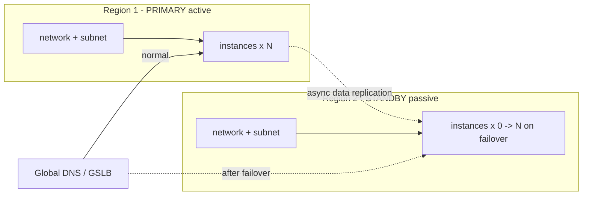

# Terraform OpenStack Active-Passive Disaster Recovery

A two-region active-passive DR pattern: a live **primary** stack in region 1 and
a pre-provisioned **standby** stack in region 2 that normally runs **zero
instances**. The standby network and subnet always exist, so failover is a single
variable flip and re-apply rather than a rebuild from scratch.

> **Primary search phrase:** Terraform OpenStack active-passive disaster recovery

## Architecture



Both regions are provisioned with an identical network and subnet (same CIDR, so
no IP re-plumbing on failover). Instances are driven by per-region count
variables: `primary_instance_count` (default 2) and `standby_instance_count`
(default 0).

## Usage

```bash
cp terraform.tfvars.example terraform.tfvars
terraform init
terraform apply        # primary live, standby network present, standby cold
```

**Failover** (region 1 lost): set `standby_instance_count` to your target (and
usually `primary_instance_count = 0`), then:

```bash
terraform apply        # standby instances boot in region 2
```

Then repoint traffic (DNS/GSLB) at the standby IPs. **Failback** is the reverse.

## DR notes

- **Standby is cold by default.** Only the network/subnet exist until failover,
  so steady-state cost is negligible while RTO stays low (no network build on the
  critical path).
- **Data replication is out of scope.** This example provisions *compute and
  network* only. Pair it with storage/database replication (volume backups,
  database log shipping, object-store replication) so the standby has current
  data — instances without data do not constitute DR.
- **Failover is operator-driven.** Flipping counts is deliberate and explicit;
  wire it into a runbook. Automating a flap on transient errors causes split
  brain.
- **Keep regions symmetric.** Identical CIDR, flavor, image, key pair, and
  security groups in both regions keep RTO predictable.
- **Test regularly.** Schedule game-day failovers; an untested DR plan is a guess.

## Inputs

| Name | Description | Type | Default |
|------|-------------|------|---------|
| `cloud_primary` | clouds.yaml entry for the primary region | `string` | `"openstack"` |
| `cloud_standby` | clouds.yaml entry for the standby region | `string` | `"openstack-region2"` |
| `name_prefix` | Prefix for all DR resources | `string` | `"app-dr"` |
| `subnet_cidr` | CIDR for the app subnet in both regions | `string` | `"10.50.0.0/24"` |
| `dns_nameservers` | DHCP DNS resolvers | `list(string)` | `["1.1.1.1","8.8.8.8"]` |
| `flavor_name` | Instance flavor | `string` | `"m1.small"` |
| `image_name` | Glance image | `string` | `"ubuntu-22.04"` |
| `key_pair_name` | Existing key pair in both regions (optional) | `string` | `""` |
| `security_group_names` | Security groups | `list(string)` | `["default"]` |
| `primary_instance_count` | Active instances in region 1 | `number` | `2` |
| `standby_instance_count` | Standby instances in region 2 (0 = cold) | `number` | `0` |
| `tags` | Base tags | `list(string)` | see `variables.tf` |

## Outputs

| Name | Description |
|------|-------------|
| `primary_network_id` | UUID of the primary network |
| `standby_network_id` | UUID of the standby network |
| `primary_instance_ids` | UUIDs of active primary instances |
| `primary_instance_ips` | IPv4 addresses of active primary instances |
| `standby_instance_ids` | UUIDs of standby instances (empty until failover) |
| `standby_instance_ips` | IPv4 addresses of standby instances (empty until failover) |

## Best practices

- **Provision the standby network up front; gate only the instances.** Neutron
  resources are cheap and slow-ish to build — keeping them warm shrinks RTO.
- **Drive both regions from shared variables** so the standby is a faithful copy.
- **Version your tfvars for normal vs. failover** (commented block in the example)
  so an on-call engineer flips a known-good config under pressure.

## Security considerations

- Use a separate application credential per region; a credential leak should not
  reach both the primary and the DR copy.
- Mirror security groups in both regions so the standby is not unexpectedly more
  open (or more closed) than the primary on failover.
- Replicate secrets/keys to the standby region through your secrets manager, not
  through Terraform variables or state.

## Troubleshooting

| Symptom | Likely cause | Fix |
|---------|--------------|-----|
| Standby instances never appear | `standby_instance_count` still 0 | Set it > 0 and re-apply |
| `No valid host was found` on failover | DR region lacks capacity for the flavor | Pre-reserve capacity or pick a flavor with headroom |
| Standby app has stale/no data | No data replication configured | Add storage/DB replication (out of scope here) |
| Both stacks live at once | Forgot to set `primary_instance_count = 0` | Scale the failed region to 0 to avoid split brain |
| Auth error for standby region | Bad `openstack-region2` credentials | Verify the standby clouds.yaml entry |

## Cleanup

```bash
terraform destroy
```

## Further reading

- [Provider configuration & clouds.yaml](../../../docs/provider-configuration.md)
- [Terraform resource `count` for scaling to zero](https://developer.hashicorp.com/terraform/language/meta-arguments/count)
- [Disaster recovery patterns on OpenStack — DevOps AI ToolKit](https://devopsaitoolkit.com/blog/)
