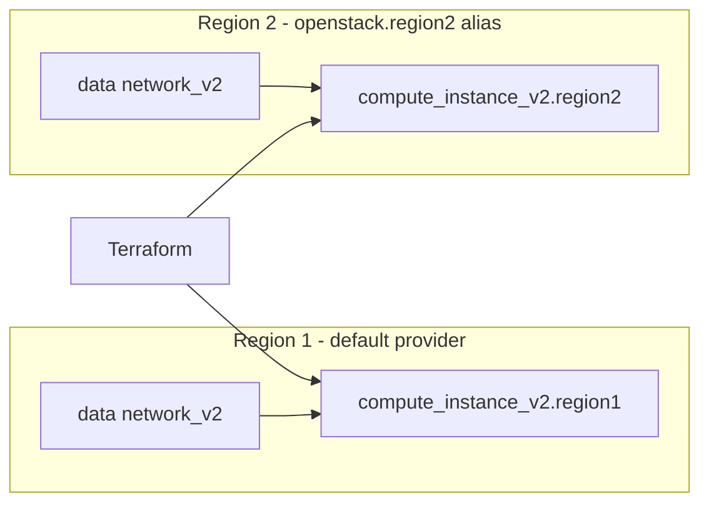

# Terraform OpenStack Multi-Region Instances

Run identical compute instances in two OpenStack regions (or two clouds) from one
configuration, selecting each region with a **provider alias**. This is the
portability building block: the same instance definition deployed side by side so
a workload can survive the loss of a single region.

> **Primary search phrase:** Terraform OpenStack instance in multiple regions

## Architecture



Each region has its own network data-source lookup and its own instance. The only
per-region difference is the `provider` meta-argument: region 2 resources carry
`provider = openstack.region2`.

## Usage

```bash
cp terraform.tfvars.example terraform.tfvars   # set both cloud entries
terraform init
terraform plan
terraform apply
```

The flavor, image, network, and key pair named in your variables must exist in
**both** regions. Names commonly differ between clouds — align them first or
parameterise per region.

## Inputs

| Name | Description | Type | Default |
|------|-------------|------|---------|
| `cloud_region1` | clouds.yaml entry for region 1 | `string` | `"openstack"` |
| `cloud_region2` | clouds.yaml entry for region 2 | `string` | `"openstack-region2"` |
| `instance_name` | Base name for the instances | `string` | `"example-multiregion"` |
| `flavor_name` | Flavor for both regions | `string` | `"m1.small"` |
| `image_name` | Glance image for both regions | `string` | `"ubuntu-22.04"` |
| `network_name` | Existing network to attach in each region | `string` | `"private"` |
| `key_pair_name` | Existing key pair in both regions (optional) | `string` | `""` |
| `security_group_names` | Security groups for both regions | `list(string)` | `["default"]` |
| `tags` | Instance tags | `list(string)` | see `variables.tf` |

## Outputs

| Name | Description |
|------|-------------|
| `region1_instance_id` | UUID of the region 1 instance |
| `region1_access_ip_v4` | First IPv4 address in region 1 |
| `region2_instance_id` | UUID of the region 2 instance |
| `region2_access_ip_v4` | First IPv4 address in region 2 |

## Best practices

- **Look networks up per region.** A data source bound to each provider resolves
  the same network *name* to the right per-region UUID — never hard-code IDs.
- **Keep the two definitions symmetric.** Share variables so both instances stay
  identical; divergence is how multi-region setups quietly rot.
- **Graduate to modules.** For more than a couple of resources per region, wrap
  the per-region resources in a module and instantiate it once per provider alias.

## Security considerations

- Distribute key pairs and security groups to both regions out of band; this
  example references them by name and assumes they already exist in each cloud.
- Use a distinct application credential per region in `clouds.yaml` so one
  leaked credential cannot reach both regions.
- Front the two instances with health-checked DNS or a global load balancer
  rather than exposing region-specific IPs to clients directly.

## Troubleshooting

| Symptom | Likely cause | Fix |
|---------|--------------|-----|
| `Image <name> not found` in one region | Image name differs between clouds | `openstack image list` in each region; align names |
| `Network <name> not found` in region 2 | Network only exists in region 1 | Create the network in both regions or vary `network_name` |
| Both instances created in region 1 | Missing `provider = openstack.region2` | Add the explicit provider meta-argument |
| `key_pair not found` | Key pair only uploaded to one region | Upload the key pair to both regions |
| Auth error for region 2 only | Bad region 2 credentials/region_name | Verify the `openstack-region2` clouds.yaml entry |

## Cleanup

```bash
terraform destroy
```

## Further reading

- [Provider configuration & clouds.yaml](../../../docs/provider-configuration.md)
- [OpenStack provider — compute instance docs](https://registry.terraform.io/providers/terraform-provider-openstack/openstack/latest/docs/resources/compute_instance_v2)
- [Designing multi-region OpenStack on DevOps AI ToolKit](https://devopsaitoolkit.com/blog/)
