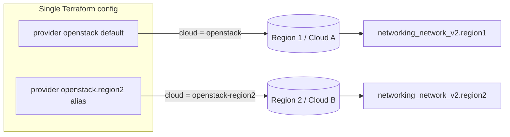

# Terraform OpenStack Multi-Region Provider Aliases

Manage resources across two OpenStack regions (or two separate clouds) from a
single Terraform configuration using **aliased provider blocks**. This minimal
example creates one network in each region so you can see the pattern with no
other moving parts.

> **Primary search phrase:** Terraform OpenStack multi-region provider

## Architecture



Each `provider "openstack"` block references a different entry in `clouds.yaml`.
The first block is the default provider; the second carries `alias = "region2"`.
A resource opts into the second region with `provider = openstack.region2`.

## clouds.yaml entries

This example expects two entries (see [`sample-clouds/clouds.yaml`](../../../sample-clouds/clouds.yaml)):

```yaml
clouds:
  openstack:           # region 1 (default provider)
    auth: { auth_url: "https://keystone.example.com:5000/v3", ... }
    region_name: "RegionOne"
  openstack-region2:   # region 2 (openstack.region2 alias)
    auth: { auth_url: "https://keystone-r2.example.com:5000/v3", ... }
    region_name: "RegionTwo"
```

The two entries may point at the same Keystone with different `region_name`
values (one cloud, multiple regions) or at two entirely separate clouds.

## Usage

```bash
cp terraform.tfvars.example terraform.tfvars   # set both cloud entries
terraform init
terraform plan
terraform apply
```

## Inputs

| Name | Description | Type | Default |
|------|-------------|------|---------|
| `cloud_region1` | clouds.yaml entry for region 1 (default provider) | `string` | `"openstack"` |
| `cloud_region2` | clouds.yaml entry for region 2 (alias) | `string` | `"openstack-region2"` |
| `network_name` | Base name for the per-region networks | `string` | `"example-multiregion"` |
| `tags` | Tags applied to each network | `list(string)` | see `variables.tf` |

## Outputs

| Name | Description |
|------|-------------|
| `region1_network_id` | UUID of the region 1 network |
| `region1_network_name` | Name of the region 1 network |
| `region2_network_id` | UUID of the region 2 network |
| `region2_network_name` | Name of the region 2 network |

## Best practices

- **One provider block per region.** Keep the default provider for your primary
  region and add an aliased block per additional region. Pass the cloud entry
  names as variables so the same config works against staging and production.
- **Never rely on implicit provider selection.** Always set `provider =
  openstack.<alias>` explicitly on non-default resources; a missing alias
  silently creates the resource in region 1.
- **Keep regions symmetric.** Drive both regions from the same variables so the
  two environments do not drift apart.

## Security considerations

- Use a separate, least-privilege application credential per region rather than
  reusing one password across clouds — store both in `clouds.yaml`/`secure.yaml`,
  never in `*.tf` or committed `terraform.tfvars`.
- A compromised credential should only expose one region. Scope each application
  credential to a single project/region.

## Troubleshooting

| Symptom | Likely cause | Fix |
|---------|--------------|-----|
| Both networks land in region 1 | Missing `provider = openstack.region2` on the resource | Add the explicit `provider` meta-argument |
| `cloud "openstack-region2" not found` | Second entry missing from `clouds.yaml` | Add the region 2 entry (see above) |
| Auth error only for region 2 | Bad credentials/`region_name` for the second cloud | Verify the region 2 `clouds.yaml` entry |
| `provider configuration not present` | Alias declared but never used, or typo in alias | Match `alias` in `providers.tf` to the `provider =` reference |

## Cleanup

```bash
terraform destroy
```

## Further reading

- [Provider configuration & clouds.yaml](../../../docs/provider-configuration.md)
- [Terraform multiple provider configurations (aliases)](https://developer.hashicorp.com/terraform/language/providers/configuration#alias-multiple-provider-configurations)
- [Multi-region OpenStack with Terraform on DevOps AI ToolKit](https://devopsaitoolkit.com/blog/)
