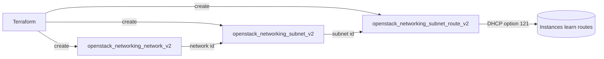

# DHCP and Host Routes

Provision a tenant network with a DHCP-enabled subnet that also pushes **static
routes** to every instance. Host routes are the classic DHCP-pushed static
routes mechanism — the DHCP agent advertises them (DHCP option 121) so instances
learn the routes automatically at lease time, with no per-instance configuration.
In provider v3 the inline subnet `host_routes` block was removed, so the routes
are managed with the dedicated `openstack_networking_subnet_route_v2` resource
(one entry per route).

> **Primary search phrase:** Terraform OpenStack subnet host_routes DHCP static routes example

## Architecture



The subnet hands out addresses from its allocation pool and, in the same lease,
pushes the configured host routes to each instance.

## Usage

```bash
export OS_CLOUD=openstack          # or set `cloud` in terraform.tfvars
cp terraform.tfvars.example terraform.tfvars
terraform init
terraform plan
terraform apply
```

## Inputs

| Name | Description | Type | Default |
|------|-------------|------|---------|
| `cloud` | clouds.yaml entry to use | `string` | `"openstack"` |
| `network_name` | Name of the tenant network | `string` | `"example-dhcp-network"` |
| `subnet_name` | Name of the subnet | `string` | `"example-dhcp-subnet"` |
| `cidr` | CIDR range for the subnet | `string` | `"10.80.0.0/24"` |
| `dns_nameservers` | DNS resolvers handed out via DHCP | `list(string)` | `["1.1.1.1", "8.8.8.8"]` |
| `allocation_start` | First address of the DHCP pool | `string` | `"10.80.0.10"` |
| `allocation_end` | Last address of the DHCP pool | `string` | `"10.80.0.200"` |
| `host_routes` | Static routes pushed via DHCP (`destination_cidr` + `next_hop`) | `list(object({destination_cidr=string, next_hop=string}))` | one route to `10.99.0.0/16` via `10.80.0.1` |

## Outputs

| Name | Description |
|------|-------------|
| `network_id` | UUID of the created network |
| `subnet_id` | UUID of the created subnet |
| `host_routes` | Static routes pushed to instances via DHCP on this subnet |

## Best practices

- **Why this approach:** Subnet routes are the classic DHCP-pushed static routes
  mechanism — define the route once and every instance on the subnet learns it
  automatically, rather than scripting routes into each guest's network config.
  The dedicated `openstack_networking_subnet_route_v2` resource is the v3-correct
  replacement for the removed inline `host_routes` block.
- **Common mistakes:** Setting a `next_hop` outside the subnet CIDR (it must be
  reachable on-link); expecting DHCP host routes to take effect on already-leased
  instances (they apply on the next DHCP renew/reboot); confusing subnet host
  routes with router `routes` (router routes steer traffic in Neutron; host
  routes only program the guest's own routing table); still using the removed
  inline `host_routes` block instead of `openstack_networking_subnet_route_v2`.
- **Scaling considerations:** The `host_routes` variable is a list of objects fed
  into `for_each`, so add or remove routes by editing `terraform.tfvars` — no code
  changes. Keep the list short; very long DHCP option 121 payloads can be
  truncated by some clients.
- **Performance considerations:** Host routes are pure control-plane/DHCP
  metadata and add no data-path overhead; the route simply lands in each guest's
  kernel routing table.
- **Cost considerations:** Network and subnet consume Neutron quota; the routes
  themselves are free. Tag everything (done here) and `terraform destroy` unused
  networks so idle resources do not exhaust quota.

## Security considerations

- Host routes shape where instances send traffic — a misconfigured `next_hop`
  can silently redirect traffic. Review routes as carefully as firewall rules.
- DHCP-pushed routes are trusted blindly by guests; only advertise next hops you
  control, and pair sensitive subnets with security groups and egress controls.
- Keep the allocation pool away from infrastructure addresses (gateway, DHCP
  ports) so a route's `next_hop` is never accidentally reassigned to a guest.

## Troubleshooting

| Symptom | Likely cause | Fix |
|---------|--------------|-----|
| Instances do not receive the routes | DHCP not renewed since the change, or guest ignores option 121 | Reboot/renew the lease (`dhclient -r && dhclient`); confirm the client honours classless static routes |
| `Port binding failed` for the DHCP agent | No DHCP agent able to service the subnet on the host | Check `openstack network agent list`; ensure a DHCP agent is up for the network |
| `Quota exceeded` | Project network/subnet quota hit | Raise quota or destroy unused networks ([quotas examples](../../quotas/)) |
| `Invalid input for host_routes ... nexthop` | `next_hop` not within the subnet CIDR | Use an on-link next hop inside `cidr` |
| `Overlapping allocation pools` / pool error | `allocation_start`/`allocation_end` outside or overlapping the CIDR | Keep the pool inside `cidr` and clear of the gateway |
| Provider auth errors | Bad/missing `clouds.yaml` or `OS_CLOUD` | See [provider configuration](../../../docs/provider-configuration.md) |

## Cleanup

```bash
terraform destroy
```

## Further reading

- [Provider configuration & clouds.yaml](../../../docs/provider-configuration.md)
- [OpenStack provider — networking subnet route docs](https://registry.terraform.io/providers/terraform-provider-openstack/openstack/latest/docs/resources/networking_subnet_route_v2)
- [Advanced OpenStack guides on DevOps AI ToolKit](https://devopsaitoolkit.com/blog/)
