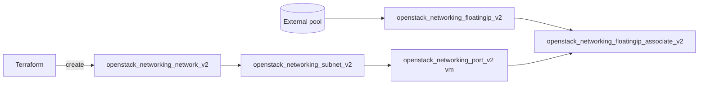

# Floating IP on a Neutron Port

Allocate an OpenStack floating IP from an external pool and associate it with an
explicit Neutron port on a tenant network. Binding to a port (rather than a VM
directly) lets you manage the public address independently of any instance that
later attaches to the port.

> **Primary search phrase:** Terraform OpenStack floating IP associate port example

## Architecture



A tenant network and subnet host a port, a floating IP is allocated from the
external pool, and the association resource binds the floating IP to the port.

## Usage

```bash
export OS_CLOUD=openstack          # or set `cloud` in terraform.tfvars
cp terraform.tfvars.example terraform.tfvars
terraform init
terraform plan
terraform apply
```

> **Note:** For the floating IP to actually be reachable, the project must have a
> router whose gateway is set on the same external pool, with an interface on this
> tenant subnet. See the [`router-with-gateway`](../router-with-gateway/) example.
> Allocating and associating a floating IP succeeds without that routing, but
> traffic will not flow until the gateway and router interface exist.

## Inputs

| Name | Description | Type | Default |
|------|-------------|------|---------|
| `cloud` | clouds.yaml entry to use | `string` | `"openstack"` |
| `floating_ip_pool` | Name of the external network/pool that provides floating IPs | `string` | `"public"` |
| `network_name` | Tenant network to create | `string` | `"fip-demo-net"` |
| `subnet_name` | Subnet to create on the tenant network | `string` | `"fip-demo-subnet"` |
| `cidr` | CIDR range for the tenant subnet | `string` | `"10.90.0.0/24"` |

## Outputs

| Name | Description |
|------|-------------|
| `floating_ip` | The allocated floating IP address |
| `port_id` | UUID of the Neutron port the floating IP is associated with |
| `floating_ip_id` | UUID of the floating IP resource |

## Best practices

- **Why this approach:** Associating the floating IP with a *port* instead of a
  VM decouples the public address lifecycle from any single instance — you can
  re-point the same address at a replacement port without re-allocating it.
- **Common mistakes:** Expecting the floating IP to be reachable without a router
  gateway on the external pool; allocating from the wrong pool name; setting both
  `port_id` on the floatingip resource *and* a separate associate resource (pick
  one — this example uses the dedicated associate resource).
- **Scaling considerations:** Floating IPs are a finite, billed resource. For
  many workloads behind one address prefer a load balancer (Octavia) over a
  floating IP per port.
- **Performance considerations:** Floating IP traffic is NAT'd at the L3 agent;
  for east-west traffic stay on the tenant network and avoid the round trip
  through the external gateway.
- **Cost considerations:** Allocated floating IPs typically bill whether or not
  they are attached. Release unused addresses with `terraform destroy` and tag
  them (done here) for spend attribution.

## Security considerations

- A floating IP exposes the bound port to the external network — attach a
  least-privilege security group to the port's workload before exposing it (see
  [`security/security-group`](../security-group/)).
- Restrict ingress to the specific ports/protocols you need; never rely on the
  `default` group for internet-facing addresses.
- Audit floating IP allocations regularly; orphaned public addresses are a common
  attack surface and a recurring source of unexpected cost.

## Troubleshooting

| Symptom | Likely cause | Fix |
|---------|--------------|-----|
| Floating IP allocated but not reachable | No router gateway on the external pool / no router interface on the subnet | Add a router with a gateway on the pool and interface this subnet ([router-with-gateway](../router-with-gateway/)) |
| `Port binding failed` / port stuck `DOWN` | No L2 agent/host can bind the port (no instance bound, or no mechanism driver match) | Bind the port to an instance, or check `openstack network agent list` and the segment/host config |
| `Quota exceeded` | Project floating-IP, port, or network quota hit | Raise quota or release unused floating IPs/ports ([quotas examples](../../quotas/)) |
| `External network <name> not found` | Wrong `floating_ip_pool` name | `openstack network list --external` |
| Association fails: floating IP already in use | The address is bound elsewhere | Disassociate it first or allocate a new floating IP |
| Provider auth errors | Bad/missing `clouds.yaml` or `OS_CLOUD` | See [provider configuration](../../../docs/provider-configuration.md) |

## Cleanup

```bash
terraform destroy
```

## Further reading

- [Provider configuration & clouds.yaml](../../../docs/provider-configuration.md)
- [OpenStack provider — floating IP associate docs](https://registry.terraform.io/providers/terraform-provider-openstack/openstack/latest/docs/resources/networking_floatingip_associate_v2)
- [Advanced OpenStack guides on DevOps AI ToolKit](https://devopsaitoolkit.com/blog/)
