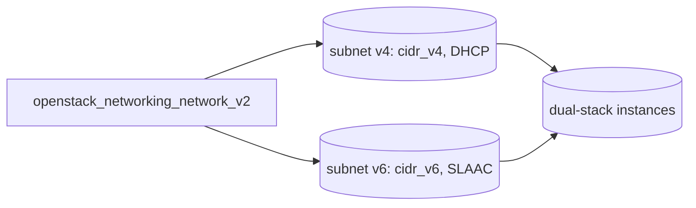

# Dual-Stack Network (IPv4 + IPv6 SLAAC)

Create one network carrying both an IPv4 subnet (with DHCP) and an IPv6 subnet
(with SLAAC for addressing and router advertisements). Instances on this network
come up dual-stack, getting a DHCP IPv4 lease and auto-configuring an IPv6
address from the advertised prefix.

> **Primary search phrase:** Terraform OpenStack IPv6 subnet SLAAC example

## Architecture



A single network hosts two subnets — IPv4 via DHCP and IPv6 via SLAAC — so
attached instances are dual-stack.

## Usage

```bash
export OS_CLOUD=openstack          # or set `cloud` in terraform.tfvars
cp terraform.tfvars.example terraform.tfvars
terraform init
terraform plan
terraform apply
```

## Inputs

| Name | Description | Type | Default |
|------|-------------|------|---------|
| `cloud` | clouds.yaml entry to use | `string` | `"openstack"` |
| `network_name` | Name of the dual-stack network | `string` | `"dualstack"` |
| `cidr_v4` | IPv4 CIDR for the IPv4 subnet | `string` | `"10.60.0.0/24"` |
| `cidr_v6` | IPv6 CIDR for the SLAAC subnet | `string` | `"fd00:60::/64"` |

## Outputs

| Name | Description |
|------|-------------|
| `network_id` | UUID of the dual-stack network |
| `subnet_v4_id` | UUID of the IPv4 subnet |
| `subnet_v6_id` | UUID of the IPv6 subnet |

## Best practices

- **Why this approach:** Putting both subnets on one network gives instances
  native dual-stack without separate NICs. SLAAC keeps IPv6 addressing
  stateless, so no DHCPv6 server state to manage.
- **Common mistakes:** Mismatching `ipv6_address_mode` and `ipv6_ra_mode`
  (use the same mode — `slaac` here — unless you specifically need DHCPv6);
  using a non-`/64` IPv6 prefix (SLAAC requires `/64`); expecting a port's
  IPv6 address before the guest has processed the router advertisement.
- **Scaling considerations:** A `/64` holds an enormous address space, so SLAAC
  scales trivially; plan your ULA/GUA prefix layout up front to avoid renumbering.
- **Performance considerations:** SLAAC offloads addressing to the guest and the
  L3 agent's RA, avoiding DHCPv6 round-trips; no measurable data-plane impact.
- **Cost considerations:** Subnets are free. Using IPv6 (or ULA + NAT64) can
  reduce demand for scarce, billable IPv4 floating IPs.

## Security considerations

- IPv6 is reachable end-to-end by design — do **not** assume NAT hides hosts.
  Apply security groups with explicit IPv6 (`ethertype = "IPv6"`) rules.
- The example uses a ULA prefix (`fd00:60::/64`); for internet-routable IPv6 use
  a provider-allocated GUA prefix and tighten ingress accordingly.
- Ensure your IPv4 and IPv6 security policies are equivalent — a port left open
  on IPv6 but closed on IPv4 is a common oversight.

## Troubleshooting

| Symptom | Likely cause | Fix |
|---------|--------------|-----|
| No IPv6 address in guest | Guest not accepting RAs, or wrong `ipv6_ra_mode` | Enable `accept_ra` in the guest; confirm `ipv6_ra_mode = "slaac"` |
| `Invalid input for ip_version` / prefix | IPv6 CIDR not a `/64` for SLAAC | Use a `/64` prefix for `cidr_v6` |
| Port binding failed | No agent/host can bind the port for this network | Check `openstack network agent list` and ML2 config |
| `Quota exceeded` | Network/subnet quota hit | Raise quota or delete unused subnets ([quotas examples](../../quotas/)) |
| IPv6 not routed off-segment | No router/RA for the prefix | Attach a router; for GUA ensure upstream routing of the prefix |
| Provider auth errors | Bad/missing `clouds.yaml` or `OS_CLOUD` | See [provider configuration](../../../docs/provider-configuration.md) |

## Cleanup

```bash
terraform destroy
```

## Further reading

- [Provider configuration & clouds.yaml](../../../docs/provider-configuration.md)
- [OpenStack provider — networking subnet docs](https://registry.terraform.io/providers/terraform-provider-openstack/openstack/latest/docs/resources/networking_subnet_v2)
- [Advanced OpenStack guides on DevOps AI ToolKit](https://devopsaitoolkit.com/blog/)
