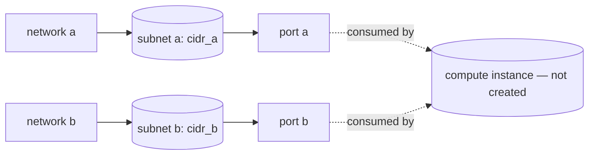

# Multiple NICs (Two Ports on Two Subnets)

Provision two networks, each with its own subnet, and a port on each. An instance
that attaches both ports comes up with two NICs — the standard pattern for
front-end/back-end separation, management vs. data planes, or appliances that
bridge two segments.

> **Primary search phrase:** Terraform OpenStack instance multiple network interfaces example

## Architecture



Two isolated network/subnet pairs each provide one port; an instance would
attach both to get two NICs.

## Usage

```bash
export OS_CLOUD=openstack          # or set `cloud` in terraform.tfvars
cp terraform.tfvars.example terraform.tfvars
terraform init
terraform plan
terraform apply
```

This example stops at the ports. To give an instance both NICs, add an
`openstack_compute_instance_v2` with two `network` blocks referencing the ports:

```hcl
resource "openstack_compute_instance_v2" "vm" {
  name        = "multinic-vm"
  flavor_name = "m1.small"
  image_name  = "ubuntu-22.04"

  network {
    port = openstack_networking_port_v2.a.id
  }

  network {
    port = openstack_networking_port_v2.b.id
  }
}
```

Order matters: the first `network` block becomes `eth0`, the second `eth1`.

## Inputs

| Name | Description | Type | Default |
|------|-------------|------|---------|
| `cloud` | clouds.yaml entry to use | `string` | `"openstack"` |
| `name_prefix` | Prefix for networks/subnets/ports | `string` | `"multinic"` |
| `cidr_a` | CIDR for the first subnet (NIC A) | `string` | `"10.50.1.0/24"` |
| `cidr_b` | CIDR for the second subnet (NIC B) | `string` | `"10.50.2.0/24"` |

## Outputs

| Name | Description |
|------|-------------|
| `port_a_id` | UUID of port A (first NIC) |
| `port_b_id` | UUID of port B (second NIC) |
| `port_a_ip` | First fixed IP assigned to port A |
| `port_b_ip` | First fixed IP assigned to port B |

## Best practices

- **Why this approach:** Pre-creating ports (rather than letting Nova auto-create
  them) lets you pin IPs, attach specific security groups, and keep stable NIC
  identities across instance rebuilds.
- **Common mistakes:** Overlapping `cidr_a` and `cidr_b` (keep them distinct);
  assuming the guest auto-configures `eth1` — most images only DHCP `eth0`, so
  you must bring up the second NIC in the guest (netplan/cloud-init).
- **Scaling considerations:** For many NICs or repeated patterns, drive the ports
  with `for_each` over a map of subnets instead of duplicating blocks.
- **Performance considerations:** Two NICs means two virtio queues and two
  security-group pipelines; for east-west heavy appliances consider trunk ports
  or SR-IOV instead of many separate NICs.
- **Cost considerations:** Ports and networks are free, but each extra NIC can
  consume a floating IP and quota — clean up unused ones.

## Security considerations

- Each port can carry its own security groups; apply least-privilege rules per
  segment (e.g. management NIC locked to a bastion, data NIC scoped to peers).
- Multi-homed VMs can become routers between segments — disable IP forwarding in
  the guest unless that is the intent.
- Keep management and data planes on separate subnets (as done here) so a
  compromise on one plane does not automatically expose the other.

## Troubleshooting

| Symptom | Likely cause | Fix |
|---------|--------------|-----|
| Second NIC has no IP in the guest | Image only configures `eth0` | Configure `eth1` via cloud-init/netplan inside the guest |
| Port binding failed | No host/agent can bind a port to its network | Check `openstack network agent list`; verify ML2 mechanism for both networks |
| `Quota exceeded` | Network/subnet/port quota hit | Raise quota or delete unused resources ([quotas examples](../../quotas/)) |
| `Invalid CIDR` / overlap | `cidr_a` and `cidr_b` overlap or are malformed | Use distinct, valid CIDRs |
| NICs swapped (eth0/eth1) | `network` block order in the instance | Reorder the `network` blocks; first = eth0 |
| Provider auth errors | Bad/missing `clouds.yaml` or `OS_CLOUD` | See [provider configuration](../../../docs/provider-configuration.md) |

## Cleanup

```bash
terraform destroy
```

## Further reading

- [Provider configuration & clouds.yaml](../../../docs/provider-configuration.md)
- [OpenStack provider — networking port docs](https://registry.terraform.io/providers/terraform-provider-openstack/openstack/latest/docs/resources/networking_port_v2)
- [Advanced OpenStack guides on DevOps AI ToolKit](https://devopsaitoolkit.com/blog/)
