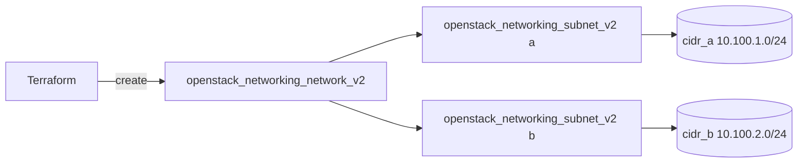

# Multiple Subnets on One Network

Create a single OpenStack tenant network that carries two independent IPv4
subnets in different CIDRs. Multiple subnets on one network let you segment
address ranges (for example application vs. data tiers) while keeping them on the
same L2 broadcast domain.

> **Primary search phrase:** Terraform OpenStack multiple subnets one network example

## Architecture



One network owns both subnets; each subnet has its own CIDR, DHCP allocation
pool, and DNS nameservers.

## Usage

```bash
export OS_CLOUD=openstack          # or set `cloud` in terraform.tfvars
cp terraform.tfvars.example terraform.tfvars
terraform init
terraform plan
terraform apply
```

## Inputs

| Name | Description | Type | Default |
|------|-------------|------|---------|
| `cloud` | clouds.yaml entry to use | `string` | `"openstack"` |
| `network_name` | Tenant network to create | `string` | `"multi-subnet-net"` |
| `subnet_a_name` | Name of the first subnet | `string` | `"subnet-a"` |
| `subnet_b_name` | Name of the second subnet | `string` | `"subnet-b"` |
| `cidr_a` | CIDR range for the first subnet | `string` | `"10.100.1.0/24"` |
| `cidr_b` | CIDR range for the second subnet | `string` | `"10.100.2.0/24"` |
| `dns_nameservers` | DNS nameservers for both subnets | `list(string)` | `["1.1.1.1", "8.8.8.8"]` |

## Outputs

| Name | Description |
|------|-------------|
| `network_id` | UUID of the tenant network |
| `subnet_a_id` | UUID of the first subnet |
| `subnet_b_id` | UUID of the second subnet |
| `subnet_cidrs` | CIDR ranges of the two subnets |

## Best practices

- **Why this approach:** Grouping related subnets under one network keeps them in
  a shared L2 domain so ports can move between ranges without a new network,
  while non-overlapping CIDRs keep routing and security rules unambiguous.
- **Common mistakes:** Overlapping `cidr_a`/`cidr_b` ranges; omitting an
  `allocation_pool` and letting DHCP hand out addresses you reserved for gateways
  or static hosts; assuming separate subnets are isolated (they share L2 — use
  security groups for isolation).
- **Scaling considerations:** For many subnets, drive them with `for_each` over a
  map of CIDRs instead of copy-pasting blocks; watch the per-project subnet quota.
- **Performance considerations:** Subnets on the same network share the DHCP and
  L2 agents; very large allocation pools increase DHCP lease churn, so size pools
  to actual need.
- **Cost considerations:** Networks and subnets are usually free, but each
  consumes quota and each attached port may carry cost — tag everything (done
  here) and `terraform destroy` unused ranges.

## Security considerations

- Subnets on the same network are **not** isolated from each other at L2; enforce
  separation with security groups (see [`security/security-group`](../security-group/)).
- Pin DNS nameservers explicitly (done here) so instances do not fall back to
  untrusted or unexpected resolvers.
- Reserve gateway and infrastructure addresses outside the DHCP allocation pool to
  avoid collisions with statically assigned hosts.

## Troubleshooting

| Symptom | Likely cause | Fix |
|---------|--------------|-----|
| `Invalid input for cidr` / overlap error | `cidr_a` and `cidr_b` overlap or are malformed | Use distinct, valid non-overlapping CIDRs |
| `Port binding failed` / instance gets no IP | DHCP agent down, or allocation pool exhausted | Check `openstack network agent list`; widen the allocation pool |
| `Quota exceeded` | Project subnet/network quota hit | Raise quota or destroy unused subnets ([quotas examples](../../quotas/)) |
| Instances resolve DNS slowly or not at all | Wrong/unreachable `dns_nameservers` | Set reachable resolvers; verify egress to them |
| `allocation_pool` outside subnet CIDR | Start/end addresses not within the subnet | Keep pool bounds inside the subnet CIDR (this example uses `cidrhost`) |
| Provider auth errors | Bad/missing `clouds.yaml` or `OS_CLOUD` | See [provider configuration](../../../docs/provider-configuration.md) |

## Cleanup

```bash
terraform destroy
```

## Further reading

- [Provider configuration & clouds.yaml](../../../docs/provider-configuration.md)
- [OpenStack provider — subnet docs](https://registry.terraform.io/providers/terraform-provider-openstack/openstack/latest/docs/resources/networking_subnet_v2)
- [Advanced OpenStack guides on DevOps AI ToolKit](https://devopsaitoolkit.com/blog/)
