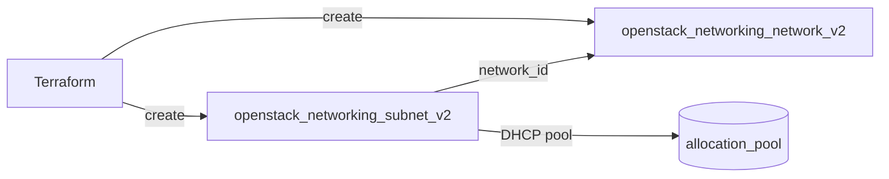

# Network and Subnet

Create a self-service (tenant) OpenStack network and an IPv4 subnet with DHCP
enabled. This is the foundational Neutron building block that compute, router,
and security examples attach to.

> **Primary search phrase:** Terraform OpenStack network and subnet example

## Architecture



The subnet references the network by `network_id` and hands out addresses from a
single DHCP allocation pool.

## Usage

```bash
export OS_CLOUD=openstack          # or set `cloud` in terraform.tfvars
cp terraform.tfvars.example terraform.tfvars
terraform init
terraform plan
terraform apply
```

## Inputs

| Name | Description | Type | Default |
|------|-------------|------|---------|
| `cloud` | clouds.yaml entry to use | `string` | `"openstack"` |
| `network_name` | Name of the tenant network | `string` | `"example-network"` |
| `subnet_name` | Name of the subnet | `string` | `"example-subnet"` |
| `cidr` | CIDR range for the subnet | `string` | `"10.10.0.0/24"` |
| `dns_nameservers` | DNS resolvers handed out via DHCP | `list(string)` | `["1.1.1.1", "8.8.8.8"]` |
| `allocation_start` | First address of the DHCP pool | `string` | `"10.10.0.10"` |
| `allocation_end` | Last address of the DHCP pool | `string` | `"10.10.0.200"` |

## Outputs

| Name | Description |
|------|-------------|
| `network_id` | UUID of the created network |
| `subnet_id` | UUID of the created subnet |
| `subnet_cidr` | CIDR range assigned to the subnet |

## Best practices

- **Why this approach:** Splitting the network and subnet into separate resources
  mirrors Neutron's own model and lets you add more subnets, routers, or ports
  later without rebuilding the network. Naming by string keeps configs portable
  with no hard-coded UUIDs.
- **Common mistakes:** Forgetting `enable_dhcp` (instances then never get an
  address); making the allocation pool span the gateway address; choosing a CIDR
  that overlaps an existing tenant network so the router interface later clashes.
- **Scaling considerations:** Keep the CIDR large enough for growth (a `/24` is
  254 usable hosts); reserve space outside the pool for static ports and VIPs.
- **Performance considerations:** A single subnet per network keeps the DHCP
  agent simple; very large flat subnets increase broadcast/ARP overhead, so
  prefer several smaller networks behind a router for big estates.
- **Cost considerations:** Networks and subnets are free, but each carries quota.
  Tag everything (done here) and `terraform destroy` unused networks so you do
  not exhaust the per-project network/subnet quota.

## Security considerations

- Subnets are reachable by any port on the same network; isolate tiers with
  separate networks plus security groups rather than one flat subnet.
- DNS resolvers are pushed to every instance — point them at trusted resolvers
  you control where possible instead of public defaults.
- A network with no router has no external path; keep sensitive subnets
  router-free unless egress is genuinely required.

## Troubleshooting

| Symptom | Likely cause | Fix |
|---------|--------------|-----|
| Instances boot but get no IP | `enable_dhcp` false or pool exhausted | Confirm `enable_dhcp = true`; widen the allocation pool |
| `Invalid input for allocation_pools` | Pool start/end outside the CIDR | Keep `allocation_start`/`allocation_end` inside `cidr` |
| Port binding failed | No DHCP/L2 agent on the host or agent down | `openstack network agent list`; restart the Neutron agent on the host |
| `Quota exceeded` | Project network/subnet quota hit | Raise quota or destroy unused networks ([quotas examples](../../quotas/)) |
| `Overlapping CIDR` on apply | Another subnet uses the same range | Pick a non-overlapping `cidr` |
| Provider auth errors | Bad/missing `clouds.yaml` or `OS_CLOUD` | See [provider configuration](../../../docs/provider-configuration.md) |

## Cleanup

```bash
terraform destroy
```

## Further reading

- [Provider configuration & clouds.yaml](../../../docs/provider-configuration.md)
- [OpenStack provider — subnet docs](https://registry.terraform.io/providers/terraform-provider-openstack/openstack/latest/docs/resources/networking_subnet_v2)
- [Advanced OpenStack guides on DevOps AI ToolKit](https://devopsaitoolkit.com/blog/)
