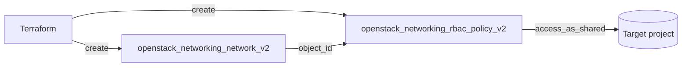

# Network RBAC (share a network with one project)

Create a Neutron network and share it with a single other project using an RBAC
policy (`action = "access_as_shared"`). RBAC sharing is the targeted alternative
to flipping `shared = true`, which would expose the network to **every** project
in the cloud.

> **Primary search phrase:** Terraform OpenStack network RBAC access_as_shared example

## Architecture



The network stays owned by your project; the RBAC policy grants exactly one
target project the right to attach to it.

## Usage

```bash
export OS_CLOUD=openstack          # or set `cloud` in terraform.tfvars
cp terraform.tfvars.example terraform.tfvars
terraform init
terraform plan
terraform apply
```

## Inputs

| Name | Description | Type | Default |
|------|-------------|------|---------|
| `cloud` | clouds.yaml entry to use | `string` | `"openstack"` |
| `network_name` | Name of the network to create and share | `string` | `"example-shared-network"` |
| `target_project_id` | Project ID to share with (looked up out-of-band, not hard-coded) | `string` | _(required)_ |

## Outputs

| Name | Description |
|------|-------------|
| `network_id` | UUID of the created network |
| `rbac_policy_id` | UUID of the RBAC policy sharing the network |

## Best practices

- **Why this approach:** RBAC scopes sharing to specific projects. `shared = true`
  is all-or-nothing and visible cloud-wide; an `access_as_shared` policy grants
  one named project access and can be revoked by deleting just that policy.
- **Common mistakes:** Hard-coding the target tenant UUID in code (here it is a
  variable, resolved per environment); confusing `access_as_shared` (attach to
  the network) with `access_as_external` (use it as an external/gateway network);
  expecting the target project to _see_ the network before the policy applies.
- **Scaling considerations:** To share with several projects, create one RBAC
  policy per project — drive them with `for_each` over a set of project IDs rather
  than reaching for `shared = true`.
- **Performance considerations:** RBAC policies are control-plane metadata only;
  they add no data-path overhead. Many policies on one network are fine.
- **Cost considerations:** The policy itself is free, but a shared network may now
  carry ports/instances owned by other projects — account for that quota and
  spend when sizing the owning project.

## Security considerations

- Share deliberately: every `access_as_shared` policy widens who can attach
  workloads to your network. Grant the minimum set of projects and review them
  periodically.
- `target_project_id` is supplied as a variable, never committed as a hard-coded
  UUID, so the same code is safe to share across environments.
- Deleting the RBAC policy revokes access, but ports the target project already
  created may persist — audit attached ports before relying on revocation.

## Troubleshooting

| Symptom | Likely cause | Fix |
|---------|--------------|-----|
| `Port binding failed` in the target project | Target attached before the RBAC policy propagated, or wrong network | Confirm the policy exists (`openstack network rbac list`) and the target uses the shared network's ID |
| `Quota exceeded` | RBAC policy quota or the target project's port/network quota hit | Raise quota or remove unused policies ([quotas examples](../../quotas/)) |
| `Object ... not found` on apply | Network not yet created or wrong `object_id` | Ensure the network resource is created first (dependency is implicit here) |
| Target project cannot see the network | Wrong `target_project_id` | Re-check with `openstack project show <name> -f value -c id` |
| `Cannot create resource ... access_as_shared` denied | Caller lacks permission to create RBAC policies | Use a role/policy that permits RBAC management |
| Provider auth errors | Bad/missing `clouds.yaml` or `OS_CLOUD` | See [provider configuration](../../../docs/provider-configuration.md) |

## Cleanup

```bash
terraform destroy
```

## Further reading

- [Provider configuration & clouds.yaml](../../../docs/provider-configuration.md)
- [OpenStack provider — networking RBAC policy docs](https://registry.terraform.io/providers/terraform-provider-openstack/openstack/latest/docs/resources/networking_rbac_policy_v2)
- [Advanced OpenStack guides on DevOps AI ToolKit](https://devopsaitoolkit.com/blog/)
