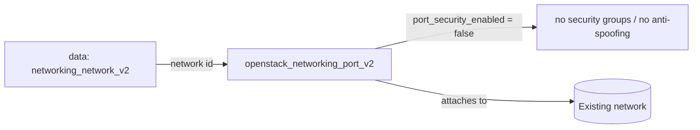

# Port with Port Security Disabled

Create a Neutron port with **port security turned off** on an existing network.
Disabling port security removes both security-group enforcement and Neutron's
anti-spoofing (MAC/IP binding) — useful for NFV and virtual-appliance VMs that
do their own filtering, and dangerous for anything else.

> **Primary search phrase:** Terraform OpenStack port security disabled example

## Architecture



The network is looked up by name, then a port is created with
`port_security_enabled = false` and `no_security_groups = true`.

## Usage

```bash
export OS_CLOUD=openstack          # or set `cloud` in terraform.tfvars
cp terraform.tfvars.example terraform.tfvars
terraform init
terraform plan
terraform apply
```

## Inputs

| Name | Description | Type | Default |
|------|-------------|------|---------|
| `cloud` | clouds.yaml entry to use | `string` | `"openstack"` |
| `network_name` | Existing network to attach the port to | `string` | `"private"` |
| `port_name` | Name of the port to create | `string` | `"example-no-port-security"` |

## Outputs

| Name | Description |
|------|-------------|
| `port_id` | UUID of the created port |
| `port_mac_address` | MAC address assigned to the port |
| `all_fixed_ips` | All fixed IP addresses assigned to the port |

## Best practices

- **Why this approach:** Some workloads (firewalls, routers, load balancers, SR-IOV
  data-plane VMs) legitimately need to forward traffic for IPs/MACs they don't
  own — exactly what anti-spoofing blocks. Disabling port security is the
  supported way to allow that.
- **Common mistakes:** Setting `port_security_enabled = false` while still
  referencing security groups (the API rejects it — you must also set
  `no_security_groups = true`); using this as a shortcut to "make networking
  work" instead of fixing security-group rules.
- **Scaling considerations:** Treat these ports as a special, audited class.
  Tag them (done here) so you can inventory every port without security and
  review them regularly.
- **Performance considerations:** Skipping security-group processing slightly
  reduces per-packet overhead on the hypervisor — a real but minor reason some
  high-throughput NFV designs use it. Prefer `allowed_address_pairs` when you
  only need a few extra IPs/MACs rather than disabling security entirely.
- **Cost considerations:** No direct cost, but a compromised unfiltered VM can
  generate large amounts of egress traffic — which can cost you.

## Security considerations

> **STRONG WARNING — read before using.**
> A port with port security disabled has **no security groups and no
> anti-spoofing** of any kind. The attached VM can send and receive traffic
> with **any** source/destination IP or MAC address, and Neutron will not drop
> a single packet on its behalf.
>
> - Use this **only** for NFV components, virtual appliances, firewalls, or
>   router VMs that perform their own packet filtering.
> - **Everything else is fully exposed** — there is no network-layer protection
>   left, so a single compromise can spoof and pivot freely on the segment.
> - **Never** use this on internet-facing ports or on any untrusted, multi-tenant,
>   or general-purpose workload.
> - If you only need a couple of extra IPs/MACs (e.g. a VIP), use
>   `allowed_address_pairs` and keep port security **on** instead.
> - Audit every port with `port_security_enabled = false` regularly.

## Troubleshooting

| Symptom | Likely cause | Fix |
|---------|--------------|-----|
| `Cannot disable port security with security groups` | `no_security_groups` not set, or groups still referenced | Set `no_security_groups = true` and remove `security_group_ids` (done here) |
| `Network <name> not found` | Wrong `network_name` or no project access | `openstack network list`; fix `network_name` |
| Port binding failed | No host/agent can bind the port (e.g. missing ML2 mechanism) | Check `openstack network agent list`; verify the VM lands on a host with the right agent |
| `Quota exceeded` | Project port quota hit | Raise quota or delete unused ports ([quotas examples](../../quotas/)) |
| Traffic still dropped | Filtering happening elsewhere (router/firewall/VM) | Port has no filtering; check upstream router rules and the guest firewall |
| Provider auth errors | Bad/missing `clouds.yaml` or `OS_CLOUD` | See [provider configuration](../../../docs/provider-configuration.md) |

## Cleanup

```bash
terraform destroy
```

## Further reading

- [Provider configuration & clouds.yaml](../../../docs/provider-configuration.md)
- [OpenStack provider — networking port docs](https://registry.terraform.io/providers/terraform-provider-openstack/openstack/latest/docs/resources/networking_port_v2)
- [Advanced OpenStack guides on DevOps AI ToolKit](https://devopsaitoolkit.com/blog/)
