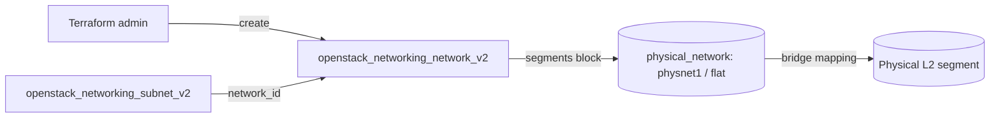

# Provider Network (Admin Only)

Create a flat provider network that maps directly onto a physical L2 segment,
plus a subnet on it. Provider networks bridge instances straight onto an
existing physical network instead of an overlay.

> **⚠️ ADMIN ONLY:** Creating a network with a `segments` block requires the
> **admin** role. It also only works on a deployment where the named
> `physical_network` (default `physnet1`) has a matching bridge mapping
> configured on the Neutron/compute hosts. A regular project token will be
> rejected, and an unmapped `physical_network` will fail at port-binding time.

> **Primary search phrase:** Terraform OpenStack provider network flat example

## Architecture



The `segments` block ties the network to a physical bridge mapping; the subnet
hands out addresses on that flat segment.

## Usage

```bash
export OS_CLOUD=openstack          # or set `cloud` in terraform.tfvars
cp terraform.tfvars.example terraform.tfvars
terraform init
terraform plan
terraform apply
```

## Inputs

| Name | Description | Type | Default |
|------|-------------|------|---------|
| `cloud` | clouds.yaml entry to use (admin credentials) | `string` | `"openstack"` |
| `network_name` | Name of the provider network | `string` | `"example-provider-network"` |
| `subnet_name` | Name of the subnet | `string` | `"example-provider-subnet"` |
| `cidr` | CIDR range for the subnet | `string` | `"10.30.0.0/24"` |
| `network_type` | Provider segment network type | `string` | `"flat"` |
| `physical_network` | Host bridge mapping name | `string` | `"physnet1"` |
| `segmentation_id` | Segment ID (ignored for flat networks) | `number` | `0` |

## Outputs

| Name | Description |
|------|-------------|
| `network_id` | UUID of the created provider network |
| `subnet_id` | UUID of the created subnet |

## Best practices

- **Why this approach:** A flat provider network puts instances directly on a
  physical segment — useful for management, storage, or legacy networks that must
  share an existing L2 domain without overlay encapsulation.
- **Common mistakes:** Running this as a non-admin user; naming a
  `physical_network` that has no bridge mapping on the hosts; setting a
  `segmentation_id` on a flat network (it is ignored, use `vlan` for tagging).
- **Scaling considerations:** Flat networks share one broadcast domain per
  physical segment — one flat network per `physnet`; use VLAN segments to carve
  many networks out of the same NICs (see [`vlan-network`](../vlan-network/)).
- **Performance considerations:** No overlay encapsulation means lower CPU/MTU
  overhead than VXLAN/GRE, but no tenant isolation — plan addressing carefully.
- **Cost considerations:** Provider networks themselves are free; the real cost
  is physical NIC/switch capacity. Tag everything (done here) and destroy unused
  segments to keep quota and bridge mappings tidy.

## Security considerations

- A flat provider network has **no tenant isolation** — every port shares the
  physical segment. Treat it as a trusted/management network and apply strict
  security groups.
- Only admins should create provider networks; lock this down with RBAC so
  tenants cannot bridge onto physical infrastructure.
- Avoid exposing sensitive subnets on a shared flat segment; use VLAN or overlay
  networks for project isolation.

## Troubleshooting

| Symptom | Likely cause | Fix |
|---------|--------------|-----|
| `Forbidden` / policy error on apply | Token lacks the admin role | Use admin credentials in `clouds.yaml`; provider segments are admin-only |
| Port binding failed | `physical_network` has no host bridge mapping | Map `physnet1` in `bridge_mappings`/`flat_networks` on the hosts and restart the agent |
| `Flat network with physical_network already exists` | Only one flat network per physnet allowed | Reuse the existing network or switch to a VLAN segment |
| `segmentation_id is prohibited for flat` | Non-zero ID on a flat type | Leave `segmentation_id = 0` for flat, or set `network_type = "vlan"` |
| `Quota exceeded` | Project network/subnet quota hit | Raise quota or destroy unused networks ([quotas examples](../../quotas/)) |
| Provider auth errors | Bad/missing `clouds.yaml` or `OS_CLOUD` | See [provider configuration](../../../docs/provider-configuration.md) |

## Cleanup

```bash
terraform destroy
```

## Further reading

- [Provider configuration & clouds.yaml](../../../docs/provider-configuration.md)
- [OpenStack provider — network docs](https://registry.terraform.io/providers/terraform-provider-openstack/openstack/latest/docs/resources/networking_network_v2)
- [Advanced OpenStack guides on DevOps AI ToolKit](https://devopsaitoolkit.com/blog/)
