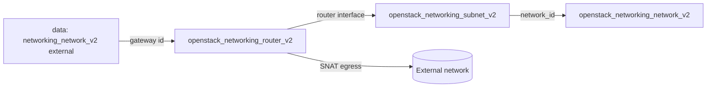

# Router with External Gateway

Create a tenant network and subnet, then a Neutron router that uses an existing
external (provider) network as its gateway with SNAT enabled, and attach the
subnet to the router. This gives instances on the tenant network outbound
internet access.

> **Primary search phrase:** Terraform OpenStack router external gateway example

## Architecture



The router looks up the external network by name for its gateway, then a router
interface stitches the tenant subnet onto the router for north-south traffic.

## Usage

```bash
export OS_CLOUD=openstack          # or set `cloud` in terraform.tfvars
cp terraform.tfvars.example terraform.tfvars
terraform init
terraform plan
terraform apply
```

## Inputs

| Name | Description | Type | Default |
|------|-------------|------|---------|
| `cloud` | clouds.yaml entry to use | `string` | `"openstack"` |
| `external_network_name` | Existing external network used as the gateway | `string` | `"public"` |
| `router_name` | Name of the router | `string` | `"example-router"` |
| `network_name` | Name of the tenant network | `string` | `"example-network"` |
| `subnet_name` | Name of the tenant subnet | `string` | `"example-subnet"` |
| `cidr` | CIDR range for the tenant subnet | `string` | `"10.20.0.0/24"` |

## Outputs

| Name | Description |
|------|-------------|
| `router_id` | UUID of the created router |
| `external_network_id` | UUID of the external network used as the gateway |
| `router_interface_id` | UUID of the router interface |
| `subnet_id` | UUID of the tenant subnet |

## Best practices

- **Why this approach:** Looking up the external network by name keeps the
  example portable — no UUIDs. Modelling the interface as its own resource lets
  you attach several subnets to one router and have Terraform manage each link.
- **Common mistakes:** Pointing `external_network_name` at a tenant network
  (the data source needs `external = true`); attaching the subnet via the router
  `external_fixed_ip` instead of a router interface; forgetting that floating IPs
  also require this router to exist.
- **Scaling considerations:** One router can front many subnets; for HA, deploy
  L3-HA or distributed (DVR) routers at the cloud level rather than per example.
- **Performance considerations:** All north-south traffic for centralized
  routers passes through the network node — watch its bandwidth, or use DVR for
  east-west and floating-IP offload.
- **Cost considerations:** Routers consume quota and, on public clouds, may bill
  per gateway/floating IP. Tag everything (done here) and destroy idle routers.

## Security considerations

- SNAT lets every instance on the subnet egress to the internet; if you only
  need inbound to a few hosts, prefer floating IPs and consider `enable_snat`
  trade-offs for your security posture.
- The router does not filter traffic — apply security groups on ports/instances
  for ingress and egress control.
- Restrict who can create routers on the external network via Neutron RBAC and
  project quotas to avoid uncontrolled egress paths.

## Troubleshooting

| Symptom | Likely cause | Fix |
|---------|--------------|-----|
| `External network <name> not found` | Wrong name or missing `external = true` | `openstack network list --external`; fix `external_network_name` |
| Instances cannot reach internet | Subnet not attached or no default route | Confirm the router interface applied; check subnet gateway IP |
| Port binding failed | No L3/L2 agent on the network node or agent down | `openstack network agent list`; restart the Neutron L3 agent |
| `Quota exceeded` | Project router/port quota hit | Raise quota or destroy unused routers ([quotas examples](../../quotas/)) |
| `Router already has a port on subnet` | Subnet already attached to a router | Detach the existing interface or reuse that router |
| Provider auth errors | Bad/missing `clouds.yaml` or `OS_CLOUD` | See [provider configuration](../../../docs/provider-configuration.md) |

## Cleanup

```bash
terraform destroy
```

## Further reading

- [Provider configuration & clouds.yaml](../../../docs/provider-configuration.md)
- [OpenStack provider — router docs](https://registry.terraform.io/providers/terraform-provider-openstack/openstack/latest/docs/resources/networking_router_v2)
- [Advanced OpenStack guides on DevOps AI ToolKit](https://devopsaitoolkit.com/blog/)
