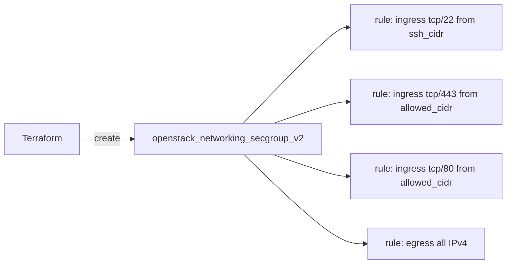

# Security Group with Rules

Create a reusable, least-privilege OpenStack security group for a web server:
SSH only from a trusted admin range, HTTP/HTTPS from your client range, and an
explicit "allow all" egress rule. This is the building block you attach to ports
and instances instead of relying on the permissive `default` group.

> **Primary search phrase:** Terraform OpenStack security group rules example

## Architecture



One security group holds four rules: scoped SSH ingress, HTTP/HTTPS ingress, and
unrestricted IPv4 egress.

## Usage

```bash
export OS_CLOUD=openstack          # or set `cloud` in terraform.tfvars
cp terraform.tfvars.example terraform.tfvars
terraform init
terraform plan
terraform apply
```

## Inputs

| Name | Description | Type | Default |
|------|-------------|------|---------|
| `cloud` | clouds.yaml entry to use | `string` | `"openstack"` |
| `secgroup_name` | Name of the security group | `string` | `"example-web-sg"` |
| `ssh_cidr` | CIDR allowed to reach SSH (tcp/22) | `string` | `"203.0.113.0/24"` |
| `allowed_cidr` | CIDR allowed to reach HTTP/HTTPS | `string` | `"0.0.0.0/0"` |

## Outputs

| Name | Description |
|------|-------------|
| `security_group_id` | UUID of the created security group |
| `security_group_name` | Name of the created security group |

## Best practices

- **Why this approach:** Defining a named group with explicit rules gives you
  least-privilege networking that is reviewable in code, instead of leaning on
  the permissive project `default` group.
- **Common mistakes:** Leaving `ssh_cidr` at `0.0.0.0/0` (exposes SSH to the
  internet); forgetting that removing all egress rules blocks outbound traffic;
  attaching the group but never opening the port your app actually listens on.
- **Scaling considerations:** Reuse one group across many instances rather than
  per-instance groups; for shared rule sets across many groups consider
  `remote_group_id` so member traffic is allowed by membership, not by CIDR.
- **Performance considerations:** Neutron security groups are stateful by
  default, so return traffic is allowed automatically — keep rule counts modest
  to avoid large iptables/OVS flow tables on the hypervisors.
- **Cost considerations:** Security groups are free, but unused open ports are a
  liability — prune rules you no longer need.

## Security considerations

- Keep `ssh_cidr` as tight as possible — ideally a bastion host or VPN range,
  never `0.0.0.0/0`.
- Only open `allowed_cidr` to the world (`0.0.0.0/0`) for genuinely public
  HTTP/HTTPS; for internal services restrict it to the consuming subnets.
- Egress is open to all IPv4 here for convenience; in hardened environments,
  replace it with destination-scoped egress rules.
- Prefer TLS (443) and redirect HTTP (80) to HTTPS at the application layer.

## Troubleshooting

| Symptom | Likely cause | Fix |
|---------|--------------|-----|
| Can't SSH in | Your source IP is outside `ssh_cidr` | Widen `ssh_cidr` to your admin range (still scoped) |
| Web port unreachable | Group not attached, or wrong `allowed_cidr` | Attach the group to the port/instance; check the CIDR |
| Port binding failed | Port attached to a group on a different network/project | Ensure the port, group, and network share the same project |
| `Quota exceeded` | Project security-group or rule quota hit | Raise quota or delete unused groups ([quotas examples](../../quotas/)) |
| `Security group rule already exists` | Duplicate rule (same direction/proto/port/CIDR) | Remove the duplicate; Neutron rejects identical rules |
| Outbound traffic blocked | All egress rules removed | Keep at least one egress rule (provided here) |

## Cleanup

```bash
terraform destroy
```

## Further reading

- [Provider configuration & clouds.yaml](../../../docs/provider-configuration.md)
- [OpenStack provider — security group rule docs](https://registry.terraform.io/providers/terraform-provider-openstack/openstack/latest/docs/resources/networking_secgroup_rule_v2)
- [Advanced OpenStack guides on DevOps AI ToolKit](https://devopsaitoolkit.com/blog/)
