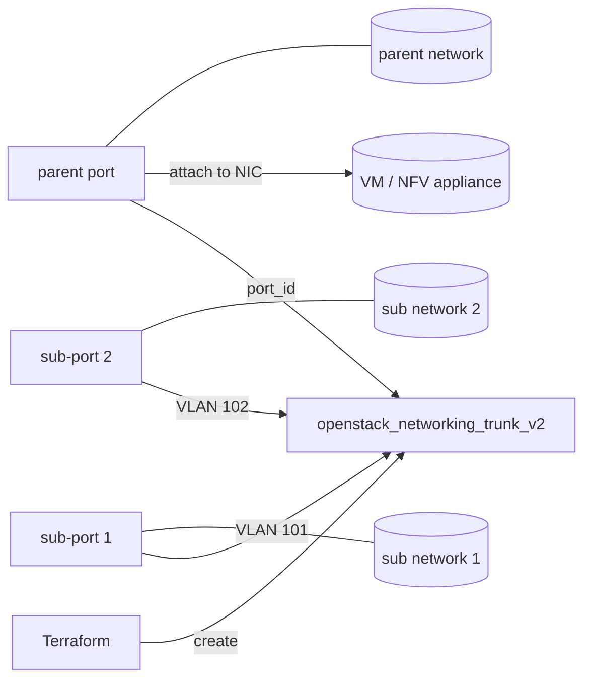

# Trunk Port (VLAN sub-ports on one NIC)

Provision an OpenStack Neutron trunk: a single **parent** port plus two
**sub-ports**, each mapping a separate network onto a VLAN ID. Attaching the
parent port to a VM lets that one NIC carry several networks at once — the
guest sees the parent network untagged and each sub-port on a tagged VLAN
sub-interface. This is the standard pattern for NFV appliances and container
hosts that need many networks without many virtual NICs.

> **Primary search phrase:** Terraform OpenStack trunk port VLAN sub-port example

## Architecture



One parent port carries the native traffic and two sub-ports ride distinct VLAN
IDs over the same trunk, all reaching the guest through a single NIC.

## Usage

```bash
export OS_CLOUD=openstack          # or set `cloud` in terraform.tfvars
cp terraform.tfvars.example terraform.tfvars
terraform init
terraform plan
terraform apply
```

## Inputs

| Name | Description | Type | Default |
|------|-------------|------|---------|
| `cloud` | clouds.yaml entry to use | `string` | `"openstack"` |
| `trunk_name` | Name of the trunk (also prefixes the networks/ports) | `string` | `"example-trunk"` |
| `parent_cidr` | CIDR for the parent network's subnet | `string` | `"10.70.0.0/24"` |
| `sub1_cidr` | CIDR for the first sub-port network's subnet | `string` | `"10.70.1.0/24"` |
| `sub2_cidr` | CIDR for the second sub-port network's subnet | `string` | `"10.70.2.0/24"` |
| `sub1_seg_id` | VLAN segmentation ID for the first sub-port | `number` | `101` |
| `sub2_seg_id` | VLAN segmentation ID for the second sub-port | `number` | `102` |

## Outputs

| Name | Description |
|------|-------------|
| `trunk_id` | UUID of the trunk |
| `parent_port_id` | UUID of the parent port (attach this to the VM NIC) |
| `sub_port_ids` | List of the two VLAN sub-port UUIDs |

## Best practices

- **Why this approach:** A trunk replaces "one NIC per network" with one NIC
  carrying many VLANs. That keeps VM definitions simple, avoids per-VM NIC
  limits, and lets you add/remove networks by editing sub-ports rather than
  re-plumbing the instance.
- **Common mistakes:** Reusing a `segmentation_id` across two sub-ports (each
  VLAN ID must be unique within the trunk); attaching a sub-port's port directly
  to a VM instead of the parent port; forgetting that the guest must be
  configured for 802.1Q tagging to see the sub-port networks.
- **Scaling considerations:** A trunk can hold many sub-ports — drive them from
  a `for_each` over a map of `{network, segmentation_id}` rather than hand-coding
  two blocks once you go past a handful.
- **Performance considerations:** Trunking adds VLAN tagging on the virtual
  switch; throughput is generally fine but `vnic_type` and the underlying ML2
  driver (OVS vs OVN) determine offload behaviour — match the driver to the
  workload for line-rate NFV.
- **Cost considerations:** Networks, subnets and ports each consume Neutron
  quota even when no VM is attached. Tag everything (done here) and
  `terraform destroy` unused trunks so idle ports do not exhaust quota.

## Security considerations

- A trunk merges several L2 domains onto one NIC; a compromised guest can reach
  every attached network. Only trunk networks that genuinely belong together and
  apply security groups per port.
- Sub-port VLAN IDs are guest-visible; treat them as configuration, not as a
  security boundary — isolation comes from Neutron, not from the tag value.
- Keep `admin_state_up = true` deliberate; bringing the parent port down drops
  all sub-port traffic at once, which can mask or amplify an incident.

## Troubleshooting

| Symptom | Likely cause | Fix |
|---------|--------------|-----|
| `Port binding failed` / parent port stuck `DOWN` | The ML2 driver/host does not support trunking, or the VM is not yet bound | Confirm the trunk extension is enabled and the compute host's mech driver supports VLAN trunks; attach the parent port to a VM to trigger binding |
| `Quota exceeded` | Project port/network/subnet quota hit (a trunk uses many) | Raise quota or destroy unused networks ([quotas examples](../../quotas/)) |
| `Trunk sub_port ... segmentation_id ... already in use` | Two sub-ports share a VLAN ID | Give each sub-port a unique `segmentation_id` |
| Guest only sees the parent network | Guest not configured for 802.1Q | Create tagged sub-interfaces (e.g. `eth0.101`) inside the instance |
| `Port ... is currently a subport` on attach | Tried to attach a sub-port directly to a VM | Attach the **parent** port; sub-ports reach the VM through the trunk |
| Provider auth errors | Bad/missing `clouds.yaml` or `OS_CLOUD` | See [provider configuration](../../../docs/provider-configuration.md) |

## Cleanup

```bash
terraform destroy
```

## Further reading

- [Provider configuration & clouds.yaml](../../../docs/provider-configuration.md)
- [OpenStack provider — networking trunk docs](https://registry.terraform.io/providers/terraform-provider-openstack/openstack/latest/docs/resources/networking_trunk_v2)
- [Advanced OpenStack guides on DevOps AI ToolKit](https://devopsaitoolkit.com/blog/)
