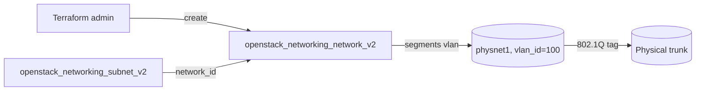

# VLAN Provider Network (Admin Only)

Create a VLAN-tagged provider network on a physical bridge mapping, plus a subnet
on it. VLAN segments carve many isolated networks out of the same physical NICs
using 802.1Q tags.

> **⚠️ ADMIN ONLY:** Creating a network with a `vlan` `segments` block requires
> the **admin** role, a matching `physical_network` (default `physnet1`) bridge
> mapping on the hosts, and a `vlan_id` inside the VLAN range permitted for that
> physnet. A regular project token is rejected; an out-of-range or unmapped tag
> fails at port-binding time.

> **Primary search phrase:** Terraform OpenStack VLAN provider network example

## Architecture



The `segments` block tags the network with a VLAN ID on the physical bridge
mapping; the subnet provides addressing on that isolated VLAN.

## Usage

```bash
export OS_CLOUD=openstack          # or set `cloud` in terraform.tfvars
cp terraform.tfvars.example terraform.tfvars
terraform init
terraform plan
terraform apply
```

## Inputs

| Name | Description | Type | Default |
|------|-------------|------|---------|
| `cloud` | clouds.yaml entry to use (admin credentials) | `string` | `"openstack"` |
| `network_name` | Name of the VLAN network | `string` | `"example-vlan-network"` |
| `subnet_name` | Name of the subnet | `string` | `"example-vlan-subnet"` |
| `cidr` | CIDR range for the subnet | `string` | `"10.40.0.0/24"` |
| `physical_network` | Host bridge mapping name | `string` | `"physnet1"` |
| `vlan_id` | 802.1Q VLAN tag (segmentation_id) | `number` | `100` |
| `dns_nameservers` | DNS resolvers handed out via DHCP | `list(string)` | `["1.1.1.1"]` |

## Outputs

| Name | Description |
|------|-------------|
| `network_id` | UUID of the created VLAN network |
| `subnet_id` | UUID of the created subnet |
| `vlan_id` | 802.1Q VLAN tag assigned to the network |

## Best practices

- **Why this approach:** VLAN segments let one set of physical NICs host many
  isolated networks, each on its own 802.1Q tag — the standard way to give
  tenants or tiers L2 isolation on shared provider infrastructure.
- **Common mistakes:** Picking a `vlan_id` outside the configured range for the
  physnet; running as a non-admin; forgetting to trunk the VLAN on the upstream
  physical switch so traffic is dropped beyond the hypervisor.
- **Scaling considerations:** Each physnet supports a finite VLAN range (often
  ~4094 minus reserved tags); plan tag allocation and avoid collisions across
  environments.
- **Performance considerations:** VLAN tagging adds negligible overhead versus
  VXLAN/GRE overlays (no encapsulation), so MTU stays standard — confirm the
  trunk ports allow your tag.
- **Cost considerations:** No direct charge for VLAN networks; cost is switch
  and NIC capacity. Tag everything (done here) and destroy unused VLANs to free
  scarce tags and quota.

## Security considerations

- VLAN isolation is only as strong as the upstream switch config; ensure trunk
  ports permit exactly the intended tags and nothing else.
- Restrict provider-network creation to admins via RBAC so tenants cannot claim
  arbitrary VLAN tags.
- Apply security groups on instance ports — VLAN separation is L2 isolation, not
  a stateful firewall.

## Troubleshooting

| Symptom | Likely cause | Fix |
|---------|--------------|-----|
| `Forbidden` / policy error on apply | Token lacks the admin role | Use admin credentials; VLAN provider segments are admin-only |
| `Invalid input for segmentation_id` | `vlan_id` outside the allowed range | Set `vlan_id` within the physnet's configured VLAN range |
| Port binding failed | `physical_network` unmapped or VLAN not trunked | Map `physnet1` and trunk the VLAN on the switch; restart the agent |
| Instances on VLAN cannot talk | Upstream switch not passing the tag | Configure the trunk port to allow `vlan_id` |
| `Quota exceeded` | Project network/subnet quota hit | Raise quota or destroy unused networks ([quotas examples](../../quotas/)) |
| Provider auth errors | Bad/missing `clouds.yaml` or `OS_CLOUD` | See [provider configuration](../../../docs/provider-configuration.md) |

## Cleanup

```bash
terraform destroy
```

## Further reading

- [Provider configuration & clouds.yaml](../../../docs/provider-configuration.md)
- [OpenStack provider — network docs](https://registry.terraform.io/providers/terraform-provider-openstack/openstack/latest/docs/resources/networking_network_v2)
- [Advanced OpenStack guides on DevOps AI ToolKit](https://devopsaitoolkit.com/blog/)
