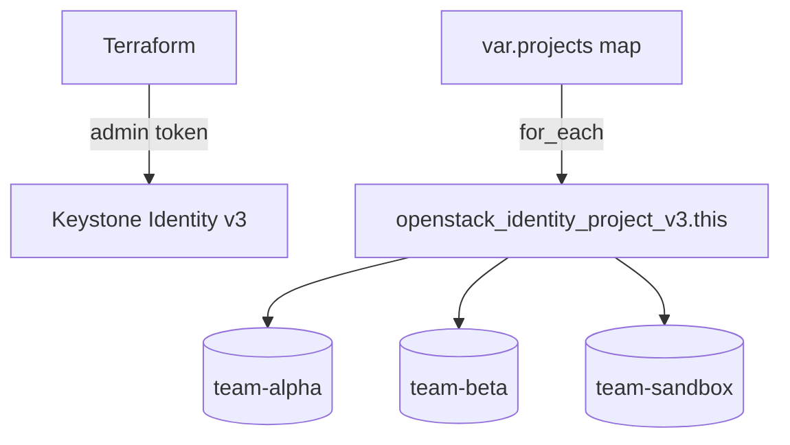

# Terraform OpenStack Multi-Project Bootstrap

> **Primary search phrase:** Terraform OpenStack multi-project bootstrap with for_each

Bootstrap many Keystone projects (tenants) at once from a single map variable
using `for_each`. This is the pattern for standing up per-team or per-environment
projects consistently, where adding a new team is a one-line change to the map.

## Architecture



## Usage

```bash
export OS_CLOUD=openstack
cp terraform.tfvars.example terraform.tfvars
# edit terraform.tfvars to define your projects map

terraform init
terraform plan
terraform apply
```

## Inputs

| Name      | Description                                                                | Type                                                                  | Default                                  |
| --------- | ------------------------------------------------------------------------- | --------------------------------------------------------------------- | ---------------------------------------- |
| cloud     | Name of the cloud entry in clouds.yaml to use.                           | `string`                                                              | `"openstack"`                            |
| domain_id | Domain ID applied to all projects (empty uses token default domain).    | `string`                                                              | `""`                                     |
| projects  | Map of project name => `{ description, enabled, tags }`.                 | `map(object({ description = string, enabled = bool, tags = list(string) }))` | 3 sample projects (alpha/beta/sandbox) |

## Outputs

| Name          | Description                            |
| ------------- | -------------------------------------- |
| project_ids   | Map of project name => generated ID.  |
| project_names | List of bootstrapped project names.   |

## Best practices

- Use the map key as the project name so resource addresses stay stable; renaming
  a key recreates that project, so treat keys as immutable identifiers.
- Drive the map from a single source of truth (e.g. a teams list) so onboarding a
  team is a one-line addition.
- Apply consistent `key:value` tags across every entry for fleet-wide filtering.
- Set `enabled = false` to pre-create a project without activating it yet.
- Keep this state separate from workload state so a project rename never cascades
  into instance/network rebuilds.

## Security considerations

- `openstack_identity_project_v3` is **admin-scoped**: bootstrapping projects
  requires a **cloud-admin or domain-admin** role. A non-admin token returns
  `403 Forbidden`.
- Bulk creation amplifies blast radius — review the plan carefully before apply,
  since a single change can create or destroy many projects at once.
- Store admin credentials in `clouds.yaml`/application credentials, never in code,
  and grant the least privilege required (domain-admin scoped to one domain where
  possible).

## Troubleshooting

| Symptom                          | Likely cause                                       | Fix                                                                  |
| -------------------------------- | -------------------------------------------------- | ------------------------------------------------------------------- |
| `403 Forbidden` on apply         | Token lacks admin/domain-admin role                | Authenticate with a cloud-admin or domain-admin user.              |
| `Conflict` / name already exists | A project name in the map already exists in domain | Rename the map key or import the existing project.                 |
| `Quota exceeded`                 | Domain project quota reached by the batch          | Raise the domain project quota or shrink the `projects` map.       |
| Renaming a key recreates project | `for_each` key changed                             | Treat keys as stable; use `terraform state mv` for intentional renames. |

## Cleanup

```bash
terraform destroy
```

## Further reading

- [Bootstrapping OpenStack projects in bulk with Terraform for_each](https://devopsaitoolkit.com/blog/)
- [openstack_identity_project_v3 registry docs](https://registry.terraform.io/providers/terraform-provider-openstack/openstack/latest/docs/resources/identity_project_v3)
- [../../../docs/provider-configuration.md](../../../docs/provider-configuration.md)
