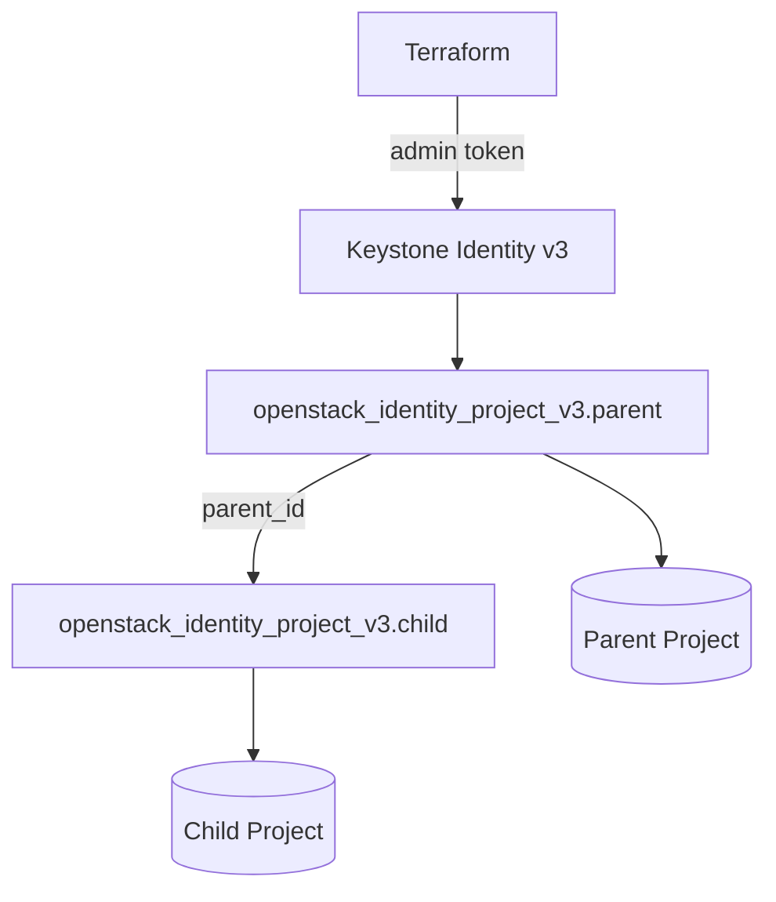

# Terraform OpenStack Project Hierarchy

> **Primary search phrase:** Terraform OpenStack project hierarchy with nested projects

Create a parent project and a child project nested under it using `parent_id`.
Nested projects let you mirror your org chart in Keystone: a top-level business
unit owns several team or department projects beneath it.

## Architecture



## Usage

```bash
export OS_CLOUD=openstack
cp terraform.tfvars.example terraform.tfvars
# edit terraform.tfvars to set parent_name, child_name, etc.

terraform init
terraform plan
terraform apply
```

## Inputs

| Name        | Description                                                                  | Type     | Default                                          |
| ----------- | ---------------------------------------------------------------------------- | -------- | ------------------------------------------------ |
| cloud       | Name of the cloud entry in clouds.yaml to use.                              | `string` | `"openstack"`                                    |
| parent_name | Name of the top-level parent project.                                      | `string` | `"engineering"`                                  |
| child_name  | Name of the child project nested under the parent.                         | `string` | `"engineering-platform"`                         |
| description | Description applied to both projects.                                       | `string` | `"Project created via Terraform project-hierarchy example."` |
| domain_id   | Domain ID of the parent (empty uses token default; child inherits domain). | `string` | `""`                                             |

## Outputs

| Name              | Description                                                       |
| ----------------- | ----------------------------------------------------------------- |
| parent_project_id | The generated ID of the parent project.                          |
| child_project_id  | The generated ID of the child project.                           |
| child_parent_id   | The parent_id recorded on the child (matches parent_project_id). |

## Best practices

- Model real organisational units: parent = business unit / department, children
  = teams or environments under that unit.
- Set the domain only on the parent. **Child projects inherit the parent's
  domain**, so leave `domain_id` unset on the child to avoid conflicts.
- Remember that **quotas are still per-project**: the hierarchy organises
  ownership but does not pool quota across parent and children.
- Use a stable parent project; destroying a parent that still has children will
  fail until the children are removed first.

## Security considerations

- `openstack_identity_project_v3` is **admin-scoped**: you need a **cloud-admin
  or domain-admin** role to create parent and child projects. Regular users get
  `403 Forbidden`.
- Creating nested hierarchies typically requires cloud-admin because it spans the
  project tree; a domain-admin is limited to projects within its own domain.
- Keep admin credentials in `clouds.yaml`/application credentials, never in code,
  and grant the least privilege required.

## Troubleshooting

| Symptom                              | Likely cause                                            | Fix                                                                  |
| ------------------------------------ | ------------------------------------------------------- | ------------------------------------------------------------------- |
| `403 Forbidden` on apply             | Token lacks admin/domain-admin role                     | Authenticate with a cloud-admin (or domain-admin) user.            |
| Child create fails with domain error | `domain_id` set on child differs from parent's domain   | Leave the child's `domain_id` unset so it inherits the parent.     |
| `Quota exceeded`                     | Domain project quota reached                            | Raise the domain project quota or delete unused projects.          |
| Destroy of parent fails              | Parent still has child projects                         | Destroy children first (or run a full `terraform destroy`).        |

## Cleanup

```bash
terraform destroy
```

## Further reading

- [Modeling org structure with nested OpenStack projects in Terraform](https://devopsaitoolkit.com/blog/)
- [openstack_identity_project_v3 registry docs](https://registry.terraform.io/providers/terraform-provider-openstack/openstack/latest/docs/resources/identity_project_v3)
- [../../../docs/provider-configuration.md](../../../docs/provider-configuration.md)
