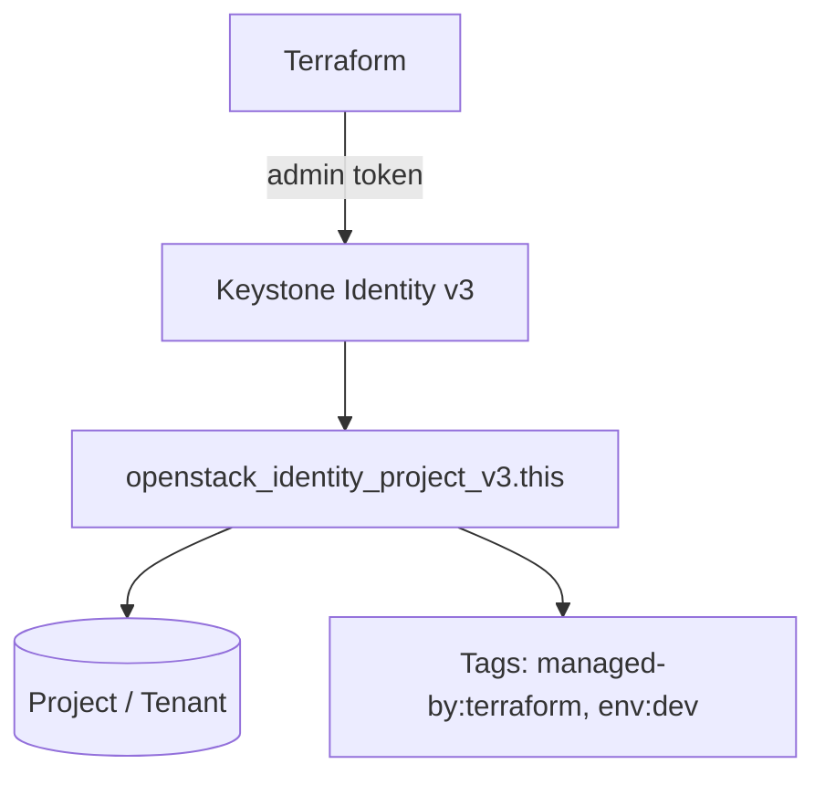

# Terraform OpenStack Project with Tags

> **Primary search phrase:** Terraform OpenStack project with tags

Create a single Keystone project (tenant) with a description, an enabled flag,
and a set of metadata tags you can later filter on for inventory and automation.

## Architecture



## Usage

```bash
export OS_CLOUD=openstack
cp terraform.tfvars.example terraform.tfvars
# edit terraform.tfvars to set project_name, tags, etc.

terraform init
terraform plan
terraform apply
```

## Inputs

| Name                | Description                                                        | Type           | Default                                      |
| ------------------- | ------------------------------------------------------------------ | -------------- | -------------------------------------------- |
| cloud               | Name of the cloud entry in clouds.yaml to use.                     | `string`       | `"openstack"`                                |
| project_name        | Name of the OpenStack project (tenant) to create.                 | `string`       | `"tagged-project"`                           |
| project_description | Human-readable description for the project.                       | `string`       | `"Project managed by Terraform with metadata tags."` |
| enabled             | Whether the project is enabled.                                   | `bool`         | `true`                                       |
| tags                | List of tags applied to the project.                              | `list(string)` | `["managed-by:terraform", "env:dev"]`        |
| domain_id           | ID of the owning domain (empty uses the token default domain).    | `string`       | `""`                                         |

## Outputs

| Name         | Description                     |
| ------------ | ------------------------------- |
| project_id   | The generated ID of the project. |
| project_name | The name of the project.        |

## Best practices

- Use consistent `key:value` tags (e.g. `env:prod`, `owner:platform`) so you can
  filter projects with `openstack project list --tags`.
- Keep `enabled = true` for active projects; disable rather than delete when you
  need to temporarily freeze a tenant while preserving its resources.
- Store `terraform.tfvars` outside version control; commit only the `.example`.
- Manage long-lived projects in a dedicated state to avoid accidental deletion.

## Security considerations

- `openstack_identity_project_v3` is **admin-scoped**: the provider token must
  hold a **cloud-admin or domain-admin** role. A regular project member token
  cannot create or modify projects and will receive `403 Forbidden`.
- Scope the admin credentials narrowly (a domain-admin can be limited to a single
  domain) and rotate them regularly.
- Never commit `clouds.yaml` or admin passwords; prefer application credentials
  with the smallest viable role set.

## Troubleshooting

| Symptom                           | Likely cause                                  | Fix                                                                 |
| --------------------------------- | --------------------------------------------- | ------------------------------------------------------------------ |
| `403 Forbidden` on apply          | Token lacks admin/domain-admin role           | Authenticate with a cloud-admin or domain-admin user.              |
| `Conflict` / project already exists | A project with the same name exists in domain | Choose a unique `project_name` or import the existing project.     |
| `Quota exceeded`                  | Project quota for the domain reached          | Raise the domain's project quota or remove unused projects.        |
| Tags not visible                  | Older Keystone microversion                   | Confirm Identity API v3.10+ which supports project tags.           |

## Cleanup

```bash
terraform destroy
```

## Further reading

- [Provisioning OpenStack projects with Terraform](https://devopsaitoolkit.com/blog/)
- [openstack_identity_project_v3 registry docs](https://registry.terraform.io/providers/terraform-provider-openstack/openstack/latest/docs/resources/identity_project_v3)
- [../../../docs/provider-configuration.md](../../../docs/provider-configuration.md)
