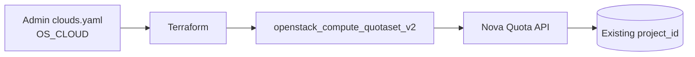

# Compute Quota (Nova) for an OpenStack Project

> **Primary search phrase:** Terraform OpenStack compute quota for a project

This example sets Nova (compute) quotas — instance count, vCPU cores, RAM,
key pairs, and per-server metadata items — on an **existing** OpenStack project
using `openstack_compute_quotaset_v2`.

## Architecture



## Usage

```bash
cp terraform.tfvars.example terraform.tfvars
# Edit terraform.tfvars: set project_id and any quota values you want to change.

export OS_CLOUD=openstack   # must be an admin-scoped cloud entry

terraform init
terraform plan
terraform apply
```

## Inputs

| Name             | Description                                   | Type     | Default       | Required |
| ---------------- | --------------------------------------------- | -------- | ------------- | :------: |
| `cloud`          | clouds.yaml entry to use (OS_CLOUD).          | `string` | `"openstack"` |    no    |
| `project_id`     | EXISTING project (tenant) ID to set quota on. | `string` | n/a           |   yes    |
| `instances`      | Maximum number of instances.                  | `number` | `10`          |    no    |
| `cores`          | Maximum number of vCPU cores.                 | `number` | `20`          |    no    |
| `ram`            | Maximum RAM in MB.                            | `number` | `51200`       |    no    |
| `key_pairs`      | Maximum number of key pairs.                  | `number` | `10`          |    no    |
| `metadata_items` | Maximum metadata items per server.            | `number` | `128`         |    no    |

> **Note:** `ram` is expressed in **MB** (51200 MB = 50 GB).

## Outputs

| Name             | Description                                       |
| ---------------- | ------------------------------------------------- |
| `quota_id`       | Resource ID of the quotaset (matches project ID). |
| `project_id`     | Project the quota applies to.                     |
| `instances`      | Configured instance limit.                        |
| `cores`          | Configured vCPU core limit.                        |
| `ram`            | Configured RAM limit (MB).                         |
| `key_pairs`      | Configured key pair limit.                         |
| `metadata_items` | Configured metadata items limit.                  |

## Best practices

- Size `cores` and `ram` together so flavors actually fit; RAM is in MB.
- Track quota values in version control and change them through review, not ad hoc CLI edits.
- Use one state/workspace per project to avoid cross-project drift.
- Set quotas slightly above expected peak usage to leave headroom for bursts.

## Security considerations

- This resource is **admin-scoped**: the credentials in `clouds.yaml` must map to a user holding the `admin` role, because setting quotas is an administrative operation.
- It does **not** create a project. It sets limits on an **existing** `project_id`, so double-check you are targeting the correct tenant.
- Keep admin `clouds.yaml`/application credentials out of version control; `terraform.tfvars` is gitignored for this reason.

## Troubleshooting

| Symptom                          | Likely cause                                            | Fix                                                                  |
| -------------------------------- | ------------------------------------------------------- | ------------------------------------------------------------------- |
| `403 Forbidden` on apply         | Credentials lack the admin role.                        | Use an admin-scoped `clouds.yaml` entry / `OS_CLOUD`.               |
| `Project not found` / `404`      | Wrong or non-existent `project_id`.                     | Verify with `openstack project list`.                              |
| Quota exceeded                   | Workload exceeds the quota you set.                     | Raise the relevant value (e.g. `cores`, `ram`, `instances`) and re-apply. |
| Plan shows drift each run        | Quota changed outside Terraform.                        | Reconcile values in `terraform.tfvars` or re-apply to enforce.     |

## Cleanup

```bash
terraform destroy
```

Destroying the `openstack_compute_quotaset_v2` resource only removes it from
Terraform management — it stops Terraform from enforcing these values. The
quota values revert toward the deployment's defaults (often the class/default
quota). No instances or projects are deleted.

## Further reading

- [Right-sizing OpenStack quotas with Terraform](https://devopsaitoolkit.com/blog/)
- [`openstack_compute_quotaset_v2` registry docs](https://registry.terraform.io/providers/terraform-provider-openstack/openstack/latest/docs/resources/compute_quotaset_v2)
- [Provider configuration guide](../../../docs/provider-configuration.md)
