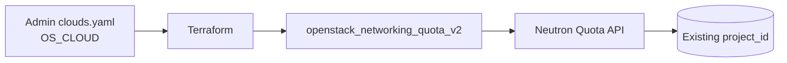

# Network Quota (Neutron) for an OpenStack Project

> **Primary search phrase:** Terraform OpenStack network quota for a project

This example sets Neutron (networking) quotas — networks, subnets, ports,
routers, floating IPs, security groups, and security group rules — on an
**existing** OpenStack project using `openstack_networking_quota_v2`.

## Architecture



## Usage

```bash
cp terraform.tfvars.example terraform.tfvars
# Edit terraform.tfvars: set project_id and any quota values you want to change.

export OS_CLOUD=openstack   # must be an admin-scoped cloud entry

terraform init
terraform plan
terraform apply
```

## Inputs

| Name                  | Description                                   | Type     | Default       | Required |
| --------------------- | --------------------------------------------- | -------- | ------------- | :------: |
| `cloud`               | clouds.yaml entry to use (OS_CLOUD).          | `string` | `"openstack"` |    no    |
| `project_id`          | EXISTING project (tenant) ID to set quota on. | `string` | n/a           |   yes    |
| `network`             | Maximum number of networks.                   | `number` | `10`          |    no    |
| `subnet`              | Maximum number of subnets.                    | `number` | `10`          |    no    |
| `port`                | Maximum number of ports.                      | `number` | `50`          |    no    |
| `router`              | Maximum number of routers.                    | `number` | `10`          |    no    |
| `floatingip`          | Maximum number of floating IPs.               | `number` | `10`          |    no    |
| `security_group`      | Maximum number of security groups.            | `number` | `10`          |    no    |
| `security_group_rule` | Maximum number of security group rules.       | `number` | `100`         |    no    |

## Outputs

| Name                  | Description                                       |
| --------------------- | ------------------------------------------------- |
| `quota_id`            | Resource ID of the quota (matches project ID).    |
| `project_id`          | Project the quota applies to.                     |
| `network`             | Configured network limit.                         |
| `subnet`              | Configured subnet limit.                          |
| `port`                | Configured port limit.                            |
| `router`              | Configured router limit.                          |
| `floatingip`          | Configured floating IP limit.                     |
| `security_group`      | Configured security group limit.                  |
| `security_group_rule` | Configured security group rule limit.             |

## Best practices

- Size `port` generously: every instance NIC, router interface, and DHCP agent consumes a port.
- Keep `security_group_rule` comfortably above `security_group` x typical rules-per-group.
- Track quota values in version control and change them through review, not ad hoc CLI edits.
- Use one state/workspace per project to avoid cross-project drift.

## Security considerations

- This resource is **admin-scoped**: the credentials in `clouds.yaml` must map to a user holding the `admin` role, because setting quotas is an administrative operation.
- It does **not** create a project. It sets limits on an **existing** `project_id`, so double-check you are targeting the correct tenant.
- Keep admin `clouds.yaml`/application credentials out of version control; `terraform.tfvars` is gitignored for this reason.

## Troubleshooting

| Symptom                     | Likely cause                                   | Fix                                                                       |
| --------------------------- | ---------------------------------------------- | ------------------------------------------------------------------------- |
| `403 Forbidden` on apply    | Credentials lack the admin role.               | Use an admin-scoped `clouds.yaml` entry / `OS_CLOUD`.                     |
| `Project not found` / `404` | Wrong or non-existent `project_id`.            | Verify with `openstack project list`.                                    |
| Quota exceeded              | Workload exceeds the quota you set.            | Raise the relevant value (e.g. `port`, `floatingip`, `network`) and re-apply. |
| Plan shows drift each run   | Quota changed outside Terraform.               | Reconcile values in `terraform.tfvars` or re-apply to enforce.           |

## Cleanup

```bash
terraform destroy
```

Destroying the `openstack_networking_quota_v2` resource only removes it from
Terraform management — it stops Terraform from enforcing these values. The
quota values revert toward the deployment's default Neutron quotas. No
networks, ports, or projects are deleted.

## Further reading

- [Right-sizing OpenStack quotas with Terraform](https://devopsaitoolkit.com/blog/)
- [`openstack_networking_quota_v2` registry docs](https://registry.terraform.io/providers/terraform-provider-openstack/openstack/latest/docs/resources/networking_quota_v2)
- [Provider configuration guide](../../../docs/provider-configuration.md)
