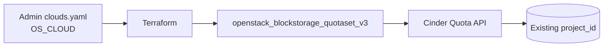

# Block Storage Quota (Cinder) for an OpenStack Project

> **Primary search phrase:** Terraform OpenStack block storage quota for a project

This example sets Cinder (block storage) quotas — volume count, snapshot count,
total volume gigabytes, per-volume size, backup count, and total backup
gigabytes — on an **existing** OpenStack project using
`openstack_blockstorage_quotaset_v3`.

## Architecture



## Usage

```bash
cp terraform.tfvars.example terraform.tfvars
# Edit terraform.tfvars: set project_id and any quota values you want to change.

export OS_CLOUD=openstack   # must be an admin-scoped cloud entry

terraform init
terraform plan
terraform apply
```

## Inputs

| Name                   | Description                                   | Type     | Default       | Required |
| ---------------------- | --------------------------------------------- | -------- | ------------- | :------: |
| `cloud`                | clouds.yaml entry to use (OS_CLOUD).          | `string` | `"openstack"` |    no    |
| `project_id`           | EXISTING project (tenant) ID to set quota on. | `string` | n/a           |   yes    |
| `volumes`              | Maximum number of volumes.                    | `number` | `20`          |    no    |
| `snapshots`            | Maximum number of snapshots.                  | `number` | `20`          |    no    |
| `gigabytes`            | Maximum total volume storage (GB).            | `number` | `1000`        |    no    |
| `per_volume_gigabytes` | Maximum size of any single volume (GB).       | `number` | `200`         |    no    |
| `backups`              | Maximum number of backups.                    | `number` | `10`          |    no    |
| `backup_gigabytes`     | Maximum total backup storage (GB).            | `number` | `1000`        |    no    |

## Outputs

| Name                   | Description                                       |
| ---------------------- | ------------------------------------------------- |
| `quota_id`             | Resource ID of the quotaset (matches project ID). |
| `project_id`           | Project the quota applies to.                     |
| `volumes`              | Configured volume limit.                          |
| `snapshots`            | Configured snapshot limit.                        |
| `gigabytes`            | Configured total volume storage limit (GB).       |
| `per_volume_gigabytes` | Configured per-volume size limit (GB).            |
| `backups`              | Configured backup limit.                          |
| `backup_gigabytes`     | Configured total backup storage limit (GB).       |

## Best practices

- Keep `gigabytes` >= `volumes` x typical volume size, otherwise volume creation fails before the count limit is reached.
- Set `per_volume_gigabytes` to cap runaway single-volume requests independent of the project total.
- Track quota values in version control and change them through review, not ad hoc CLI edits.
- Use one state/workspace per project to avoid cross-project drift.

## Security considerations

- This resource is **admin-scoped**: the credentials in `clouds.yaml` must map to a user holding the `admin` role, because setting quotas is an administrative operation.
- It does **not** create a project. It sets limits on an **existing** `project_id`, so double-check you are targeting the correct tenant.
- Keep admin `clouds.yaml`/application credentials out of version control; `terraform.tfvars` is gitignored for this reason.

## Troubleshooting

| Symptom                     | Likely cause                                       | Fix                                                                          |
| --------------------------- | -------------------------------------------------- | ---------------------------------------------------------------------------- |
| `403 Forbidden` on apply    | Credentials lack the admin role.                   | Use an admin-scoped `clouds.yaml` entry / `OS_CLOUD`.                        |
| `Project not found` / `404` | Wrong or non-existent `project_id`.                | Verify with `openstack project list`.                                       |
| Quota exceeded              | Workload exceeds the quota you set.                | Raise the relevant value (e.g. `volumes`, `gigabytes`) and re-apply.        |
| Volume create fails early   | `gigabytes` too low for the requested volume size. | Increase `gigabytes` (and/or `per_volume_gigabytes`) and re-apply.          |

## Cleanup

```bash
terraform destroy
```

Destroying the `openstack_blockstorage_quotaset_v3` resource only removes it
from Terraform management — it stops Terraform from enforcing these values. The
quota values revert toward the deployment's default Cinder quotas. No volumes,
snapshots, backups, or projects are deleted.

## Further reading

- [Right-sizing OpenStack quotas with Terraform](https://devopsaitoolkit.com/blog/)
- [`openstack_blockstorage_quotaset_v3` registry docs](https://registry.terraform.io/providers/terraform-provider-openstack/openstack/latest/docs/resources/blockstorage_quotaset_v3)
- [Provider configuration guide](../../../docs/provider-configuration.md)
