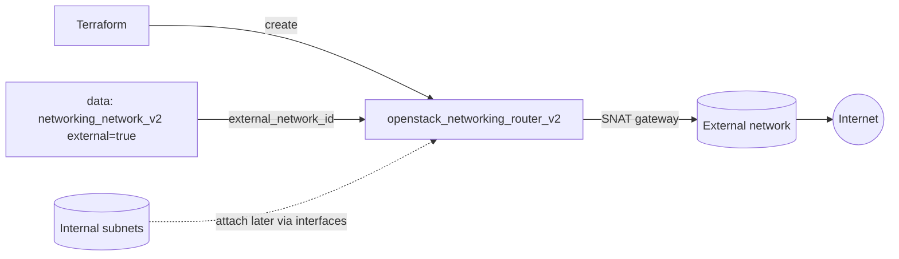

# Router with an External Gateway

Create a Neutron router and attach an external (public) network as its gateway,
with source NAT enabled. This is the standard way to give private tenant subnets
outbound internet access and to anchor floating IPs — almost every routed
OpenStack topology starts here.

> **Primary search phrase:** Terraform OpenStack router external gateway

## Architecture



The external network is resolved by name with a data source and wired to the
router as its gateway. With `enable_snat = true`, traffic from internal subnets
is source-NATed to the gateway address for outbound connectivity.

## Usage

```bash
export OS_CLOUD=openstack          # or set `cloud` in terraform.tfvars
cp terraform.tfvars.example terraform.tfvars
terraform init
terraform plan
terraform apply
```

To give instances connectivity, attach internal subnets with
[`router-with-interfaces`](../router-with-interfaces/).

## Inputs

| Name | Description | Type | Default |
|------|-------------|------|---------|
| `cloud` | clouds.yaml entry to use | `string` | `"openstack"` |
| `router_name` | Name of the router | `string` | `"example-edge-router"` |
| `external_network_name` | External network for the gateway | `string` | `"public"` |
| `admin_state_up` | Administrative state | `bool` | `true` |
| `enable_snat` | Enable source NAT on the gateway | `bool` | `true` |
| `tags` | Router tags | `list(string)` | see `variables.tf` |

## Outputs

| Name | Description |
|------|-------------|
| `router_id` | UUID of the router |
| `router_name` | Name of the router |
| `external_network_id` | External network used as gateway |
| `enable_snat` | Whether SNAT is enabled |

## Best practices

- **Why this approach:** Resolving the external network by name keeps the config
  portable; enabling SNAT here is the conventional default for internet-facing
  tenant routers.
- **Common mistakes:** Pointing the gateway at a tenant network (it must be
  `external = true`); expecting instances to reach the internet before any
  internal subnet is attached with a router interface.
- **Scaling:** One router can serve many subnets; attach them all rather than
  creating a router per subnet.

## Security considerations

- A router gateway with SNAT gives every attached subnet outbound internet
  access. If a subnet should stay isolated, do not attach it, or use a separate
  router without a gateway.
- The gateway alone does not allow inbound traffic — that requires floating IPs
  plus permissive security groups. Keep ingress least-privilege (see
  [`security/security-group`](../../security/security-group/)).

## Troubleshooting

| Symptom | Likely cause | Fix |
|---------|--------------|-----|
| `Network <name> not found` or not external | Wrong `external_network_name` or it is a tenant network | `openstack network list --external` |
| Instances still cannot reach internet | No internal subnet attached to the router | Add interfaces ([router-with-interfaces](../router-with-interfaces/)) |
| `Floating IP association failed` | Port's subnet not attached to this router / no gateway route | Attach the subnet here, confirm the gateway is set |
| `Router already has a gateway` | Gateway managed elsewhere too | Manage the gateway in one place only |
| Provider auth errors | Bad/missing `clouds.yaml` or `OS_CLOUD` | See [provider configuration](../../../docs/provider-configuration.md) |

## Cleanup

```bash
terraform destroy
```

Detach any router interfaces or floating IPs that depend on this router first,
or destroy will fail with an "in use" error.

## Further reading

- [Provider configuration & clouds.yaml](../../../docs/provider-configuration.md)
- [OpenStack provider — router docs](https://registry.terraform.io/providers/terraform-provider-openstack/openstack/latest/docs/resources/networking_router_v2)
- [Advanced OpenStack guides on DevOps AI ToolKit](https://devopsaitoolkit.com/blog/)
