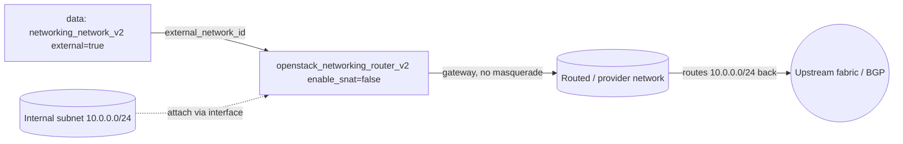

# Router with SNAT Disabled (Routed / Provider Networks)

Create a Neutron router with an external gateway but **source NAT turned off**.
With `enable_snat = false`, traffic leaving internal subnets keeps its original
source IP instead of being masqueraded behind the gateway address. This is the
right choice for routed/provider-network designs where the upstream fabric routes
the tenant CIDRs natively.

> **Primary search phrase:** Terraform OpenStack router disable SNAT

## Architecture



The gateway is set as usual, but because SNAT is disabled the upstream fabric
must have routes back to the internal subnets — otherwise return traffic is
black-holed.

## When to disable SNAT

Disable SNAT when **the network outside the router already knows how to reach the
internal subnets**:

- **Routed / provider networks** where tenant subnets are real, routable ranges
  advertised upstream (not RFC1918 hidden behind NAT).
- **Dynamic routing (BGP)**, e.g. Neutron's `neutron-dynamic-routing`, announces
  the internal CIDRs to the physical fabric.
- **Upstream static routes** on physical routers point the internal CIDRs back at
  the router's gateway IP.
- You need **end-to-end source IP preservation** for security policy, auditing,
  or services that key off the real client address.

Keep SNAT **enabled** (the usual default — see
[`router-external-gateway`](../router-external-gateway/)) for ordinary tenants
with private RFC1918 subnets that just need outbound internet access. Without a
route back, no-SNAT traffic will leave but never return.

## Usage

```bash
export OS_CLOUD=openstack          # or set `cloud` in terraform.tfvars
cp terraform.tfvars.example terraform.tfvars
terraform init
terraform plan
terraform apply
```

## Inputs

| Name | Description | Type | Default |
|------|-------------|------|---------|
| `cloud` | clouds.yaml entry to use | `string` | `"openstack"` |
| `router_name` | Name of the router | `string` | `"example-no-snat-router"` |
| `external_network_name` | External/provider network for the gateway | `string` | `"provider"` |
| `enable_snat` | Source NAT (kept `false` here) | `bool` | `false` |
| `tags` | Router tags | `list(string)` | see `variables.tf` |

## Outputs

| Name | Description |
|------|-------------|
| `router_id` | UUID of the router |
| `router_name` | Name of the router |
| `external_network_id` | External/provider network used as gateway |
| `enable_snat` | Whether SNAT is enabled (false) |

## Best practices

- **Why disable SNAT:** Preserving source IPs is essential for routed designs and
  for any policy that depends on the real client address; SNAT would hide it.
- **Common mistakes:** Disabling SNAT without arranging return routes upstream
  (traffic leaves but never comes back); using a normal NAT `public` pool instead
  of a properly routed provider network.
- **Pairing:** Attach internal subnets with
  [`router-with-interfaces`](../router-with-interfaces/) and, if needed, add
  upstream-facing entries with [`router-static-routes`](../router-static-routes/).

## Security considerations

- Without SNAT, internal hosts are reachable by their real addresses from the
  routed network — there is no NAT boundary to lean on. Rely on least-privilege
  security groups and, ideally, upstream firewalling (see
  [`security/security-group`](../../security/security-group-basic/)).
- Confirm the internal CIDRs are intended to be routable; accidentally exposing
  an RFC1918 range on a routed fabric can make hosts reachable more widely than
  expected.

## Troubleshooting

| Symptom | Likely cause | Fix |
|---------|--------------|-----|
| Outbound works, no replies | No upstream route back to internal subnets | Add BGP/static routes on the fabric for the internal CIDRs |
| `external network does not support SNAT setting` | Network/driver does not allow toggling SNAT | Use a provider network that supports it, or keep default SNAT |
| Hosts unexpectedly reachable | Internal CIDR routable with no NAT boundary | Tighten security groups / upstream firewall |
| `Floating IP association failed` | Floating IPs/NAT semantics differ on no-SNAT gateways | For NAT + floating IPs use a SNAT router ([router-external-gateway](../router-external-gateway/)) |
| Provider auth errors | Bad/missing `clouds.yaml` or `OS_CLOUD` | See [provider configuration](../../../docs/provider-configuration.md) |

## Cleanup

```bash
terraform destroy
```

Detach any router interfaces that depend on this router first.

## Further reading

- [Provider configuration & clouds.yaml](../../../docs/provider-configuration.md)
- [OpenStack provider — router docs](https://registry.terraform.io/providers/terraform-provider-openstack/openstack/latest/docs/resources/networking_router_v2)
- [Advanced OpenStack guides on DevOps AI ToolKit](https://devopsaitoolkit.com/blog/)
