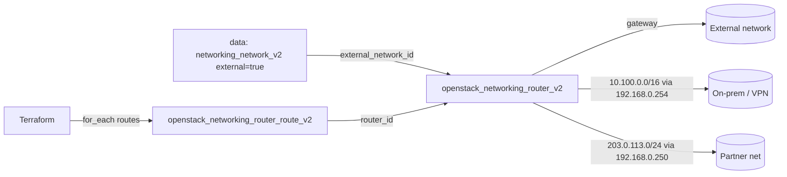

# Router with Static Routes

Create a Neutron router and add a set of static routes to it with
`openstack_networking_router_route_v2`, driven by `for_each` over a routes
variable. Static routes tell the router how to reach networks it is not directly
attached to — for example an on-prem range behind a VPN appliance or a peered
partner network.

> **Primary search phrase:** Terraform OpenStack router static routes

## Architecture



The router is created with an external gateway, then `for_each` over `routes`
creates one route resource per entry. Each route's `next_hop` must be an address
reachable on a subnet the router already has an interface on.

## Usage

```bash
export OS_CLOUD=openstack          # or set `cloud` in terraform.tfvars
cp terraform.tfvars.example terraform.tfvars
terraform init
terraform plan
terraform apply
```

## Inputs

| Name | Description | Type | Default |
|------|-------------|------|---------|
| `cloud` | clouds.yaml entry to use | `string` | `"openstack"` |
| `router_name` | Name of the router | `string` | `"example-static-routes-router"` |
| `external_network_name` | External network for the gateway | `string` | `"public"` |
| `enable_snat` | Enable source NAT on the gateway | `bool` | `true` |
| `routes` | Map of key to `{ destination_cidr, next_hop }` | `map(object)` | see `variables.tf` |
| `tags` | Router tags | `list(string)` | see `variables.tf` |

## Outputs

| Name | Description |
|------|-------------|
| `router_id` | UUID of the router |
| `router_name` | Name of the router |
| `routes` | Map of route key to its CIDR and next hop |

## Best practices

- **Why discrete route resources:** Managing routes as `router_route_v2` (instead
  of an inline `routes` block on the router) prevents Terraform and Neutron from
  clobbering each other's view of the route table, and lets you add/remove a
  single route via `for_each` without disturbing the rest.
- **Common mistakes:** A `next_hop` that is not on a directly-attached subnet (the
  route is rejected); overlapping/duplicate `destination_cidr` values; expecting a
  route to work before the relevant router interface exists.
- **Reuse:** Pair with [`router-with-interfaces`](../router-with-interfaces/) so
  the next hops are reachable.

## Security considerations

- Static routes extend reachability — make sure you are not inadvertently opening
  a path from a sensitive subnet to an external range. Routing does not bypass
  security groups, so keep them least-privilege (see
  [`security/security-group`](../../security/security-group-basic/)).
- Document each route's purpose (the map keys do this) so stale routes to
  decommissioned networks are easy to spot and remove.

## Troubleshooting

| Symptom | Likely cause | Fix |
|---------|--------------|-----|
| `Invalid input ... next_hop not connected` | Next hop is not on a directly-attached subnet | Attach the subnet first ([router-with-interfaces](../router-with-interfaces/)) |
| `Cidr ... overlaps` / duplicate route | Two entries share a destination | Make `destination_cidr` values unique |
| Route present but traffic not flowing | Security groups or the next-hop appliance dropping it | Check security groups and the VPN/appliance |
| `Floating IP association failed` | Unrelated: instance subnet not on a gateway router | Attach its subnet to a router with a gateway |
| Provider auth errors | Bad/missing `clouds.yaml` or `OS_CLOUD` | See [provider configuration](../../../docs/provider-configuration.md) |

## Cleanup

```bash
terraform destroy
```

Remove individual entries from `routes` and re-apply to delete single routes
without touching the router.

## Further reading

- [Provider configuration & clouds.yaml](../../../docs/provider-configuration.md)
- [OpenStack provider — router route docs](https://registry.terraform.io/providers/terraform-provider-openstack/openstack/latest/docs/resources/networking_router_route_v2)
- [Advanced OpenStack guides on DevOps AI ToolKit](https://devopsaitoolkit.com/blog/)
