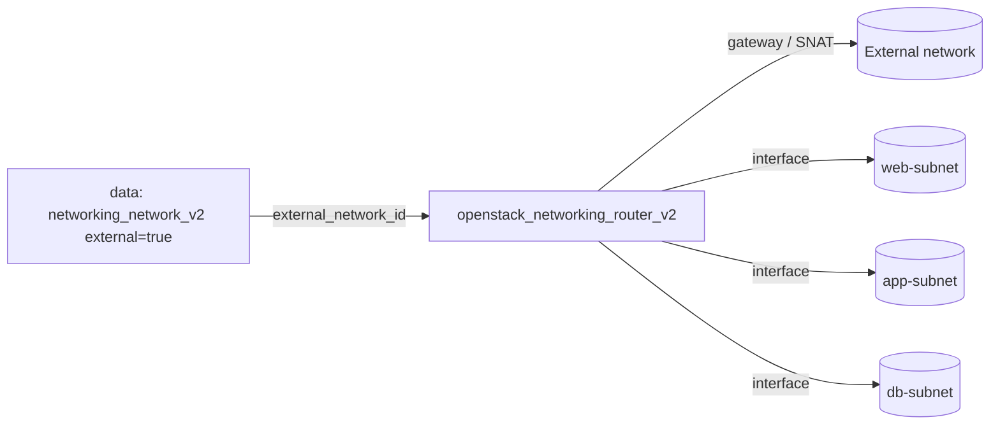

# Router with Interfaces to Multiple Subnets

Create a Neutron router with an external gateway and attach it to several
existing subnets at once using `for_each`. Each router interface gives the
router a leg on a subnet, letting those subnets route to each other and reach
the internet through the shared gateway — the backbone of a multi-tier topology.

> **Primary search phrase:** Terraform OpenStack router multiple subnets

## Architecture



The router is created with an external gateway, then `for_each` over
`subnet_ids` creates one `openstack_networking_router_interface_v2` per subnet.
Keying by subnet UUID keeps each attachment independent in state.

## Usage

```bash
export OS_CLOUD=openstack          # or set `cloud` in terraform.tfvars
openstack subnet list              # collect the subnet UUIDs to attach
cp terraform.tfvars.example terraform.tfvars
terraform init
terraform plan
terraform apply
```

## Inputs

| Name | Description | Type | Default |
|------|-------------|------|---------|
| `cloud` | clouds.yaml entry to use | `string` | `"openstack"` |
| `router_name` | Name of the router | `string` | `"example-multi-subnet-router"` |
| `external_network_name` | External network for the gateway | `string` | `"public"` |
| `enable_snat` | Enable source NAT on the gateway | `bool` | `true` |
| `subnet_ids` | Subnets to attach (one interface each) | `set(string)` | n/a |
| `tags` | Router tags | `list(string)` | see `variables.tf` |

## Outputs

| Name | Description |
|------|-------------|
| `router_id` | UUID of the router |
| `router_name` | Name of the router |
| `interface_ids` | Map of subnet UUID to interface UUID |
| `attached_subnet_count` | Number of subnets attached |

## Best practices

- **Why `for_each` over `count`:** Keying interfaces by subnet UUID means
  removing one subnet from the set destroys only that interface; `count` would
  re-index and churn every interface after the removed one.
- **Common mistakes:** Attaching a subnet whose `gateway_ip` is `null`/disabled
  (a router interface needs the subnet's gateway address); attaching the same
  subnet to two routers.
- **Reuse:** Combine with the [`networking`](../../networking/) examples that
  create the subnets, passing their IDs straight into `subnet_ids`.

## Security considerations

- Attaching a subnet to a router with an external gateway gives that subnet
  outbound internet access via SNAT. Keep truly private subnets off the router,
  or use a gateway-less router for east-west-only routing.
- Routing between subnets is governed by security groups on each port — attaching
  the router does not bypass them. Keep groups least-privilege (see
  [`security/security-group`](../../security/security-group-basic/)).

## Troubleshooting

| Symptom | Likely cause | Fix |
|---------|--------------|-----|
| `Subnet <id> could not be found` | Wrong UUID or another project's subnet | `openstack subnet list`; confirm project |
| `Router interface ... already exists` | Subnet already attached (here or elsewhere) | Detach the existing interface or remove from `subnet_ids` |
| `No gateway IP` / interface fails | Subnet has `no_gateway`/null gateway | Give the subnet a gateway IP, or attach by port instead |
| `Floating IP association failed` | Instance subnet not attached to this router | Add its subnet to `subnet_ids` and re-apply |
| Provider auth errors | Bad/missing `clouds.yaml` or `OS_CLOUD` | See [provider configuration](../../../docs/provider-configuration.md) |

## Cleanup

```bash
terraform destroy
```

Terraform removes the interfaces before the router. Detach any floating IPs that
rely on routes through this router first.

## Further reading

- [Provider configuration & clouds.yaml](../../../docs/provider-configuration.md)
- [OpenStack provider — router interface docs](https://registry.terraform.io/providers/terraform-provider-openstack/openstack/latest/docs/resources/networking_router_interface_v2)
- [Advanced OpenStack guides on DevOps AI ToolKit](https://devopsaitoolkit.com/blog/)
