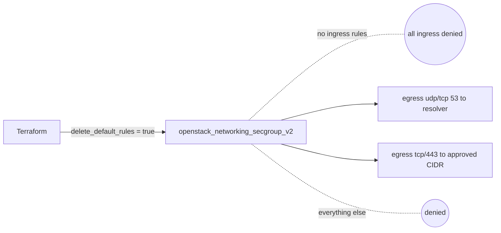

# OpenStack Default-Deny Security Group Baseline with Terraform

Provision a security group that denies everything by default — no ingress at all
and the permissive default egress stripped — then allows back only DNS and HTTPS
to approved destinations. This is the deny-by-default posture you want as the
starting point for hardened workloads.

> **Primary search phrase:** Terraform OpenStack default deny security group

## Architecture



`delete_default_rules = true` removes the default allow-all egress. With no
ingress rules added, the group is deny-all in both directions; only the three
explicit egress rules punch through.

## Usage

```bash
export OS_CLOUD=openstack          # or set `cloud` in terraform.tfvars
cp terraform.tfvars.example terraform.tfvars
terraform init
terraform plan
terraform apply
```

## Inputs

| Name | Description | Type | Default |
|------|-------------|------|---------|
| `cloud` | clouds.yaml entry to use | `string` | `"openstack"` |
| `secgroup_name` | Group name | `string` | `"example-default-deny"` |
| `dns_resolver_cidr` | Approved DNS resolver CIDR | `string` | `"10.0.0.2/32"` |
| `egress_https_cidr` | Approved HTTPS destination CIDR | `string` | `"0.0.0.0/0"` |
| `tags` | Tags on the group | `list(string)` | see `variables.tf` |

## Outputs

| Name | Description |
|------|-------------|
| `secgroup_id` | UUID of the baseline group |
| `secgroup_name` | Name of the baseline group |
| `egress_rule_ids` | UUIDs of the allowed egress rules |

## Best practices

- **Why this approach:** Default-deny inverts the trust model — traffic is blocked
  unless explicitly justified, so mistakes fail closed instead of open.
- **Common mistakes:** Forgetting `delete_default_rules` (leaving allow-all egress
  in place); allowing egress to `0.0.0.0/0` and calling it "default-deny"; not
  allowing DNS, which breaks almost everything silently.
- **Scaling considerations:** Treat this as a base group and layer service-specific
  ingress on top via additional groups attached to the same port.

## Security considerations

- **Egress matters:** Outbound lockdown limits data exfiltration and command-and-
  control if a host is compromised. Scope `egress_https_cidr` to real destinations.
- No ingress means management access must come from a separate, attached group —
  see [`ssh-bastion-access`](../ssh-bastion-access/).
- OpenStack groups are stateful, so you do not need inbound rules for the replies
  to allowed outbound connections.
- Audit periodically: every rule should map to a documented requirement.

## Troubleshooting

| Symptom | Likely cause | Fix |
|---------|--------------|-----|
| Name resolution fails | DNS resolver outside `dns_resolver_cidr` | Set the CIDR to your real resolver |
| Package installs hang | HTTPS destination outside `egress_https_cidr` | Add the mirror/API range |
| Group still allows all egress | `delete_default_rules` omitted/false | Set it to `true` and re-apply |
| Cannot manage the host | No ingress here by design | Attach a separate SSH/bastion group |
| Provider auth errors | Bad/missing `clouds.yaml` or `OS_CLOUD` | See [provider configuration](../../../docs/provider-configuration.md) |

## Cleanup

```bash
terraform destroy
```

## Further reading

- [Provider configuration & clouds.yaml](../../../docs/provider-configuration.md)
- [OpenStack provider — secgroup docs](https://registry.terraform.io/providers/terraform-provider-openstack/openstack/latest/docs/resources/networking_secgroup_v2)
- [DevOps AI ToolKit blog](https://devopsaitoolkit.com/blog/)
