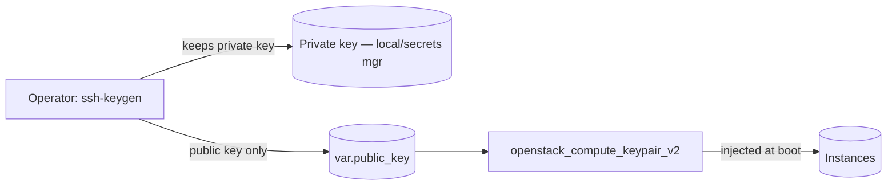

# Manage an OpenStack SSH Key Pair with Terraform (Bring Your Own Public Key)

Register an existing SSH public key as a Nova key pair so instances can inject
it at boot. Crucially, the **private key is never generated by or stored in
Terraform**, keeping it out of state and version control.

> **Primary search phrase:** Terraform OpenStack keypair public key example

## Architecture



You generate the key pair yourself; Terraform only uploads the public half.

## Usage

```bash
# 1. Generate a key pair (private key stays on your machine):
ssh-keygen -t ed25519 -f ~/.ssh/openstack_ed25519 -C "you@example.com"

# 2. Register the public half:
export OS_CLOUD=openstack
cp terraform.tfvars.example terraform.tfvars   # paste your .pub contents
terraform init
terraform plan
terraform apply
```

Reference the result as `key_pair = <keypair_name>` on an instance.

## Inputs

| Name | Description | Type | Default |
|------|-------------|------|---------|
| `cloud` | clouds.yaml entry to use | `string` | `"openstack"` |
| `keypair_name` | Name of the key pair | `string` | `"example-managed-key"` |
| `public_key` | OpenSSH public key to register (required) | `string` | n/a |

## Outputs

| Name | Description |
|------|-------------|
| `keypair_name` | Name to use as `key_pair` on instances |
| `fingerprint` | Public key fingerprint |
| `public_key` | The registered public key (public material) |

## Best practices

- **Why this approach:** Supplying only the public key means the private key never
  enters Terraform state, plan logs, or remote backends. State is not a secret store.
- **Common mistakes:** Using `tls_private_key` to generate keys in TF — the private
  key lands in state in plaintext for anyone with state access. Committing private keys.
- **Scaling considerations:** Per-person key pairs make off-boarding simple (delete
  one key). For fleets, prefer short-lived certificates or an SSH CA over static keys.

## Security considerations

- **Never generate private keys in Terraform.** State is often stored remotely and
  read by CI; a private key there is a credential leak waiting to happen.
- Prefer `ed25519` keys; protect the private key with a passphrase and OS file perms (`600`).
- Treat the public key and fingerprint as non-secret (they are exposed as outputs).
- Rotate keys periodically and remove unused key pairs from the project.
- For interactive access, combine this with a [bastion](../ssh-bastion-access/) rather
  than exposing SSH broadly.

## Troubleshooting

| Symptom | Likely cause | Fix |
|---------|--------------|-----|
| Validation error on `public_key` | Pasted a private key or wrong format | Paste the `.pub` (starts with `ssh-ed25519`/`ssh-rsa`) |
| `Key pair already exists` | Name collides with an existing pair | Choose a unique `keypair_name` |
| Cannot SSH after boot | Wrong matching private key, or wrong default user | Use the private key for this pair; check image's login user |
| Key not injected | Instance not created with `key_pair` set | Set `key_pair = <keypair_name>` on the instance |
| Provider auth errors | Bad/missing `clouds.yaml` or `OS_CLOUD` | See [provider configuration](../../../docs/provider-configuration.md) |

## Cleanup

```bash
terraform destroy
```

Removing the key pair does not affect instances already booted with it.

## Further reading

- [Provider configuration & clouds.yaml](../../../docs/provider-configuration.md)
- [OpenStack provider — keypair docs](https://registry.terraform.io/providers/terraform-provider-openstack/openstack/latest/docs/resources/compute_keypair_v2)
- [DevOps AI ToolKit blog](https://devopsaitoolkit.com/blog/)
