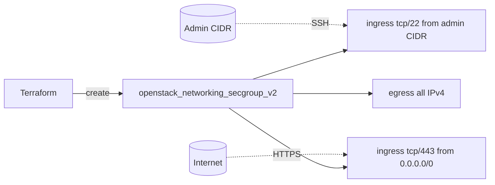

# Basic OpenStack Security Group with Terraform

Create a dedicated, least-privilege OpenStack security group (Neutron) that
allows SSH only from a scoped admin CIDR, HTTPS from the internet, and all
egress. This is the foundational security pattern every other example here
extends.

> **Primary search phrase:** Terraform OpenStack security group example

## Architecture



A single security group carries three explicit rules. Management access (SSH)
is locked to an admin range while the public service port (HTTPS) is open.

## Usage

```bash
export OS_CLOUD=openstack          # or set `cloud` in terraform.tfvars
cp terraform.tfvars.example terraform.tfvars
terraform init
terraform plan
terraform apply
```

Attach the resulting group to an instance via its `security_groups`/`security_group_ids`.

## Inputs

| Name | Description | Type | Default |
|------|-------------|------|---------|
| `cloud` | clouds.yaml entry to use | `string` | `"openstack"` |
| `secgroup_name` | Name of the security group | `string` | `"example-basic-web"` |
| `secgroup_description` | Group description | `string` | see `variables.tf` |
| `admin_ssh_cidr` | CIDR allowed SSH (22); cannot be `0.0.0.0/0` | `string` | `"203.0.113.0/24"` |
| `https_cidr` | CIDR allowed HTTPS (443) | `string` | `"0.0.0.0/0"` |
| `tags` | Tags on the group | `list(string)` | see `variables.tf` |

## Outputs

| Name | Description |
|------|-------------|
| `secgroup_id` | UUID of the security group |
| `secgroup_name` | Name of the security group |
| `ingress_rule_ids` | UUIDs of the SSH and HTTPS ingress rules |

## Best practices

- **Why this approach:** A purpose-built group beats reusing `default`. Each rule
  is explicit and reviewable, and the `admin_ssh_cidr` validation makes an
  insecure SSH-to-the-world rule impossible to apply by accident.
- **Common mistakes:** Opening SSH to `0.0.0.0/0`; piling unrelated rules into one
  group; assuming `default` is safe.
- **Scaling considerations:** For many similar rules use the
  [`web-tier-security-groups`](../web-tier-security-groups/) `for_each` pattern.

## Security considerations

- **Least privilege:** Only the ports a host actually serves should be open, and
  each only to the narrowest source range that works. SSH here is admin-only.
- Prefer reaching SSH through a [bastion](../ssh-bastion-access/) rather than
  exposing 22 even to an admin CIDR.
- Keep `https_cidr` at `0.0.0.0/0` only for genuinely public endpoints; internal
  services should be scoped to a VPC/tenant range.
- OpenStack security groups are **stateful** — return traffic for an allowed
  connection is permitted automatically, so you do not add a reverse rule. See
  [`stateless-vs-stateful-note`](../stateless-vs-stateful-note/).

## Troubleshooting

| Symptom | Likely cause | Fix |
|---------|--------------|-----|
| Cannot SSH in | Your source IP is outside `admin_ssh_cidr` | Set the CIDR to your real egress IP (`curl ifconfig.me`) |
| HTTPS unreachable | Group not attached, or app not listening on 443 | Attach group to the instance/port; check the service |
| `Security group rule already exists` | Duplicate rule (often vs `default`) | Remove duplicates; use a clean dedicated group |
| `0.0.0.0/0` validation error | SSH CIDR set to the whole internet | Scope `admin_ssh_cidr` to a real range |
| Provider auth errors | Bad/missing `clouds.yaml` or `OS_CLOUD` | See [provider configuration](../../../docs/provider-configuration.md) |

## Cleanup

```bash
terraform destroy
```

Detach the group from any instances first, or destroy will fail on an in-use group.

## Further reading

- [Provider configuration & clouds.yaml](../../../docs/provider-configuration.md)
- [OpenStack provider — secgroup rule docs](https://registry.terraform.io/providers/terraform-provider-openstack/openstack/latest/docs/resources/networking_secgroup_rule_v2)
- [DevOps AI ToolKit blog](https://devopsaitoolkit.com/blog/)
