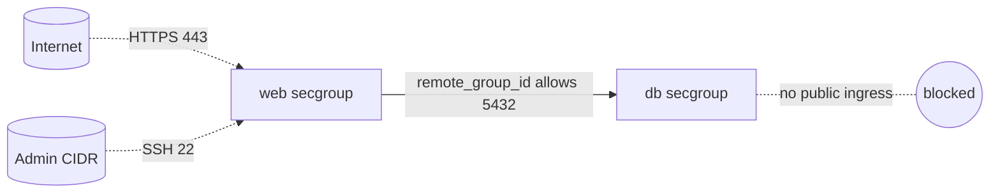

# OpenStack Security Group remote_group_id (Tiered Architecture)

Build a two-tier (web + database) network policy where the database accepts its
listener port **only** from members of the web security group, using
`remote_group_id` instead of IP ranges. This is the canonical pattern for
identity-based, tier-to-tier access on OpenStack.

> **Primary search phrase:** Terraform OpenStack security group remote_group_id

## Architecture



The DB rule references the **web group's identity**, so any instance in the web
group can reach PostgreSQL regardless of its IP, and nothing else can.

## Usage

```bash
export OS_CLOUD=openstack          # or set `cloud` in terraform.tfvars
cp terraform.tfvars.example terraform.tfvars
terraform init
terraform plan
terraform apply
```

Attach web instances to the web group and database instances to the db group.

## Inputs

| Name | Description | Type | Default |
|------|-------------|------|---------|
| `cloud` | clouds.yaml entry to use | `string` | `"openstack"` |
| `web_secgroup_name` | Web-tier group name | `string` | `"example-web"` |
| `db_secgroup_name` | DB-tier group name | `string` | `"example-db"` |
| `admin_ssh_cidr` | CIDR allowed SSH to web; not `0.0.0.0/0` | `string` | `"203.0.113.0/24"` |
| `db_port` | DB listener port | `number` | `5432` |
| `tags` | Tags on both groups | `list(string)` | see `variables.tf` |

## Outputs

| Name | Description |
|------|-------------|
| `web_secgroup_id` | UUID of the web group |
| `db_secgroup_id` | UUID of the db group |
| `db_from_web_rule_id` | UUID of the web-to-db rule |

## Best practices

- **Why this approach:** `remote_group_id` ties access to group membership, not
  addresses. It survives autoscaling, instance replacement, and DHCP changes
  with zero rule edits.
- **Common mistakes:** Allowing the DB port from a broad CIDR "to be safe";
  referencing the wrong group ID; putting both tiers in one group (then the
  remote-group rule lets every member reach the DB).
- **Scaling considerations:** Add more web instances freely — the db rule needs
  no change. Add a cache/queue tier the same way.

## Security considerations

- The database has **no** public ingress; the only path in is from the web group.
- Keep tiers in separate groups so membership remains a meaningful access boundary.
- `remote_group_id` is evaluated within the project/tenant — cross-tenant access
  needs RBAC, not a remote-group reference.
- Groups are stateful: the DB's reply to the web tier is allowed automatically.

## Troubleshooting

| Symptom | Likely cause | Fix |
|---------|--------------|-----|
| Web cannot reach DB | Web instance not actually in the web group | Attach the web group to the web instance/port |
| Everything can reach DB | Both tiers share one group | Split into separate web/db groups |
| `Security group <id> not found` | Referencing a deleted/foreign group | Use the in-config group IDs |
| DB reachable from internet | A stray CIDR ingress rule exists | Remove it; rely only on `remote_group_id` |
| Provider auth errors | Bad/missing `clouds.yaml` or `OS_CLOUD` | See [provider configuration](../../../docs/provider-configuration.md) |

## Cleanup

```bash
terraform destroy
```

Detach both groups from their instances first or destroy will fail.

## Further reading

- [Provider configuration & clouds.yaml](../../../docs/provider-configuration.md)
- [OpenStack provider — secgroup rule docs](https://registry.terraform.io/providers/terraform-provider-openstack/openstack/latest/docs/resources/networking_secgroup_rule_v2)
- [DevOps AI ToolKit blog](https://devopsaitoolkit.com/blog/)
