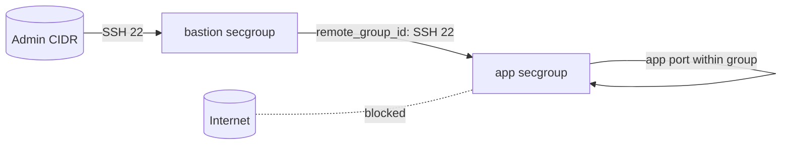

# OpenStack SSH Bastion (Jump Host) Security Groups with Terraform

Implement the jump-host pattern: a bastion security group is the only place SSH
is exposed (and only to an admin CIDR), while application instances accept SSH
exclusively from the bastion group via `remote_group_id`. App hosts are never
SSH-reachable from the internet.

> **Primary search phrase:** Terraform OpenStack bastion security group SSH

## Architecture



Operators SSH to the bastion; from there they jump to app hosts. The app group's
SSH rule trusts the bastion group's identity, not an IP range.

## Usage

```bash
export OS_CLOUD=openstack          # or set `cloud` in terraform.tfvars
cp terraform.tfvars.example terraform.tfvars
terraform init
terraform plan
terraform apply
```

Then connect with an SSH jump:

```bash
ssh -J user@<bastion-ip> user@<app-private-ip>
```

## Inputs

| Name | Description | Type | Default |
|------|-------------|------|---------|
| `cloud` | clouds.yaml entry to use | `string` | `"openstack"` |
| `bastion_secgroup_name` | Bastion group name | `string` | `"example-bastion"` |
| `app_secgroup_name` | App group name | `string` | `"example-app"` |
| `bastion_admin_cidr` | CIDR allowed SSH to bastion; not `0.0.0.0/0` | `string` | `"203.0.113.0/24"` |
| `app_port` | App listener port (in-group) | `number` | `8080` |
| `tags` | Tags on both groups | `list(string)` | see `variables.tf` |

## Outputs

| Name | Description |
|------|-------------|
| `bastion_secgroup_id` | UUID of the bastion group |
| `app_secgroup_id` | UUID of the app group |
| `app_ssh_from_bastion_rule_id` | UUID of the bastion-to-app SSH rule |

## Best practices

- **Why this approach:** Concentrating SSH exposure on one hardened, heavily-audited
  bastion shrinks the attack surface to a single, monitorable choke point.
- **Common mistakes:** Giving app hosts their own internet-facing SSH "just for
  setup"; using a CIDR instead of `remote_group_id` for the bastion-to-app rule
  (breaks when the bastion's IP changes).
- **Scaling considerations:** Run the bastion in an HA pair/ASG; all members share
  the bastion group, so the app rule needs no changes.

## Security considerations

- The bastion is the only SSH ingress from outside, and only from `bastion_admin_cidr`.
- App instances accept SSH only from the bastion group — there is no direct path
  from the internet.
- Harden the bastion: MFA, session recording, short-lived keys/certs, patching.
- Combine with [`managed-keypair`](../managed-keypair/) for key hygiene and
  [`default-deny-baseline`](../default-deny-baseline/) for egress lockdown.
- Groups are stateful, so reply traffic for established SSH sessions is automatic.

## Troubleshooting

| Symptom | Likely cause | Fix |
|---------|--------------|-----|
| Cannot SSH to bastion | Your IP is outside `bastion_admin_cidr` | Set the CIDR to your real egress IP |
| Cannot jump to app host | App instance not in the app group, or bastion not in bastion group | Attach the correct groups |
| App SSH open to internet | A stray CIDR SSH rule on the app group | Remove it; rely on `remote_group_id` |
| `-J` jump fails | Agent forwarding/key not available on bastion | Use `ssh -J` (ProxyJump), not key copy |
| Provider auth errors | Bad/missing `clouds.yaml` or `OS_CLOUD` | See [provider configuration](../../../docs/provider-configuration.md) |

## Cleanup

```bash
terraform destroy
```

Detach both groups from their instances first or destroy will fail.

## Further reading

- [Provider configuration & clouds.yaml](../../../docs/provider-configuration.md)
- [OpenStack provider — secgroup rule docs](https://registry.terraform.io/providers/terraform-provider-openstack/openstack/latest/docs/resources/networking_secgroup_rule_v2)
- [DevOps AI ToolKit blog](https://devopsaitoolkit.com/blog/)
