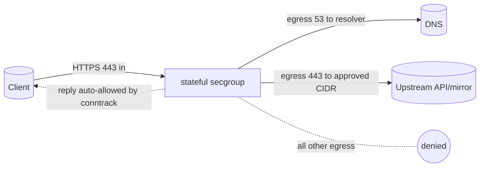

# OpenStack Security Groups Are Stateful: Terraform Example and Explainer

A working security group plus a clear explanation that OpenStack security groups
are **stateful** — reply traffic for an allowed connection is permitted
automatically, so you do not add reverse rules. Contrasts security groups with
stateless ACLs, Neutron FWaaS, and Kubernetes NetworkPolicy, and shows an egress
lockdown.

> **Primary search phrase:** OpenStack security group stateful vs stateless

## Architecture



Only inbound HTTPS and two narrow egress rules are declared. The high-port reply
packets back to clients need no rule because the group is stateful.

## Usage

```bash
export OS_CLOUD=openstack          # or set `cloud` in terraform.tfvars
cp terraform.tfvars.example terraform.tfvars
terraform init
terraform plan
terraform apply
```

## Stateful vs stateless — what this means

- **Stateful (OpenStack security groups, default):** Connection tracking
  (conntrack) remembers allowed flows. Allow an inbound connection and its return
  packets are permitted automatically. You write rules for the *initiating*
  direction only.
- **Stateless (traditional network ACLs, e.g. AWS NACLs, or `stateful = false`
  groups):** Each packet is judged independently. You must explicitly allow both
  request and reply directions (including ephemeral high ports).
- **Neutron FWaaS:** A separate, router/perimeter-level firewall service for
  zone-style policy across subnets — complements, rather than replaces, per-port
  security groups.
- **Kubernetes NetworkPolicy:** Pod-level, label-selector policy enforced by the
  CNI. Conceptually similar (default-deny once a policy selects a pod) but lives
  in the cluster, not in Neutron.

## Inputs

| Name | Description | Type | Default |
|------|-------------|------|---------|
| `cloud` | clouds.yaml entry to use | `string` | `"openstack"` |
| `secgroup_name` | Group name | `string` | `"example-stateful"` |
| `https_cidr` | Inbound HTTPS source CIDR | `string` | `"0.0.0.0/0"` |
| `egress_https_cidr` | Approved outbound HTTPS CIDR | `string` | `"0.0.0.0/0"` |
| `dns_resolver_cidr` | Approved DNS resolver CIDR | `string` | `"10.0.0.2/32"` |
| `tags` | Tags on the group | `list(string)` | see `variables.tf` |

## Outputs

| Name | Description |
|------|-------------|
| `secgroup_id` | UUID of the group |
| `secgroup_name` | Name of the group |
| `stateful` | Whether the group is stateful |

## Best practices

- **Why this approach:** Relying on statefulness keeps rule sets small and readable
  — declare intent (the initiating direction) and let conntrack handle replies.
- **Common mistakes:** Adding reverse/ephemeral-port rules "to be safe" (noise on a
  stateful group); flipping `stateful = false` without then adding the required
  return-direction rules (silently breaks connectivity).
- **Scaling considerations:** Keep security groups for per-instance microsegmentation;
  reach for FWaaS when you need centralized, router-level perimeter policy.

## Security considerations

- Statefulness simplifies rules but does not lessen the need for **egress lockdown**
  — this example strips default allow-all egress and permits only DNS and approved
  HTTPS to limit exfiltration.
- Setting `stateful = false` makes the group behave like a stateless ACL; only do
  this deliberately and then allow both directions explicitly.
- Pair with a [default-deny baseline](../default-deny-baseline/) for the strictest posture.

## Troubleshooting

| Symptom | Likely cause | Fix |
|---------|--------------|-----|
| Replies blocked after flipping to stateless | `stateful = false` without return rules | Re-enable stateful, or add ephemeral-port egress |
| Outbound calls fail | Destination outside `egress_https_cidr` | Add the upstream range |
| DNS fails | Resolver outside `dns_resolver_cidr` | Set the real resolver CIDR |
| Group still allows all egress | `delete_default_rules` not set | Set it to `true` and re-apply |
| Provider auth errors | Bad/missing `clouds.yaml` or `OS_CLOUD` | See [provider configuration](../../../docs/provider-configuration.md) |

## Cleanup

```bash
terraform destroy
```

## Further reading

- [Provider configuration & clouds.yaml](../../../docs/provider-configuration.md)
- [OpenStack provider — secgroup docs](https://registry.terraform.io/providers/terraform-provider-openstack/openstack/latest/docs/resources/networking_secgroup_v2)
- [DevOps AI ToolKit blog](https://devopsaitoolkit.com/blog/)
