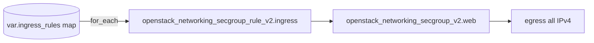

# Reusable OpenStack Security Group Rules with Terraform for_each

Drive an OpenStack security group's ingress rules from a single map variable
using `for_each`. Add or remove a port by editing data, not by copying resource
blocks — a clean, reusable pattern for web tiers and beyond.

> **Primary search phrase:** Terraform OpenStack security group for_each rules

## Architecture



Each entry in `ingress_rules` becomes one rule resource, keyed by its name, so
the collection stays stable as entries are added or removed.

## Usage

```bash
export OS_CLOUD=openstack          # or set `cloud` in terraform.tfvars
cp terraform.tfvars.example terraform.tfvars
terraform init
terraform plan
terraform apply
```

## Inputs

| Name | Description | Type | Default |
|------|-------------|------|---------|
| `cloud` | clouds.yaml entry to use | `string` | `"openstack"` |
| `secgroup_name` | Group name | `string` | `"example-web-tier"` |
| `ingress_rules` | Map of `{protocol, port, cidr}` keyed by rule name | `map(object)` | see `variables.tf` |
| `tags` | Tags on the group | `list(string)` | see `variables.tf` |

## Outputs

| Name | Description |
|------|-------------|
| `secgroup_id` | UUID of the security group |
| `secgroup_name` | Name of the security group |
| `ingress_rule_ids` | Map of rule name to rule UUID |

## Best practices

- **Why this approach:** `for_each` over a map keys each rule by name, so deleting
  the middle rule does not re-create the others (unlike `count`, which re-indexes).
- **Common mistakes:** Using `count` and watching unrelated rules churn; non-unique
  or unstable map keys; forgetting that changing a key forces replace of that rule.
- **Scaling considerations:** Lift `ingress_rules` into a module input and feed
  per-environment maps from `*.tfvars` to reuse the pattern everywhere.

## Security considerations

- A validation block rejects any rule that opens port 22 to `0.0.0.0/0`, keeping
  least privilege enforceable even when rules come from external data.
- Keep the map small and intentional — every entry is an attack-surface decision.
- Prefer `remote_group_id`-based rules (see
  [`security-group-remote-group`](../security-group-remote-group/)) for tier-to-tier
  access; use CIDR rules mainly for genuinely external sources.
- Groups are stateful; no reverse rules are required for replies.

## Troubleshooting

| Symptom | Likely cause | Fix |
|---------|--------------|-----|
| Validation error on apply | A rule opens SSH to `0.0.0.0/0` | Scope that entry's `cidr` |
| Many rules replaced on edit | Renamed a map key | Keep keys stable; rename is a destroy/create |
| Duplicate rule error | Same proto/port/cidr already exists | Remove the duplicate map entry |
| Rule not taking effect | Group not attached to the instance/port | Attach `secgroup_id` to the workload |
| Provider auth errors | Bad/missing `clouds.yaml` or `OS_CLOUD` | See [provider configuration](../../../docs/provider-configuration.md) |

## Cleanup

```bash
terraform destroy
```

## Further reading

- [Provider configuration & clouds.yaml](../../../docs/provider-configuration.md)
- [OpenStack provider — secgroup rule docs](https://registry.terraform.io/providers/terraform-provider-openstack/openstack/latest/docs/resources/networking_secgroup_rule_v2)
- [DevOps AI ToolKit blog](https://devopsaitoolkit.com/blog/)
