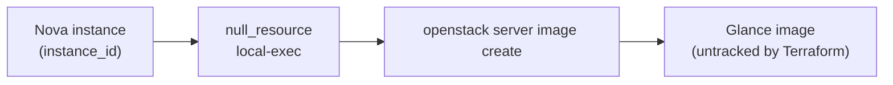

# Instance Snapshot via OpenStack CLI

> **Primary search phrase:** Terraform OpenStack instance snapshot example

**There is no native Terraform resource for instance snapshots.** The OpenStack
provider cannot snapshot a Nova server, so this example wraps the CLI command
`openstack server image create`, which captures a running instance into a Glance
image. The resulting image is **not** tracked by Terraform state and survives
`terraform destroy`.

## Architecture



## Usage

```bash
export OS_CLOUD=openstack
cp terraform.tfvars.example terraform.tfvars
# edit terraform.tfvars: set instance_id and image_name

terraform init
terraform plan
terraform apply
```

With `wait = true` the command blocks until the image reaches `active`. The
OpenStack CLI must be installed and on PATH on the Terraform host.

## Inputs

| Name        | Description                                                   | Type   | Default                |
| ----------- | ------------------------------------------------------------ | ------ | ---------------------- |
| cloud       | Name of the cloud entry in clouds.yaml (via OS_CLOUD/`cloud`).| string | "openstack"            |
| instance_id | UUID of the Nova instance to snapshot into a Glance image.   | string | (required)             |
| image_name  | Name to assign to the resulting Glance image.                | string | "tf-instance-snapshot" |
| wait        | Block until the image becomes active before returning.       | bool   | true                   |

## Outputs

| Name       | Description                                                  |
| ---------- | ----------------------------------------------------------- |
| image_name | Name of the Glance image created from the instance snapshot.|
| note       | Reminder that the image is untracked, with delete command.  |

## Best practices

- For an instance with **attached extra volumes**, `server image create`
  snapshots only the **root disk** — the data volumes are not captured. Snapshot
  those separately (see the `snapshot-via-cli` example).
- For a **boot-from-volume** instance, Nova instead creates volume snapshots of
  the attached volumes; budget snapshot quota accordingly.
- For consistency, quiesce the filesystem or stop the instance before
  snapshotting; a live snapshot is crash-consistent only.
- Use timestamped `image_name` values and prune old images, since Terraform does
  not manage their lifecycle.

## Security considerations

- A snapshot image contains the full root disk, including any secrets baked into
  it. Restrict who can download or boot from the image.
- Sanitize instances (remove SSH keys, credentials, logs) before snapshotting if
  the image may be shared beyond the project.
- Keep `clouds.yaml` out of version control and scope credentials to the minimum
  role needed to create images.

## Troubleshooting

| Symptom                          | Likely cause                                          | Fix                                                                       |
| -------------------------------- | ----------------------------------------------------- | ------------------------------------------------------------------------ |
| `openstack: command not found`   | OpenStack CLI not installed on the Terraform host.    | Install `python-openstackclient` and ensure it is on PATH.               |
| Image stuck in `queued`/`saving` | Glance/Nova still uploading the snapshot.             | Wait, or use `wait = true`; check `openstack image show <name>`.         |
| Data volumes missing from image  | Instance had attached volumes (only root is captured).| Snapshot data volumes separately via `snapshot-via-cli`.                 |
| Volume attachment failed         | Boot-from-volume snapshot left a volume in transition.| Wait for volumes to return to `available`/`in-use`, then retry.          |
| Quota exceeded                   | Project image or snapshot quota reached.              | `openstack quota show`; delete old images/snapshots or raise the quota.  |

## Cleanup

```bash
terraform destroy
```

`terraform destroy` removes the `null_resource` from state but does **NOT**
delete the Glance image it created. Delete the image manually:

```bash
openstack image delete tf-instance-snapshot
```

## Further reading

- [DevOps AI Toolkit blog](https://devopsaitoolkit.com/blog/)
- [null_resource registry docs](https://registry.terraform.io/providers/hashicorp/null/latest/docs/resources/resource)
