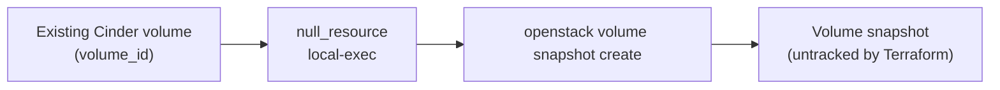

# Volume Snapshot via OpenStack CLI

> **Primary search phrase:** Terraform OpenStack volume snapshot example

**The OpenStack Terraform provider has NO native volume-snapshot resource.**
There is no `openstack_blockstorage_snapshot` resource you can declare. This
example therefore orchestrates `openstack volume snapshot create` through a
`null_resource` with a `local-exec` provisioner. Terraform records that the
provisioner ran, but it does **not** track the snapshot's lifecycle —
`terraform destroy` will not delete the snapshot.

## Architecture



## Usage

```bash
export OS_CLOUD=openstack
cp terraform.tfvars.example terraform.tfvars
# edit terraform.tfvars: set volume_id and snapshot_name

terraform init
terraform plan
terraform apply
```

Re-running `apply` after changing `volume_id`, `snapshot_name`, or `force`
re-triggers the snapshot. The OpenStack CLI must be installed and on PATH on the
machine running Terraform.

## Inputs

| Name                 | Description                                                                          | Type   | Default                        |
| -------------------- | ----------------------------------------------------------------------------------- | ------ | ------------------------------ |
| cloud                | Name of the cloud entry in clouds.yaml to use (via OS_CLOUD or `cloud`).             | string | "openstack"                    |
| volume_id            | UUID of the volume to snapshot.                                                     | string | (required)                     |
| snapshot_name        | Name to assign to the created volume snapshot.                                      | string | "tf-snapshot"                  |
| snapshot_description | Description applied to the created snapshot.                                        | string | "Created by Terraform via CLI" |
| force                | Allow snapshotting an in-use (attached) volume. Crash-consistent only.              | bool   | false                          |

## Outputs

| Name          | Description                                                  |
| ------------- | ----------------------------------------------------------- |
| snapshot_name | Name of the snapshot created via the CLI.                   |
| note          | Reminder that the snapshot is untracked, with delete command. |

## Best practices

- Prefer snapshotting a **detached** volume. When a volume is attached and
  in-use, the snapshot succeeds only with `force = true`.
- `force = true` produces a **crash-consistent** snapshot only — equivalent to
  pulling the power. For application consistency, quiesce/freeze the filesystem
  (e.g. `fsfreeze`) or stop the application before snapshotting.
- Use timestamped `snapshot_name` values so repeated snapshots do not collide.
- Track and prune snapshots out-of-band; because Terraform does not manage them,
  they will accumulate (and consume quota) until you delete them.

## Security considerations

- A snapshot is a full copy of the volume's data; protect it with the same
  data-classification controls as the source volume.
- Scope `clouds.yaml` credentials to the minimum role needed to create
  snapshots, and keep the file out of version control.
- The `local-exec` runs on the Terraform host — ensure that host and its shell
  history are trusted, since the OpenStack credentials are exposed there.

## Troubleshooting

| Symptom                        | Likely cause                                                | Fix                                                                                |
| ------------------------------ | ----------------------------------------------------------- | --------------------------------------------------------------------------------- |
| `openstack: command not found` | OpenStack CLI not installed on the Terraform host.          | Install `python-openstackclient` and ensure it is on PATH.                         |
| Snapshot create fails: in-use  | Volume is attached and `force` is false.                    | Set `force = true` (crash-consistent) or detach the volume first.                 |
| Volume attachment failed       | Volume busy/attaching when the snapshot ran.                | Wait for the volume to reach `available`/`in-use`, then re-run.                    |
| Quota exceeded                 | Project snapshot count or gigabyte quota reached.           | `openstack quota show`; delete old snapshots or raise the quota.                   |
| Duplicate snapshot every apply | A trigger value changed unexpectedly.                       | Pin `snapshot_name`/`volume_id`; only change triggers when a new snapshot is wanted. |

## Cleanup

```bash
terraform destroy
```

`terraform destroy` removes the `null_resource` from state but does **NOT**
delete the snapshot it created. Delete the snapshot manually:

```bash
openstack volume snapshot delete tf-snapshot
```

## Further reading

- [DevOps AI Toolkit blog](https://devopsaitoolkit.com/blog/)
- [null_resource registry docs](https://registry.terraform.io/providers/hashicorp/null/latest/docs/resources/resource)
