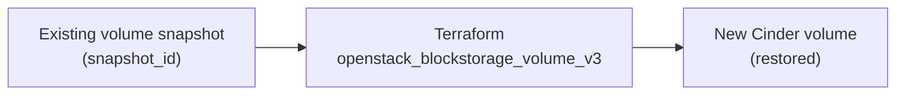

# Cinder Volume From a Snapshot

> **Primary search phrase:** Terraform OpenStack volume from snapshot example

This example restores a brand-new Cinder volume from an existing volume
snapshot. The new volume is a full, independent copy — once created it has no
ongoing dependency on the snapshot.

## Architecture



## Usage

```bash
export OS_CLOUD=openstack
cp terraform.tfvars.example terraform.tfvars
# edit terraform.tfvars: set snapshot_id and sizing

terraform init
terraform plan
terraform apply
```

The restore workflow is: (1) a snapshot already exists — create one with the
`snapshot-via-cli` example or `openstack volume snapshot create`; (2) supply its
UUID as `snapshot_id`; (3) `terraform apply` provisions a new volume populated
from that snapshot. The `volume_size` must be **greater than or equal to** the
source snapshot size; omit it to inherit the snapshot's size.

## Inputs

| Name               | Description                                                                 | Type   | Default                              |
| ------------------ | --------------------------------------------------------------------------- | ------ | ------------------------------------ |
| cloud              | Name of the cloud entry in clouds.yaml to use (via OS_CLOUD or `cloud`).     | string | "openstack"                          |
| volume_name        | Name for the new volume restored from the snapshot.                         | string | "restored-volume"                    |
| volume_description | Description applied to the restored volume.                                 | string | "Restored from snapshot by Terraform" |
| volume_size        | Size of the restored volume in GiB. Must be >= the source snapshot size.    | number | 10                                   |
| snapshot_id        | UUID of the source volume snapshot to restore from.                         | string | (required)                           |

## Outputs

| Name               | Description                                          |
| ------------------ | ---------------------------------------------------- |
| volume_id          | UUID of the restored volume.                         |
| volume_name        | Name of the restored volume.                         |
| source_snapshot_id | UUID of the snapshot the volume was restored from.   |

## Best practices

- Always size the restored volume **>= the snapshot size**. Sizing equal to the
  snapshot is fine; the volume can be grown later but never shrunk.
- Tag the restored volume with `metadata` (e.g. restore date, source snapshot)
  so its provenance is auditable.
- Restore into the same availability zone as the workload that will attach it to
  avoid cross-AZ attach failures.
- Validate data after restore by mounting the volume read-only before promoting
  it into production.

## Security considerations

- A restored volume inherits the data of the snapshot — treat it with the same
  data-classification as the source. Encrypt with an encrypted `volume_type`
  when the source held sensitive data.
- Restrict who can read snapshots in your project; anyone who can restore a
  snapshot effectively has a full copy of the original data.
- Keep `clouds.yaml` out of version control and scope credentials to the minimum
  project/role needed to create volumes.

## Troubleshooting

| Symptom                    | Likely cause                                              | Fix                                                                       |
| -------------------------- | -------------------------------------------------------- | ------------------------------------------------------------------------ |
| Snapshot not found         | Wrong `snapshot_id` or snapshot in another project.       | `openstack volume snapshot list` and copy the correct UUID.              |
| Requested size too small   | `volume_size` is smaller than the snapshot size.          | Set `volume_size` >= snapshot size, or omit it to inherit.              |
| Volume stuck in `creating` | Backend slow or out of capacity.                          | Check `openstack volume show <id>` and Cinder logs; verify pool space.   |
| Volume attachment failed   | AZ mismatch or volume already attached elsewhere.         | Ensure the volume and instance share an AZ; detach before re-attaching.  |
| Quota exceeded             | Project volume count or gigabyte quota reached.           | `openstack quota show` then raise the quota or delete unused volumes.    |

## Cleanup

```bash
terraform destroy
```

This deletes only the restored volume that Terraform created. The source
snapshot is **not** managed here and is left untouched.

## Further reading

- [DevOps AI Toolkit blog](https://devopsaitoolkit.com/blog/)
- [openstack_blockstorage_volume_v3 registry docs](https://registry.terraform.io/providers/terraform-provider-openstack/openstack/latest/docs/resources/blockstorage_volume_v3)
