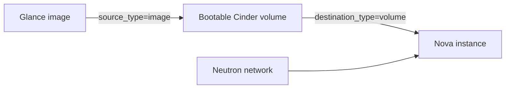

# Boot From Volume Instance

> **Primary search phrase:** Terraform OpenStack boot from volume example

This example boots a Nova instance from a new Cinder volume created from a Glance
image, rather than from the ephemeral root disk. The result is a persistent,
resizable root disk that can outlive the instance.

## Architecture



## Usage

```bash
export OS_CLOUD=openstack
cp terraform.tfvars.example terraform.tfvars
# edit terraform.tfvars for your environment

terraform init
terraform plan
terraform apply
```

## Inputs

| Name                  | Description                                                                           | Type           | Default            |
| --------------------- | ------------------------------------------------------------------------------------ | -------------- | ------------------ |
| cloud                 | Name of the cloud entry in clouds.yaml to use.                                        | `string`       | `"openstack"`      |
| instance_name         | Name to assign to the booted instance.                                               | `string`       | `"example-bfv"`    |
| flavor_name           | Nova flavor (size) for the instance.                                                 | `string`       | `"m1.small"`       |
| image_name            | Name of the Glance image to create the root volume from.                             | `string`       | `"ubuntu-22.04"`   |
| network_name          | Name of the Neutron network to attach the instance to.                               | `string`       | `"private"`        |
| root_volume_size      | Size of the bootable root volume in GiB.                                              | `number`       | `20`               |
| delete_on_termination | Whether the root volume is deleted when the instance is destroyed.                   | `bool`         | `true`             |
| key_pair_name         | Optional Nova key pair name for SSH access. Empty for none.                           | `string`       | `""`               |
| security_group_names  | Security groups to apply to the instance.                                            | `list(string)` | `["default"]`      |

## Outputs

| Name          | Description                                       |
| ------------- | ------------------------------------------------ |
| instance_id   | UUID of the booted instance.                     |
| instance_name | Name of the booted instance.                     |
| access_ip_v4  | IPv4 address Terraform uses to reach the instance. |

## Best practices

- **Why this approach:** `source_type = "image"` with `destination_type =
  "volume"` tells Nova to create a bootable Cinder volume from the image and boot
  the instance off it. Unlike an ephemeral root disk, this volume persists and can
  be snapshotted and resized.
- **`delete_on_termination` controls data retention.** Leave it `true` for
  disposable instances. Set it to `false` to keep the root volume (and its data)
  after the instance is destroyed — useful for recovery, but the orphaned volume
  keeps incurring cost until you delete it.
- **Common mistake:** Setting `root_volume_size` smaller than the image's minimum
  disk requirement, which makes the boot volume creation fail. Size the root
  volume at or above the image's `min_disk`.
- **Scaling:** For fleets, drive `instance_name` and counts with `for_each`/`count`
  and keep the image/flavor as variables so the same module serves many sizes.
- **Performance:** Choose a `volume_type`-backed storage tier (configured at the
  Cinder backend) that matches the instance's IO profile; boot-from-volume IO is
  bound by the Cinder backend, not local disk.
- **Cost:** Boot volumes are billed continuously. With `delete_on_termination =
  false`, audit for orphaned volumes regularly.

## Security considerations

- Always attach an SSH `key_pair_name` for production instances; avoid password
  auth on the image.
- Scope `security_group_names` tightly — `default` often permits more than you
  want. Restrict ingress to required ports/sources.
- Retained root volumes (`delete_on_termination = false`) may contain sensitive
  data; encrypt them via an encrypted volume type and delete them when finished.
- Keep `clouds.yaml` permissions tight (`chmod 600`) and out of version control.

## Troubleshooting

| Symptom                      | Likely cause                                                          | Fix                                                                                       |
| ---------------------------- | --------------------------------------------------------------------- | ---------------------------------------------------------------------------------------- |
| Volume attachment failed     | The bootable volume could not be created or attached (AZ mismatch, backend full, image too large for `root_volume_size`). | Ensure the chosen AZ has Cinder capacity, set `root_volume_size` >= image `min_disk`, and confirm the image is active. |
| Quota exceeded               | Project quota for instances, volumes, or gigabytes is reached.        | Reduce size/count or request a quota increase from your operator.                         |
| Image not found / ambiguous  | `image_name` does not match, or multiple images share the name.       | Verify with `openstack image list`; `most_recent = true` already disambiguates duplicates. |
| Network not found            | `network_name` does not exist in this project.                        | Check `openstack network list` and use the correct name.                                  |
| No access_ip_v4 returned     | The network provides no fixed IPv4 reachable by Terraform.            | Attach a network/subnet with IPv4 or associate a floating IP.                             |

## Cleanup

```bash
terraform destroy
```

> Note: if `delete_on_termination = false`, the root volume survives `destroy`
> and must be deleted manually with `openstack volume delete`.

## Further reading

- [OpenStack DevOps articles on devopsaitoolkit.com](https://devopsaitoolkit.com/blog/)
- [openstack_compute_instance_v2 resource docs](https://registry.terraform.io/providers/terraform-provider-openstack/openstack/latest/docs/resources/compute_instance_v2)
