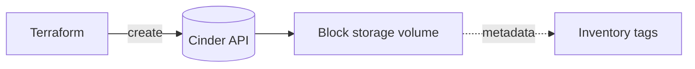

# Cinder Block Storage Volume

> **Primary search phrase:** Terraform OpenStack Cinder volume example

This example provisions a single standalone Cinder block storage volume. It is
the base building block that the other storage examples in this repository build
on top of.

## Architecture



## Usage

```bash
export OS_CLOUD=openstack
cp terraform.tfvars.example terraform.tfvars
# edit terraform.tfvars for your environment

terraform init
terraform plan
terraform apply
```

## Inputs

| Name               | Description                                                          | Type          | Default                              |
| ------------------ | ------------------------------------------------------------------- | ------------- | ------------------------------------ |
| cloud              | Name of the cloud entry in clouds.yaml to use.                       | `string`      | `"openstack"`                        |
| volume_name        | Name to assign to the Cinder volume.                                 | `string`      | `"example-volume"`                   |
| volume_description | Human-readable description stored on the volume.                     | `string`      | `"Managed by Terraform"`             |
| volume_size        | Size of the volume in GiB.                                           | `number`      | `10`                                 |
| volume_type        | Cinder volume type. Leave empty to use the backend default.          | `string`      | `""`                                 |
| metadata           | Key/value metadata attached to the volume for inventory.            | `map(string)` | `{ "managed-by" = "terraform" }`     |

## Outputs

| Name        | Description                            |
| ----------- | -------------------------------------- |
| volume_id   | UUID of the created Cinder volume.     |
| volume_name | Name of the created Cinder volume.     |
| volume_size | Size of the created Cinder volume in GiB. |

## Best practices

- **Why this approach:** Managing a volume as a discrete resource keeps its
  lifecycle independent of any compute instance, so data survives instance
  rebuilds and re-creation.
- **Size is in GiB.** `volume_size = 10` means 10 GiB. Cinder rounds up to whole
  GiB; there is no sub-GiB allocation.
- **`volume_type` is optional.** Leaving it empty (`""`) lets Cinder pick the
  backend default type. Set it explicitly (for example `ssd` or `nvme`) only when
  your cloud exposes multiple types and you need a specific tier.
- **Use `metadata` for inventory.** Tag volumes with owner, environment, and
  cost-center keys so they can be reconciled against billing and CMDB records.
- **Common mistake:** Hard-coding a `volume_type` that does not exist in the
  target cloud — `terraform apply` fails at create time. Confirm available types
  with `openstack volume type list`.
- **Scaling:** For many similar volumes use `count` or `for_each` rather than
  copy/pasting the resource block.
- **Performance:** Match the `volume_type` tier to the workload; spinning up a
  large volume on a slow default backend is a common throughput surprise.
- **Cost:** Volumes are billed for their full provisioned size whether or not the
  data is used, so right-size from the start and clean up orphaned volumes.

## Security considerations

- Volume metadata is visible to anyone with read access to the project; do not
  store secrets in it.
- Credentials come from `clouds.yaml`; keep that file out of version control and
  restrict its file permissions (`chmod 600`).
- Use project-scoped credentials with only the Cinder permissions required.
- Enable volume encryption at the volume-type level in clouds that support it for
  data-at-rest protection.

## Troubleshooting

| Symptom                  | Likely cause                                              | Fix                                                                 |
| ------------------------ | -------------------------------------------------------- | ------------------------------------------------------------------ |
| Volume attachment failed | This example only creates a volume; attach happens elsewhere. | See the `volume-attachment` example; ensure the volume is `available`. |
| Quota exceeded           | Project Cinder quota (volumes or gigabytes) is reached.  | Reduce `volume_size`/count or request a quota increase from your operator. |
| Invalid volume type      | `volume_type` not defined on the backend.                | Run `openstack volume type list` and use a valid type or leave empty. |
| Authentication error     | `OS_CLOUD` unset or wrong `cloud` entry.                 | `export OS_CLOUD=openstack` and verify the entry in clouds.yaml.    |

## Cleanup

```bash
terraform destroy
```

## Further reading

- [OpenStack DevOps articles on devopsaitoolkit.com](https://devopsaitoolkit.com/blog/)
- [openstack_blockstorage_volume_v3 resource docs](https://registry.terraform.io/providers/terraform-provider-openstack/openstack/latest/docs/resources/blockstorage_volume_v3)
