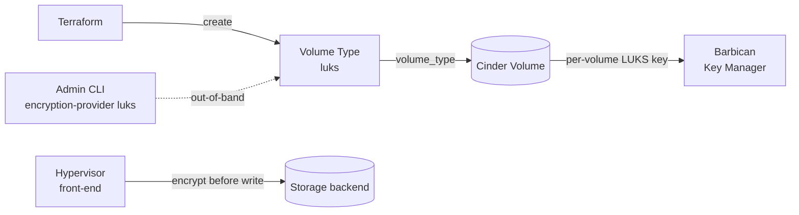

# Encrypted Cinder Volume Type

> **Primary search phrase:** Terraform OpenStack encrypted volume example

## Architecture



## Usage

```bash
export OS_CLOUD=openstack
cp terraform.tfvars.example terraform.tfvars
# edit terraform.tfvars to taste

terraform init
terraform plan
terraform apply
```

After apply, an admin must attach the encryption parameters to the volume type
(the provider has no native resource for this):

```bash
openstack volume type set --encryption-provider luks \
  --encryption-cipher aes-xts-plain64 \
  --encryption-key-size 256 \
  --encryption-control-location front-end luks
```

> **Admin only:** creating volume types and setting volume-type encryption
> requires the **admin** role.

## Inputs

| Name                      | Description                                                          | Type          | Default                                                            |
| ------------------------- | ------------------------------------------------------------------- | ------------- | ----------------------------------------------------------------- |
| `cloud`                   | Name of the cloud entry in clouds.yaml to use (via OS_CLOUD or the provider 'cloud' argument). | `string`      | `"openstack"`                                                     |
| `volume_type_name`        | Name of the volume type intended for LUKS encryption.               | `string`      | `"luks"`                                                          |
| `volume_type_description` | Human-readable description for the volume type.                     | `string`      | `"LUKS-encrypted volumes (encryption configured via CLI/Barbican)"` |
| `extra_specs`             | Extra specs for the volume type (e.g. backend selection).           | `map(string)` | `{ volume_backend_name = "lvmdriver-1" }`                         |
| `volume_name`             | Name of the Cinder volume created from the encrypted type.          | `string`      | `"example-encrypted-volume"`                                     |
| `volume_size`             | Size of the volume in GiB.                                          | `number`      | `10`                                                             |

## Outputs

| Name             | Description                                          |
| ---------------- | --------------------------------------------------- |
| `volume_type_id` | ID of the encryption-intended volume type.          |
| `volume_id`      | ID of the Cinder volume created from the encrypted type. |

## Best practices

- Keep encryption configuration declarative where you can (the volume type and
  its `extra_specs`) and document the out-of-band CLI step alongside the code.
- Use a clear, intent-based type name such as `luks` so operators know volumes
  of this type are encrypted.
- Standardize on a strong cipher and key size (e.g. `aes-xts-plain64`, 256-bit)
  across environments.
- Verify Barbican (Key Manager) is deployed and that Cinder/Nova are configured
  to use it before relying on LUKS encryption.

## Security considerations

- **LUKS + Barbican:** per-volume LUKS keys are generated and stored in Barbican
  (the Key Manager service). Without Barbican, encrypted volumes cannot be
  created or attached. Protect and back up Barbican accordingly.
- **Out-of-band config:** the encryption parameters (provider, cipher, key size,
  control location) are set via the admin CLI shown in `main.tf`; the provider
  has no native resource for them, so they are not tracked in Terraform state.
- **front-end control location:** encryption happens on the **hypervisor** —
  data is encrypted before it ever reaches the storage backend, so data at rest
  on the backend (and in transit to it) is ciphertext.
- **Performance overhead:** hypervisor-side encryption consumes compute CPU and
  adds latency; benchmark before using it for IO-heavy workloads.
- This workflow is **admin-only**; scope credentials accordingly and keep
  `clouds.yaml` out of version control.

## Troubleshooting

| Symptom                            | Likely cause                                                          | Fix                                                                                       |
| ---------------------------------- | --------------------------------------------------------------------- | ----------------------------------------------------------------------------------------- |
| Volume stuck/error on create       | Barbican (Key Manager) unavailable or Cinder not configured for LUKS. | Verify Barbican is deployed and Cinder's key manager points to it; check `cinder-volume` logs. |
| Encryption not applied to volumes  | Volume-type encryption parameters were never set via the CLI.         | Run `openstack volume type set --encryption-provider luks ... <type>` as admin.           |
| Volume attachment failed           | Nova cannot retrieve the LUKS key from Barbican, or volume in error state. | Check Nova/Barbican connectivity and policy; inspect `openstack volume show <id>`.        |
| Quota exceeded                     | Project volume or gigabyte quota is exhausted.                        | Free unused volumes or request a quota increase (`openstack quota show`).                  |
| `403`/policy error setting type    | Caller lacks the admin role for volume types/encryption.              | Use admin credentials.                                                                     |

## Cleanup

```bash
terraform destroy
```

## Further reading

- [Volume encryption on devopsaitoolkit.com](https://devopsaitoolkit.com/blog/)
- [openstack_blockstorage_volume_type_v3 registry docs](https://registry.terraform.io/providers/terraform-provider-openstack/openstack/latest/docs/resources/blockstorage_volume_type_v3)
