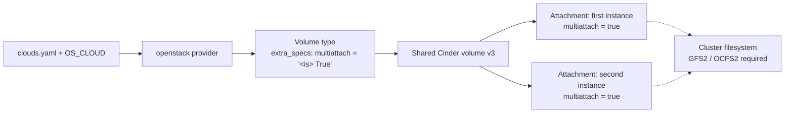

# Multiattach Cinder Volume

> **Primary search phrase:** Terraform OpenStack multiattach volume example

> **Note:** Creating the multiattach volume type requires the **admin** role.

## Architecture



## Usage

```bash
export OS_CLOUD=openstack
cp terraform.tfvars.example terraform.tfvars
# edit terraform.tfvars: set first_instance_id and second_instance_id

terraform init
terraform plan
terraform apply
```

## Inputs

| Name               | Description                                                                       | Type     | Default                     |
| ------------------ | --------------------------------------------------------------------------------- | -------- | --------------------------- |
| cloud              | Name of the cloud entry in clouds.yaml to use (via OS_CLOUD or 'cloud').           | `string` | `"openstack"`               |
| volume_type_name   | Name of the multiattach-capable Cinder volume type to create (admin-only).        | `string` | `"multiattach"`             |
| volume_name        | Name of the shared Cinder volume to create.                                       | `string` | `"example-shared-volume"`   |
| volume_size        | Size of the shared volume in GiB.                                                 | `number` | `10`                        |
| first_instance_id  | ID of the first instance to attach the shared volume to.                          | `string` | _(required)_                |
| second_instance_id | ID of the second instance to attach the shared volume to.                         | `string` | _(required)_                |

## Outputs

| Name                 | Description                                  |
| -------------------- | -------------------------------------------- |
| volume_id            | ID of the shared multiattach volume.         |
| first_attachment_id  | ID of the attachment to the first instance.  |
| second_attachment_id | ID of the attachment to the second instance. |

## Best practices

- **How multiattach is actually enabled:** The `openstack_blockstorage_volume_v3` resource has **no `multiattach` argument**. The capability is granted by the **volume type** via `extra_specs = { "multiattach" = "<is> True" }`. The volume then references that type, and **each attachment** (`openstack_compute_volume_attach_v2`) opts in with `multiattach = true`. Setting `multiattach = true` on an attachment to a volume whose type lacks the spec fails.
- **A cluster filesystem is mandatory:** Multiattach exposes the same block device to multiple instances; it does **not** coordinate writes. Formatting it as plain ext4/xfs and mounting read-write on two nodes **will corrupt the data**. You must run a cluster-aware filesystem such as **GFS2 or OCFS2** (with the matching cluster manager, e.g. Pacemaker/DLM), or keep all-but-one mount read-only.
- **Common mistakes:** Expecting a `multiattach` flag on the volume; omitting the type's `extra_specs`; formatting with a single-writer filesystem; attaching to instances on backends that do not support multiattach.
- **Scaling:** Generalize the two static attachments into `for_each` over a set of instance IDs to share one volume across an N-node cluster.
- **Performance:** Concurrent access multiplies IOPS demand on one volume — place multiattach volumes on a fast backend and watch for contention; the shared device can become a cluster-wide bottleneck.
- **Cost:** One shared volume is cheaper than N copies, but the cluster filesystem and quorum infrastructure add operational cost — only adopt multiattach when shared block storage is a real requirement.

## Security considerations

- **Data-corruption risk is the headline security concern:** without a cluster-aware filesystem (GFS2/OCFS2), concurrent read-write mounts will corrupt the volume. Treat the cluster filesystem as a hard requirement, not an optimization.
- Creating the multiattach volume type is **admin-only**; protect the admin `clouds.yaml` entry.
- Every instance attached to the volume can read all of its data — only attach to instances inside the same trust boundary, and use the cluster filesystem's locking to bound write access.

## Troubleshooting

| Symptom                          | Likely cause                                                          | Fix                                                                                  |
| -------------------------------- | -------------------------------------------------------------------- | ------------------------------------------------------------------------------------ |
| Type create returns 403          | Credentials lack the admin role                                      | Use an admin `clouds.yaml` entry to create the multiattach volume type.              |
| `multiattach = true` rejected    | Volume type missing `extra_specs "multiattach" = "<is> True"`        | Ensure the volume uses the multiattach-capable type before attaching.                |
| Volume attachment failed         | Instance/volume in different AZs, instance not ACTIVE, or backend has no multiattach support | Same AZ, instance ACTIVE; confirm the storage backend supports multiattach.          |
| Filesystem corruption on shared volume | Plain ext4/xfs mounted read-write on multiple nodes            | Use a cluster filesystem (GFS2/OCFS2) or keep extra mounts read-only.                |
| Quota exceeded                   | Project volume count or gigabytes quota reached                      | Free volumes or request a quota increase with `openstack quota show`.                |

## Cleanup

```bash
terraform destroy
```

## Further reading

- [DevOps AI Toolkit blog](https://devopsaitoolkit.com/blog/)
- [openstack_compute_volume_attach_v2 registry docs](https://registry.terraform.io/providers/terraform-provider-openstack/openstack/latest/docs/resources/compute_volume_attach_v2)
