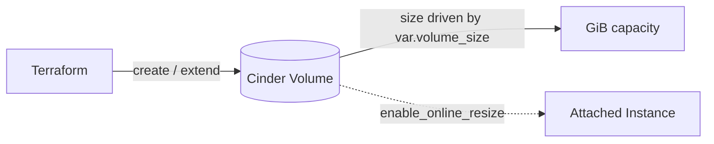

# Resize a Cinder Volume

> **Primary search phrase:** Terraform OpenStack resize volume example

## Architecture



## Usage

```bash
export OS_CLOUD=openstack
cp terraform.tfvars.example terraform.tfvars
# edit terraform.tfvars to taste

terraform init
terraform plan
terraform apply
```

To grow the volume, raise `volume_size` in `terraform.tfvars` and re-run
`terraform apply`.

## Inputs

| Name                   | Description                                                                                                          | Type     | Default                                  |
| ---------------------- | ------------------------------------------------------------------------------------------------------------------ | -------- | ---------------------------------------- |
| `cloud`                | Name of the cloud entry in clouds.yaml to use (via OS_CLOUD or the provider 'cloud' argument).                      | `string` | `"openstack"`                            |
| `volume_name`          | Name of the Cinder volume.                                                                                          | `string` | `"example-resizable-volume"`             |
| `volume_description`   | Human-readable description for the volume.                                                                          | `string` | `"Resizable volume managed by Terraform"` |
| `volume_size`          | Size of the volume in GiB. Increase and re-apply to grow; Cinder cannot shrink a volume.                           | `number` | `10`                                     |
| `enable_online_resize` | Allow the volume to grow while attached to a running instance. Set true only if the backend and Nova support online extend. | `bool`   | `false`                                  |

## Outputs

| Name          | Description                              |
| ------------- | ---------------------------------------- |
| `volume_id`   | ID of the managed Cinder volume.         |
| `volume_size` | Current size of the volume in GiB.       |

## Best practices

- Drive `size` from a variable so capacity changes are reviewable in a plan and
  recorded in version control.
- Cinder can only **extend** (grow) a volume, never shrink it. Pick a sensible
  starting size and grow as needed.
- For online growth of an attached volume, set `enable_online_resize = true` and
  confirm your storage backend and Nova both support online extend.
- After the volume grows at the Cinder layer, you still must grow the partition
  and filesystem **inside the guest**, e.g. `growpart /dev/vdb 1` followed by
  `resize2fs /dev/vdb1` (ext4) or `xfs_growfs /mountpoint` (XFS).

## Security considerations

- Limit who can extend volumes; capacity changes consume project quota and can
  incur cost.
- Online resize touches a running instance's attached disk. Take a snapshot or
  backup before resizing production data volumes.
- Keep `clouds.yaml` credentials out of version control; reference them via
  `OS_CLOUD`.

## Troubleshooting

| Symptom                                | Likely cause                                                              | Fix                                                                                          |
| -------------------------------------- | ------------------------------------------------------------------------- | -------------------------------------------------------------------------------------------- |
| Lowering `volume_size` errors out      | Cinder cannot shrink a volume; reducing size forces an error/replacement. | Restore the previous (larger) value; create a new smaller volume and migrate data if needed. |
| Volume attachment failed               | Volume is in an error/reserved state, or attach raced with another op.    | Check `openstack volume show <id>`; detach/reset state, then re-apply.                        |
| Quota exceeded                         | Project volume or gigabyte quota is exhausted.                            | Free unused volumes or request a quota increase (`openstack quota show`).                     |
| Online resize rejected                 | Backend or Nova does not support extending an attached volume.            | Detach the volume, grow it, reattach; or enable online extend on the backend.                |
| Guest filesystem still shows old size  | Cinder extended the block device but the guest FS was not grown.          | Run `growpart` then `resize2fs`/`xfs_growfs` inside the instance.                             |

## Cleanup

```bash
terraform destroy
```

## Further reading

- [Block storage on devopsaitoolkit.com](https://devopsaitoolkit.com/blog/)
- [openstack_blockstorage_volume_v3 registry docs](https://registry.terraform.io/providers/terraform-provider-openstack/openstack/latest/docs/resources/blockstorage_volume_v3)
