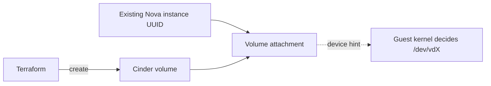

# Attach a Cinder Volume to an Instance

> **Primary search phrase:** Terraform OpenStack volume attachment example

This example creates a Cinder volume and attaches it to an existing Nova
instance. The instance is referenced by UUID, so the example stays decoupled
from however that instance was provisioned.

## Architecture



## Usage

```bash
export OS_CLOUD=openstack
cp terraform.tfvars.example terraform.tfvars
# edit terraform.tfvars and set instance_id to your instance UUID

terraform init
terraform plan
terraform apply
```

## Inputs

| Name        | Description                                                                  | Type     | Default                  |
| ----------- | --------------------------------------------------------------------------- | -------- | ------------------------ |
| cloud       | Name of the cloud entry in clouds.yaml to use.                               | `string` | `"openstack"`            |
| volume_name | Name to assign to the Cinder volume that will be attached.                   | `string` | `"example-data-volume"`  |
| volume_size | Size of the volume in GiB.                                                   | `number` | `10`                     |
| instance_id | UUID of the existing Nova instance to attach the volume to.                  | `string` | _(required)_             |
| device      | Optional device hint such as /dev/vdb. The guest kernel may not honour it.   | `string` | `""`                     |

## Outputs

| Name          | Description                                              |
| ------------- | ------------------------------------------------------- |
| volume_id     | UUID of the created Cinder volume.                      |
| attachment_id | ID of the volume attachment resource.                  |
| device        | Device path the volume was attached as (per Nova).     |

## Best practices

- **Why this approach:** Referencing the instance by UUID keeps the attachment
  decoupled from instance creation, so you can attach storage to instances built
  by another module, team, or process.
- **Device naming is a hint, not a guarantee.** The `device` value (e.g.
  `/dev/vdb`) is passed to Nova, but the guest kernel ultimately decides the path.
  Inside the guest, identify volumes by serial/UUID (`/dev/disk/by-id/...`) rather
  than relying on a fixed `/dev/vdX` name.
- **Common mistake:** Trying to attach a volume to an instance that is not yet
  `ACTIVE`, or a volume that is not `available` — both cause attachment failures.
- **Scaling:** For multiple data disks, use `for_each` over a map of volume
  definitions instead of duplicating the resource pair.
- **Performance:** Place the volume and instance in the same availability zone to
  avoid cross-AZ attachment failures and latency.
- **Cost:** The attached volume is billed for its full provisioned size; detach
  and delete volumes that are no longer needed.

## Security considerations

- Restrict who can supply `instance_id`; attaching a volume to the wrong instance
  can expose data to another tenant of that instance.
- Use volume-type level encryption for sensitive data at rest.
- Keep `clouds.yaml` permissions tight (`chmod 600`) and out of version control.
- Format and mount the attached device with appropriate permissions inside the
  guest; a raw attached block device is world-readable to root.

## Troubleshooting

| Symptom                  | Likely cause                                                              | Fix                                                                                          |
| ------------------------ | ------------------------------------------------------------------------ | ------------------------------------------------------------------------------------------- |
| Volume attachment failed | Instance not `ACTIVE`, volume not `available`, or instance/volume in different AZs. | Wait for the instance to reach `ACTIVE`, ensure the volume is `available`, and place both in the same AZ. |
| Quota exceeded           | Project Cinder volume/gigabyte quota reached.                            | Reduce size/count or request a quota increase from your operator.                            |
| Device shows wrong path  | Guest kernel ignored the `device` hint.                                  | Identify the disk by `/dev/disk/by-id/` inside the guest instead of `/dev/vdX`.              |
| Instance not found       | `instance_id` UUID is wrong or in another project.                       | Verify with `openstack server show <id>` using the same credentials.                         |

## Cleanup

```bash
terraform destroy
```

## Further reading

- [OpenStack DevOps articles on devopsaitoolkit.com](https://devopsaitoolkit.com/blog/)
- [openstack_compute_volume_attach_v2 resource docs](https://registry.terraform.io/providers/terraform-provider-openstack/openstack/latest/docs/resources/compute_volume_attach_v2)
