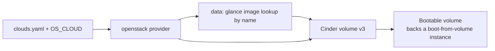

# Cinder Volume From a Glance Image

> **Primary search phrase:** Terraform OpenStack volume from image example

## Architecture



## Usage

```bash
export OS_CLOUD=openstack
cp terraform.tfvars.example terraform.tfvars
# edit terraform.tfvars for your cloud

terraform init
terraform plan
terraform apply
```

## Inputs

| Name        | Description                                                                 | Type     | Default                  |
| ----------- | --------------------------------------------------------------------------- | -------- | ------------------------ |
| cloud       | Name of the cloud entry in clouds.yaml to use (via OS_CLOUD or 'cloud').     | `string` | `"openstack"`            |
| image_name  | Name of the Glance image to look up and use as the volume source.           | `string` | `"ubuntu-22.04"`         |
| volume_name | Name of the Cinder volume to create.                                        | `string` | `"example-image-volume"` |
| volume_size | Size of the volume in GiB. Must be >= the image's minimum disk size.         | `number` | `20`                     |

## Outputs

| Name        | Description                                       |
| ----------- | ------------------------------------------------- |
| volume_id   | ID of the created Cinder volume.                  |
| image_id    | ID of the Glance image used as the volume source. |
| volume_size | Size of the created volume in GiB.                |

## Best practices

- **Why this approach:** Looking the image up by name with a data source (rather than hardcoding an image UUID) keeps the configuration portable. The same code works across clouds and survives image re-publishing, where the name is stable but the UUID changes.
- **Minimum disk size:** The volume must be **>= the image's minimum disk size** (`min_disk`). If `volume_size` is smaller, the create fails. Pad generously: a 20 GiB volume on a 10 GiB image leaves room for the root filesystem to grow on first boot via cloud-init.
- **Bootable result:** A volume created from an image is **bootable** and can directly back a boot-from-volume instance, giving you a persistent root disk that survives instance deletion.
- **Common mistakes:** Multiple images sharing a name without `most_recent = true` makes the data source ambiguous and fails the plan; sizing the volume below `min_disk`; forgetting that the volume, not the instance, now holds the OS lifecycle.
- **Scaling:** Use `for_each` over a map of `{name = size}` to provision a fleet of golden-image volumes from one module.
- **Performance:** Choose a `volume_type` backed by SSD/NVMe for root disks; image-to-volume copy time scales with image size, so prefer compact, sparse images.
- **Cost:** You pay for provisioned GiB, not used GiB. Right-size `volume_size` and delete unused bootable volumes, which keep billing even when no instance is attached.

## Security considerations

- Only consume trusted Glance images; a tampered image becomes your bootable root disk.
- Credentials come from `clouds.yaml`/`OS_CLOUD` — keep that file out of version control and readable only by your user.
- Treat the resulting volume as sensitive: it may contain baked-in secrets or SSH host keys from the source image.

## Troubleshooting

| Symptom                  | Likely cause                                                       | Fix                                                                          |
| ------------------------ | ----------------------------------------------------------------- | --------------------------------------------------------------------------- |
| Image lookup fails       | Name not found, or several images share the name                  | Verify with `openstack image list`; keep `most_recent = true`.              |
| Volume create fails      | `volume_size` is smaller than the image `min_disk`                | Raise `volume_size` to at least the image's minimum disk size.              |
| Volume attachment failed | Instance and volume in different AZs, or instance not ACTIVE      | Place both in the same availability zone; ensure the instance is running.   |
| Quota exceeded           | Project volume count or gigabytes quota reached                   | Free volumes or request a quota increase with `openstack quota show`.       |

## Cleanup

```bash
terraform destroy
```

## Further reading

- [DevOps AI Toolkit blog](https://devopsaitoolkit.com/blog/)
- [openstack_blockstorage_volume_v3 registry docs](https://registry.terraform.io/providers/terraform-provider-openstack/openstack/latest/docs/resources/blockstorage_volume_v3)
