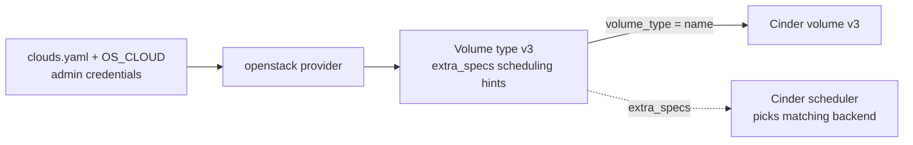

# Cinder Volume Type

> **Primary search phrase:** Terraform OpenStack volume type example

> **Note:** Creating volume types requires the **admin** role. A regular project
> user can consume an existing type but cannot create one.

## Architecture



## Usage

```bash
export OS_CLOUD=openstack
cp terraform.tfvars.example terraform.tfvars
# edit terraform.tfvars for your cloud (admin credentials required)

terraform init
terraform plan
terraform apply
```

## Inputs

| Name                    | Description                                                                   | Type          | Default                                       |
| ----------------------- | ----------------------------------------------------------------------------- | ------------- | --------------------------------------------- |
| cloud                   | Name of the cloud entry in clouds.yaml to use (via OS_CLOUD or 'cloud').       | `string`      | `"openstack"`                                 |
| volume_type_name        | Name of the Cinder volume type to create (admin-only operation).              | `string`      | `"ssd"`                                       |
| volume_type_description | Human-readable description of the volume type.                                | `string`      | `"SSD-backed volumes"`                        |
| is_public               | Whether the volume type is visible to all tenants (true) or private (false).  | `bool`        | `true`                                        |
| extra_specs             | Backend scheduling hints passed to the Cinder scheduler.                      | `map(string)` | `{ "volume_backend_name" = "lvmdriver-1" }`   |
| volume_name             | Name of the Cinder volume to create using the volume type.                    | `string`      | `"example-ssd-volume"`                        |
| volume_size             | Size of the volume in GiB.                                                     | `number`      | `10`                                          |

## Outputs

| Name             | Description                                  |
| ---------------- | -------------------------------------------- |
| volume_type_id   | ID of the created Cinder volume type.        |
| volume_type_name | Name of the created Cinder volume type.      |
| volume_id        | ID of the volume created with this volume type. |

## Best practices

- **Why this approach:** Volume types let operators expose storage tiers (SSD, HDD, encrypted, replicated) behind simple names. The `extra_specs` map is how a type maps onto real backends — `volume_backend_name` matches the name a Cinder backend advertises, and the scheduler places each new volume on a backend whose capabilities satisfy the type's specs.
- **extra_specs and the scheduler:** Keys like `volume_backend_name`, or capability filters such as `"volume_backend_name" = "lvmdriver-1"`, are evaluated by the Cinder capacity/capability scheduler at volume-create time. Get the spec wrong and the scheduler finds no host, so the volume sticks in `error`.
- **is_public / visibility:** `is_public = true` makes the type usable by every tenant; set it `false` for private types, then grant access per-project out of band. Use private types to keep premium tiers hidden from general users.
- **Admin-only:** Both creating and updating volume types require the **admin** role; plan/apply with a non-admin cloud entry fails with a 403.
- **Common mistakes:** Referencing a `volume_backend_name` that no backend advertises; making a premium type public by accident; editing `extra_specs` in place when a backend rename is needed (recreate instead).
- **Scaling:** Manage a catalog of types with `for_each` over a map of `{name = extra_specs}` so all storage tiers live in one reviewable module.
- **Performance:** Match types to backends deliberately — point latency-sensitive workloads at NVMe/SSD backends and bulk data at HDD backends.
- **Cost:** Types themselves are free; the volumes created from them are not. Use types to steer expensive workloads onto the right-cost backend rather than over-provisioning a single fast tier.

## Security considerations

- Volume-type management is **admin-only**; protect the admin `clouds.yaml` entry and prefer separate credentials for type management vs. day-to-day volume use.
- Use `is_public = false` for sensitive or premium tiers so they are not discoverable by every tenant.
- `extra_specs` can reference encryption or QoS backends — review them so storage policy (encryption-at-rest, replication) is enforced by the type rather than left to users.

## Troubleshooting

| Symptom                  | Likely cause                                                  | Fix                                                                             |
| ------------------------ | ------------------------------------------------------------ | ------------------------------------------------------------------------------- |
| 403 on type create       | Credentials lack the admin role                              | Use an admin `clouds.yaml` entry; volume-type creation is admin-only.           |
| Volume stuck in `error`  | `extra_specs` reference a backend no host advertises         | Match `volume_backend_name` to a real backend (`cinder get-pools`).             |
| Volume attachment failed | Instance and volume in different AZs, or instance not ACTIVE | Place both in the same availability zone; ensure the instance is running.       |
| Quota exceeded           | Project volume count or gigabytes quota reached              | Free volumes or request a quota increase with `openstack quota show`.           |

## Cleanup

```bash
terraform destroy
```

## Further reading

- [DevOps AI Toolkit blog](https://devopsaitoolkit.com/blog/)
- [openstack_blockstorage_volume_type_v3 registry docs](https://registry.terraform.io/providers/terraform-provider-openstack/openstack/latest/docs/resources/blockstorage_volume_type_v3)
